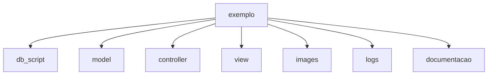

# Projeto exemplo de CRUD em Python

Projeto usado como exemplo na disciplina de Engenharia de Software e programação.

Na pasta documentacao estão os detalhes de cada elemento deste projeto descritos no arquivo **documentacao.md**.

Para rodar este projeto, rode o arquivo main.py em qualquer IDE Python.

Este projeto usa uma estrutura de pastas no estilo MVC, dentro de C:\exemplo, neste caso:

Objetivo deste programa:

```
Fornecer um projeto de exemplo ou template para que se possam 
fazer adaptações futuras em outras situações com um código básico.
```

Esta contido deste projeto:
```
Grid, forms, mestre-detalhes, documentação de código, 
docstrings, funções, relatórios, forms modais, script sql, acesso 
a dados no mysql, geração de eventos, geração de logs, gravação de 
imagens no banco de dados, gráficos, exportação de dados, etc.
```

Diagrama de sub pastas do projeto:



Na raiz do projeto temos 3 arquivos:

* main.py o programa principal
* logs.py o gerador de logs das ações feitas dentro do programa
* documentador.py o gerador de documentação em formato markdown

As pastas são as seguintes:

**controller**: Contém a lógica de negócio e controladores que intermediam entre a interface gráfica e o banco de dados.

**db_script**: Armazena os scripts SQL para criação das tabelas do banco de dados.

**documentacao**: Guarda os arquivos de documentação técnica do projeto, como o documentacao.md.

**images**: Contém recursos visuais do sistema, como a imagem de fundo wallpaper.jpg.

**logs**: Registra eventos e atividades do sistema em arquivos como logs.csv.

**model**: Implementa a conexão e configuração com o banco de dados.

**view**: Define as interfaces gráficas da aplicação utilizando [CustomTkinter](https://github.com/TomSchimansky/CustomTkinter).

