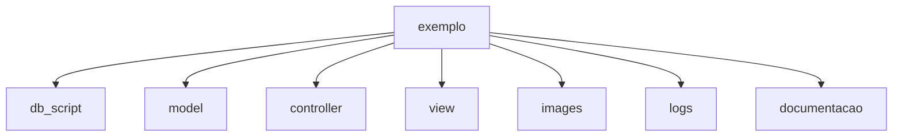
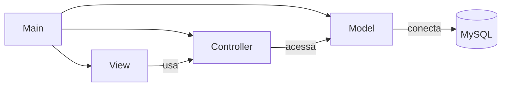
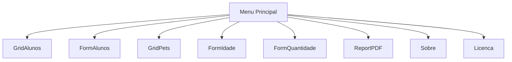
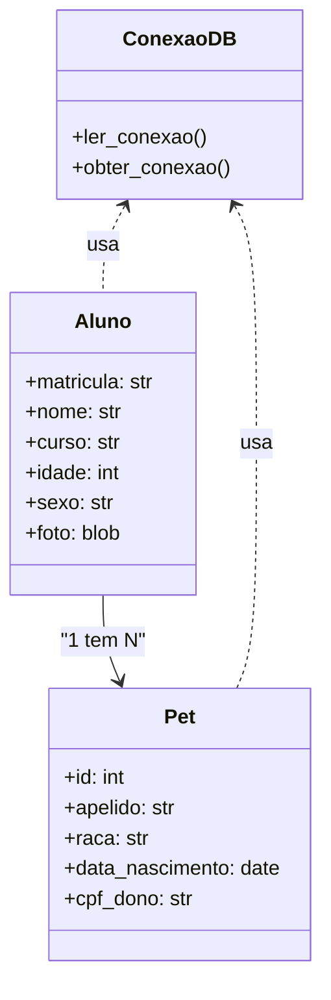

# Projeto exemplo de CRUD em Python estruturado com MVC


- [Projeto exemplo de CRUD em Python estruturado com MVC](#projeto-exemplo-de-crud-em-python-estruturado-com-mvc)
- [1. Descrição](#1-descrição)
- [2. Detalhes da documentação](#2-detalhes-da-documentação)
- [3. Objetivo](#3-objetivo)
  - [3.1. Conteúdo do projeto](#31-conteúdo-do-projeto)
    - [3.1.1. Menu](#311-menu)
    - [3.1.2. Grid](#312-grid)
    - [3.1.3. Form](#313-form)
    - [3.1.4. Mestre detalhe](#314-mestre-detalhe)
    - [3.1.5. Documentação de código](#315-documentação-de-código)
    - [3.1.6. Docstrings](#316-docstrings)
    - [3.1.7. Funções](#317-funções)
    - [3.1.8. Relatórios](#318-relatórios)
    - [3.1.9. Form modal](#319-form-modal)
    - [3.1.10. Script SQL](#3110-script-sql)
    - [3.1.11. Acesso ao banco de dados](#3111-acesso-ao-banco-de-dados)
    - [3.1.12. Geração de eventos e logs](#3112-geração-de-eventos-e-logs)
    - [3.1.13. Tratamento de erros (try...except)](#3113-tratamento-de-erros-tryexcept)
    - [3.1.14. Gravação de imagens no banco de dados](#3114-gravação-de-imagens-no-banco-de-dados)
    - [3.1.15. Gráficos](#3115-gráficos)
    - [3.1.16. Exportação de dados](#3116-exportação-de-dados)
    - [3.1.17. Carregamento de imagem (wallpaper)](#3117-carregamento-de-imagem-wallpaper)
  - [3.2. Limitações](#32-limitações)
    - [3.3. Diagrama de sub pastas do projeto:](#33-diagrama-de-sub-pastas-do-projeto)
  - [3.3.1. Descrição de pastas](#331-descrição-de-pastas)
  - [3.4. Algumas telas do sistema](#34-algumas-telas-do-sistema)
- [4. Diagramas UML](#4-diagramas-uml)
  - [📦 4.1. Diagrama de Pacotes](#-41-diagrama-de-pacotes)
  - [🧭 4.2. Diagrama de Navegação](#-42-diagrama-de-navegação)
  - [🧱 4.3. Diagrama de Classes Simplificado](#-43-diagrama-de-classes-simplificado)
- [5. Ferramentas utilizadas](#5-ferramentas-utilizadas)
- [6. Licença](#6-licença)


---
# 1. Descrição

Projeto usado como exemplo na disciplina de Engenharia de Software e programação, este projeto apresenta várias situações que podem ser tratadas no desenvolvimento de um sistema com foco no uso de [CRUD](https://pt.wikipedia.org/wiki/CRUD) em [MVC](https://pt.wikipedia.org/wiki/MVC) em aplicações comerciais e podem ser abordadas principalmente nas disciplinas como programação, banco de dados e engenharia de software, e em disciplinas com assuntos correlatos como: testes de software, usabilidade entre outros.


---
# 2. Detalhes da documentação

Na pasta documentacao estão os detalhes de cada elemento deste projeto descritos no arquivo **documentacao.md**. A documentação gerada na pasta documentacao foi feita rodando o arquivo documentador.py.

Para rodar este projeto, rode o arquivo main.py em qualquer IDE Python, por exemplo sugerimos a IDE [Spyder](https://www.spyder-ide.org/).

Este projeto usa uma estrutura de pastas no estilo MVC, coloque o projeto dentro de uma pasta na raiz do seu drive, por exemplo C:\exemplo.

---
# 3. Objetivo

```
Fornecer um projeto de exemplo ou modelo (template) para que 
terceiros (alunos) se possam fazer adaptações futuras em 
outras situações a partir de código básico que requeirão o uso de
CRUD (principalmente em projeto cujo foco sejam aplicações comerciais).
```

## 3.1. Conteúdo do projeto

Elementos báscicos contidos nestes projetos

```
Menu, grid, forms, mestre-detalhes, documentação de código, 
docstrings, funções, relatórios, forms modais, script sql, acesso 
a dados no MySQL(MariaDB), geração de eventos, geração de logs, gravação de 
imagens no banco de dados, gráficos, exportação de dados.
```

### 3.1.1. Menu

É definido no arquivo main.py


### 3.1.2. Grid

### 3.1.3. Form

### 3.1.4. Mestre detalhe

### 3.1.5. Documentação de código

É gerado pelo script documentador.py. O script percorre a estrutura do projeto, extrai conteúdos e gera o arquivo documentacao.md com trechos de código, estruturas de diretórios, diagramas Mermaid (UML) e detalhes adicionais como logs e imagens.

### 3.1.6. Docstrings

### 3.1.7. Funções

### 3.1.8. Relatórios

### 3.1.9. Form modal

### 3.1.10. Script SQL

### 3.1.11. Acesso ao banco de dados 

### 3.1.12. Geração de eventos e logs

### 3.1.13. Tratamento de erros (try...except)


### 3.1.14. Gravação de imagens no banco de dados

### 3.1.15. Gráficos

### 3.1.16. Exportação de dados

### 3.1.17. Carregamento de imagem (wallpaper)


## 3.2. Limitações

Este projeto não aborda o seguinte:

1. Apesar de ser um Script Python, ele não foi testado no Linux.
2. Não é objetivo deste projeto atender um negócio específico.
3. Não possui uma versão web nem mobile, o projeto roda em um desktop.
4. Não possui mecanismo de autenticação (controle de acesso).


### 3.3. Diagrama de sub pastas do projeto:




Na raiz do projeto temos 3 arquivos:

* main.py o programa principal
* logs.py o gerador de logs das ações feitas dentro do programa
* documentador.py o gerador de documentação em formato markdown

## 3.3.1. Descrição de pastas

**controller**: Contém a lógica de negócio e controladores que intermediam entre a interface gráfica e o banco de dados.

**db_script**: Armazena os scripts SQL para criação das tabelas do banco de dados.

**documentacao**: Guarda os arquivos de documentação técnica do projeto, como o documentacao.md.

**images**: Contém recursos visuais do sistema, como a imagem de fundo wallpaper.jpg.

**logs**: Registra eventos e atividades do sistema em arquivos como logs.csv.

**model**: Implementa a conexão e configuração com o banco de dados.

**view**: Define as interfaces gráficas da aplicação utilizando [CustomTkinter](https://github.com/TomSchimansky/CustomTkinter).


## 3.4. Algumas telas do sistema


---
# 4. Diagramas UML

## 📦 4.1. Diagrama de Pacotes



## 🧭 4.2. Diagrama de Navegação



## 🧱 4.3. Diagrama de Classes Simplificado



---
# 5. Ferramentas utilizadas

1. Geração de prompt e código via [ChatGPT](https://chatgpt.com/).
2. [Anaconda](https://www.anaconda.com/download) + [IDE Spyder](https://www.spyder-ide.org/download).
3. Banco de dados [MariaDB](https://mariadb.org/download/) via [Laragon](https://laragon.org/download/).
4. [Github desktop](https://desktop.github.com/download/).
5. Visual Studio Code com as extensões para markdown: Markdown All in One, Markdownlint, Markdown Preview Showdoen (MDPS), Markdown Preview GitHub Styling, Mermaid Markdown Syntax Highlight.

Bibliotecas Python:

* [CustomTkinter](https://github.com/TomSchimansky/CustomTkinter)
* os
* mysql
* tkinter
* PIL Python Imaging Library
  

---
# 6. Licença


