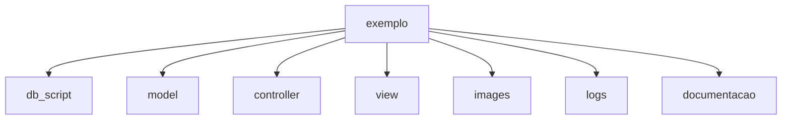
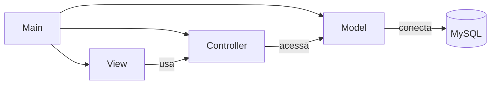
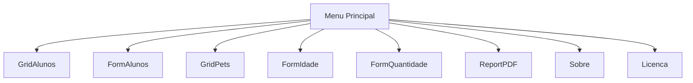
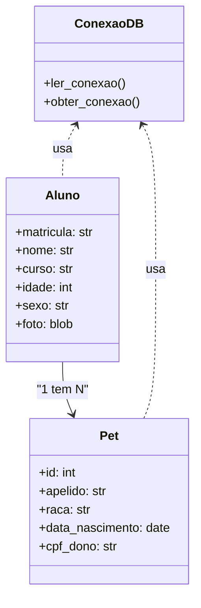

# 🐍 Projeto exemplo de CRUD em Python estruturado com MVC


## 📋 Índice

- [🐍 Projeto exemplo de CRUD em Python estruturado com MVC](#-projeto-exemplo-de-crud-em-python-estruturado-com-mvc)
  - [📋 Índice](#-índice)
  - [🚀 Quick Start](#-quick-start)
    - [📥 Pré-requisitos](#-pré-requisitos)
    - [⚡ Instalação Rápida](#-instalação-rápida)
  - [🎓 Finalidade Acadêmica](#-finalidade-acadêmica)
    - [🎯 Objetivo Pedagógico](#-objetivo-pedagógico)
- [1. 📖 Descrição](#1--descrição)
- [2. 📚 Detalhes da documentação](#2--detalhes-da-documentação)
- [3. 🎯 Objetivo](#3--objetivo)
  - [3.1. 📦 Conteúdo do projeto](#31--conteúdo-do-projeto)
    - [3.1.1. 🍔 Menu](#311--menu)
    - [3.1.2. 📊 Grid](#312--grid)
    - [3.1.3. 📝 Form](#313--form)
    - [3.1.4. 🔗 Mestre detalhe](#314--mestre-detalhe)
    - [3.1.5. 📄 Documentação de código](#315--documentação-de-código)
    - [3.1.6. 💬 Docstrings](#316--docstrings)
    - [3.1.7. ⚙️ Funções](#317-️-funções)
    - [3.1.8. 📑 Relatórios](#318--relatórios)
    - [3.1.9. 🪟 Form modal](#319--form-modal)
    - [3.1.10. 🗄️ Script SQL](#3110-️-script-sql)
    - [3.1.11. 🔌 Acesso ao banco de dados](#3111--acesso-ao-banco-de-dados)
    - [3.1.12. 📋 Geração de eventos e logs](#3112--geração-de-eventos-e-logs)
    - [3.1.13. 🛡️ Tratamento de erros (try...except)](#3113-️-tratamento-de-erros-tryexcept)
    - [3.1.14. 🖼️ Gravação de imagens no banco de dados](#3114-️-gravação-de-imagens-no-banco-de-dados)
    - [3.1.15. 📈 Gráficos](#3115--gráficos)
    - [3.1.16. 📤 Exportação de dados](#3116--exportação-de-dados)
  - [3.2. ⚠️ Limitações](#32-️-limitações)
    - [3.3. 📁 Diagrama de sub pastas do projeto:](#33--diagrama-de-sub-pastas-do-projeto)
  - [3.3.1. 📂 Descrição de pastas](#331--descrição-de-pastas)
  - [3.4. 🖥️ Algumas telas do sistema](#34-️-algumas-telas-do-sistema)
- [4. 📐 Diagramas UML](#4--diagramas-uml)
  - [📦 4.1. Diagrama de Pacotes](#-41-diagrama-de-pacotes)
  - [🧭 4.2. Diagrama de Navegação](#-42-diagrama-de-navegação)
  - [🧱 4.3. Diagrama de Classes Simplificado](#-43-diagrama-de-classes-simplificado)
- [5. 🛠️ Ferramentas utilizadas](#5-️-ferramentas-utilizadas)
- [6. 🔧 Troubleshooting](#6--troubleshooting)
  - [6.1. ❌ Problemas Comuns](#61--problemas-comuns)
    - [🔴 Erro: "No module named 'customtkinter'"](#-erro-no-module-named-customtkinter)
    - [🔴 Erro: "Access denied for user"](#-erro-access-denied-for-user)
    - [🔴 Erro: "Can't connect to MySQL server"](#-erro-cant-connect-to-mysql-server)
    - [🔴 Erro: "Table 'alunos' doesn't exist"](#-erro-table-alunos-doesnt-exist)
    - [🔴 Erro: "FileNotFoundError: wallpaper.jpg"](#-erro-filenotfounderror-wallpaperjpg)
    - [🔴 Tela em branco ou congelada](#-tela-em-branco-ou-congelada)
    - [🔴 Erro de encoding/caracteres especiais](#-erro-de-encodingcaracteres-especiais)
    - [📞 Não encontrou solução?](#-não-encontrou-solução)
- [7. 🤝 Como Contribuir](#7--como-contribuir)
    - [📧 Entre em contato:](#-entre-em-contato)
    - [🌟 Formas de Contribuir:](#-formas-de-contribuir)
- [8. 📖 Como Citar em Trabalhos Acadêmicos](#8--como-citar-em-trabalhos-acadêmicos)
  - [8.1. 📝 Formato ABNT](#81--formato-abnt)
  - [8.2. 🔖 Formato BibTeX](#82--formato-bibtex)
  - [8.3. 💬 Citação em Texto](#83--citação-em-texto)
- [9. 👨‍🏫 Créditos](#9--créditos)
  - [🎓 Autor e Mantenedor](#-autor-e-mantenedor)
    - [🌐 Contato](#-contato)
    - [🙏 Agradecimentos](#-agradecimentos)
    - [📜 Licença](#-licença)
    - [⭐ Se este projeto foi útil para você, considere dar uma estrela no repositório!](#-se-este-projeto-foi-útil-para-você-considere-dar-uma-estrela-no-repositório)

---

## 🚀 Quick Start

### 📥 Pré-requisitos

Antes de iniciar, certifique-se de ter instalado:

- **Python 3.8+** ([Download aqui](https://www.python.org/downloads/))
- **MySQL ou MariaDB** ([Laragon](https://laragon.org/download/) é recomendado para Windows)
- **Git** (opcional, para clonar o repositório)

### ⚡ Instalação Rápida

**Passo 1:** Clone ou baixe o projeto
```bash
git clone https://github.com/monteiro74/exemplo_python_CRUD_MVC.git
cd exemplo_python_CRUD_MVC
```

**Passo 2:** Instale as dependências
```bash
pip install -r requirements.txt
```
Ou use o script automático:
```bash
python instalar_dependencias.py
```

**Passo 3:** Configure o banco de dados

1. Inicie seu servidor MySQL/MariaDB
2. Crie um banco de dados:
```sql
CREATE DATABASE nome_do_banco CHARACTER SET utf8mb4 COLLATE utf8mb4_general_ci;
```

3. Execute os scripts SQL na pasta `db_script/`:
```sql
source db_script/alunos.sql
source db_script/pets.sql
source db_script/users.sql
```

**Passo 4:** Configure a conexão

Crie o arquivo `model/conexao.con` com suas credenciais:
```
host='localhost'
port='3306'
database='nome_do_banco'
user='seu_usuario'
password='sua_senha'
```

**Passo 5:** Execute a aplicação
```bash
python main.py
```

🎉 **Pronto!** O sistema será iniciado e você verá a tela de login.

---

## 🎓 Finalidade Acadêmica

Este projeto foi desenvolvido com **propósito exclusivamente educacional** para ser utilizado em disciplinas de:

- 💻 **Engenharia de Software**
- 🗄️ **Banco de Dados**
- 🐍 **Programação Python**
- 🧪 **Testes de Software**
- 🎨 **Usabilidade e Interface Humano-Computador**

### 🎯 Objetivo Pedagógico

Fornecer um **exemplo prático e completo** de desenvolvimento de aplicações desktop em Python, demonstrando:

✅ Arquitetura MVC (Model-View-Controller)
✅ Operações CRUD (Create, Read, Update, Delete)
✅ Integração com banco de dados relacional
✅ Interface gráfica moderna com CustomTkinter
✅ Boas práticas de documentação de código
✅ Geração de relatórios e gráficos
✅ Sistema de logs e tratamento de erros

**Este projeto serve como template base** para que estudantes possam adaptar e expandir conforme suas necessidades específicas de aprendizado e projetos acadêmicos.


---
# 1. 📖 Descrição

Projeto usado como exemplo na disciplina de Engenharia de Software e programação, este projeto apresenta várias situações que podem ser tratadas no desenvolvimento de um sistema com foco no uso de [CRUD](https://pt.wikipedia.org/wiki/CRUD) em [MVC](https://pt.wikipedia.org/wiki/MVC) em aplicações comerciais e podem ser abordadas principalmente nas disciplinas como programação, banco de dados e engenharia de software, e em disciplinas com assuntos correlatos como: testes de software, usabilidade entre outros.


---
# 2. 📚 Detalhes da documentação

Na pasta documentacao estão os detalhes de cada elemento deste projeto descritos no arquivo **documentacao.md**. A documentação gerada na pasta documentacao foi feita rodando o arquivo documentador.py.

Para rodar este projeto, rode o arquivo main.py em qualquer IDE Python, por exemplo sugerimos a IDE [Spyder](https://www.spyder-ide.org/).

Este projeto usa uma estrutura de pastas no estilo MVC, coloque o projeto dentro de uma pasta na raiz do seu drive, por exemplo C:\exemplo.

---
# 3. 🎯 Objetivo

```
Fornecer um projeto de exemplo ou modelo (template) para que 
terceiros (alunos) se possam fazer adaptações futuras em 
outras situações a partir de código básico que requeirão o uso de
CRUD (principalmente em projeto cujo foco sejam aplicações comerciais).
```

## 3.1. 📦 Conteúdo do projeto

Elementos báscicos contidos nestes projetos

```
Menu, grid, forms, mestre-detalhes, documentação de código, 
docstrings, funções, relatórios, forms modais, script sql, acesso 
a dados no MySQL(MariaDB), geração de eventos, geração de logs, gravação de 
imagens no banco de dados, gráficos, exportação de dados.
```

### 3.1.1. 🍔 Menu

É definido no arquivo main.py


### 3.1.2. 📊 Grid

Exemplo definido em grid_alunos.py


### 3.1.3. 📝 Form

Exemplo definido em form_alunos.py


### 3.1.4. 🔗 Mestre detalhe

Exemplo definido em form_mestre_detalhe.py


### 3.1.5. 📄 Documentação de código

É gerado pelo script documentador.py. O script percorre a estrutura do projeto, extrai conteúdos e gera o arquivo documentacao.md com trechos de código, estruturas de diretórios, diagramas Mermaid (UML) e detalhes adicionais como logs e imagens.

### 3.1.6. 💬 Docstrings

Uma docstring é uma literal de string que ocorre como a primeira instrução na definição de um módulo, função, classe ou método. Ela é usada para documentar o código, explicando o que ele faz, seus parâmetros e seus valores de retorno. Docstrings são escritas usando aspas triplas (""" ou ''').

Exemplo:


### 3.1.7. ⚙️ Funções


### 3.1.8. 📑 Relatórios

O relatório é gerado por report_alunos.py e produz como saída um PDF na pasta raiz do projeto.


### 3.1.9. 🪟 Form modal

Exemplos de chamadas modal a partir do form main, estes exemplos estão em main.py.

```python
def abrir_grid_alunos(self):
    ...
    form = GridAlunos(self)
    form.transient(self)
    form.grab_set()
    form.focus_set()
```

```python
def abrir_form_alunos(self):
    ...
    form = FormAlunos(self)
    form.transient(self)
    form.grab_set()
    form.focus_set()
```

### 3.1.10. 🗄️ Script SQL

O scrip para criar as tabelas do banco de dados estão na pasta db_script.
Este exemplo trabalho com  duas tabelas, são elas:

Os scripts são: alunos.sql e pets.sql.


### 3.1.11. 🔌 Acesso ao banco de dados 

O programa deverá ler o arquivo conexao.con onde estão os parâmetros para conectar com o banco MySQL (servidor, conta, senha e banco). Abaixo estão as duas funções que conectar o sistema como o banco de dados.

```python
def ler_conexao(arquivo='conexao.con'):
    """Lê as configurações de conexão a partir do arquivo .con dentro da mesma pasta."""
    # Descobre o diretório onde este script (conexao_db.py) está localizado
    pasta_atual = os.path.dirname(__file__)
    # Junta esse diretório com o nome do arquivo
    caminho_completo = os.path.join(pasta_atual, arquivo)

    config = {}
    with open(caminho_completo, 'r', encoding='utf-8') as f:
        for linha in f:
            if '=' in linha:
                chave, valor = linha.strip().strip(';').split('=')
                config[chave.strip()] = valor.strip().strip("'")
    return config

def obter_conexao():
    """Estabelece a conexão com o banco de dados usando as configurações lidas."""
    config = ler_conexao()  # por padrão, 'conexao.con'
    try:
        conn = mysql.connector.connect(
            host=config['host'],
            port=config['port'],
            database=config['database'],
            user=config['user'],
            password=config['password']
        )
        return conn
    except mysql.connector.Error as e:
        print(f"Erro de conexão: {e}")
        raise
```


### 3.1.12. 📋 Geração de eventos e logs

O arquivo de log, logs.csv este formato com ponto e vírgula, pode ser lido por outras ferramentas e é gerado pelo módulo logger.py.


### 3.1.13. 🛡️ Tratamento de erros (try...except)


### 3.1.14. 🖼️ Gravação de imagens no banco de dados

Campo long blob para armazenar imagem.


### 3.1.15. 📈 Gráficos


### 3.1.16. 📤 Exportação de dados


## 3.2. ⚠️ Limitações

Este projeto não aborda o seguinte:

1. Apesar de ser um Script Python, ele não foi testado no Linux.
2. Não é objetivo deste projeto atender um negócio específico.
3. Não possui uma versão web nem mobile, o projeto roda em um desktop.
4. Não possui mecanismo de autenticação (controle de acesso).


### 3.3. 📁 Diagrama de sub pastas do projeto:




Na raiz do projeto temos 3 arquivos:

* main.py o programa principal
* logs.py o gerador de logs das ações feitas dentro do programa
* documentador.py o gerador de documentação em formato markdown

## 3.3.1. 📂 Descrição de pastas

**controller**: Contém a lógica de negócio e controladores que intermediam entre a interface gráfica e o banco de dados.

**db_script**: Armazena os scripts SQL para criação das tabelas do banco de dados.

**documentacao**: Guarda os arquivos de documentação técnica do projeto, como o documentacao.md.

**images**: Contém recursos visuais do sistema, como a imagem de fundo wallpaper.jpg.

**logs**: Registra eventos e atividades do sistema em arquivos como logs.csv.

**model**: Implementa a conexão e configuração com o banco de dados.

**view**: Define as interfaces gráficas da aplicação utilizando [CustomTkinter](https://github.com/TomSchimansky/CustomTkinter).


## 3.4. 🖥️ Algumas telas do sistema


---
# 4. 📐 Diagramas UML

## 📦 4.1. Diagrama de Pacotes



## 🧭 4.2. Diagrama de Navegação



## 🧱 4.3. Diagrama de Classes Simplificado



---
# 5. 🛠️ Ferramentas utilizadas

1. Geração de prompt e código via [ChatGPT](https://chatgpt.com/).
2. [Anaconda](https://www.anaconda.com/download) + [IDE Spyder](https://www.spyder-ide.org/download).
3. Banco de dados [MariaDB](https://mariadb.org/download/) via [Laragon](https://laragon.org/download/).
4. [Github desktop](https://desktop.github.com/download/).
5. Visual Studio Code com as extensões para markdown: Markdown All in One, Markdownlint, Markdown Preview Showdoen (MDPS), Markdown Preview GitHub Styling, Mermaid Markdown Syntax Highlight.

Bibliotecas Python:

* [CustomTkinter](https://github.com/TomSchimansky/CustomTkinter)
* os
* mysql
* tkinter
* PIL Python Imaging Library

---

# 6. 🔧 Troubleshooting

## 6.1. ❌ Problemas Comuns

### 🔴 Erro: "No module named 'customtkinter'"
**Solução:**
```bash
pip install customtkinter
```
Ou reinstale todas as dependências:
```bash
pip install -r requirements.txt
```

### 🔴 Erro: "Access denied for user"
**Problema:** Credenciais incorretas no arquivo `conexao.con`

**Solução:**
1. Verifique se o arquivo `model/conexao.con` existe
2. Confirme se usuário e senha estão corretos
3. Teste a conexão no MySQL Workbench ou terminal:
```sql
mysql -u seu_usuario -p
```

### 🔴 Erro: "Can't connect to MySQL server"
**Problema:** Servidor MySQL não está rodando

**Solução:**
- **Windows (Laragon):** Inicie o Laragon e clique em "Start All"
- **Windows (XAMPP):** Inicie o MySQL no painel do XAMPP
- **Linux:** `sudo systemctl start mysql`
- **macOS:** `brew services start mysql`

### 🔴 Erro: "Table 'alunos' doesn't exist"
**Problema:** Tabelas não foram criadas no banco de dados

**Solução:**
Execute os scripts SQL na pasta `db_script/`:
```bash
mysql -u seu_usuario -p nome_do_banco < db_script/alunos.sql
mysql -u seu_usuario -p nome_do_banco < db_script/pets.sql
mysql -u seu_usuario -p nome_do_banco < db_script/users.sql
```

### 🔴 Erro: "FileNotFoundError: wallpaper.jpg"
**Problema:** Arquivo de imagem não encontrado

**Solução:**
Verifique se a pasta `images/` existe na raiz do projeto e contém o arquivo `wallpaper.jpg`

### 🔴 Tela em branco ou congelada
**Solução:**
1. Feche a aplicação completamente
2. Verifique o arquivo `logs/logs.csv` para identificar erros
3. Execute novamente: `python main.py`

### 🔴 Erro de encoding/caracteres especiais
**Problema:** Acentos ou caracteres especiais não aparecem corretamente

**Solução:**
- Certifique-se de que o banco de dados usa charset `utf8mb4`
- Verifique se os arquivos Python estão salvos com encoding UTF-8

### 📞 Não encontrou solução?
Consulte a seção [Como Contribuir](#7--como-contribuir) para entrar em contato.

---

# 7. 🤝 Como Contribuir

Este projeto é mantido para fins educacionais. Se você deseja:

- 💡 **Sugerir melhorias**
- 🐛 **Reportar bugs**
- ❓ **Tirar dúvidas**
- 📚 **Solicitar recursos adicionais**
- 🤝 **Colaborar no projeto**

### 📧 Entre em contato:

- **Site:** [www.pontodeensino.com](http://www.pontodeensino.com)
- **Professor:** Dr. Emiliano Soares Monteiro
- **Email:** Entre em contato através do site

### 🌟 Formas de Contribuir:

1. **Relate Issues:** Abra uma issue no repositório descrevendo problemas ou sugestões
2. **Melhore a Documentação:** Ajude a tornar este material mais claro para outros estudantes
3. **Compartilhe:** Use este projeto em suas aulas e compartilhe experiências
4. **Adapte:** Crie variações deste projeto e compartilhe suas melhorias

**Nota:** Este é um projeto acadêmico aberto. Contribuições que melhorem o valor educacional são muito bem-vindas!

---

# 8. 📖 Como Citar em Trabalhos Acadêmicos

Se você utilizou este projeto em seu trabalho acadêmico (TCC, artigo, dissertação, tese, relatório), por favor, cite adequadamente.

## 8.1. 📝 Formato ABNT

```
MONTEIRO, Emiliano Soares. Projeto exemplo de CRUD em Python estruturado com MVC.
2025. Disponível em: <https://github.com/monteiro74/exemplo_python_CRUD_MVC>.
Acesso em: [dia] [mês abreviado]. [ano].
```

**Exemplo:**
```
MONTEIRO, Emiliano Soares. Projeto exemplo de CRUD em Python estruturado com MVC.
2025. Disponível em: <https://github.com/monteiro74/exemplo_python_CRUD_MVC>.
Acesso em: 22 dez. 2025.
```

## 8.2. 🔖 Formato BibTeX

```bibtex
@misc{monteiro2025pythoncrud,
  author = {Monteiro, Emiliano Soares},
  title = {Projeto exemplo de CRUD em Python estruturado com MVC},
  year = {2025},
  publisher = {GitHub},
  journal = {GitHub repository},
  howpublished = {\url{https://github.com/monteiro74/exemplo_python_CRUD_MVC}},
  note = {Acesso em: 22 dez. 2025}
}
```

## 8.3. 💬 Citação em Texto

**Citação direta:**
> "Este projeto apresenta várias situações que podem ser tratadas no desenvolvimento de um sistema com foco no uso de CRUD em MVC em aplicações comerciais" (MONTEIRO, 2025).

**Citação indireta:**
> Conforme demonstrado por Monteiro (2025), a arquitetura MVC aplicada a operações CRUD em Python facilita o aprendizado de boas práticas de desenvolvimento de software.

---

# 9. 👨‍🏫 Créditos

## 🎓 Autor e Mantenedor

**Prof. Dr. Emiliano Soares Monteiro**

Este projeto foi desenvolvido e é mantido pelo Prof. Dr. Emiliano Soares Monteiro como material didático para disciplinas de Engenharia de Software, Programação e Banco de Dados.

### 🌐 Contato

- **Site:** [www.pontodeensino.com](http://www.pontodeensino.com)
- **Instituição:** Material educacional aberto
- **Propósito:** Ensino de desenvolvimento de software com Python

### 🙏 Agradecimentos

- Aos **alunos** que utilizaram este material e forneceram feedback valioso
- À comunidade **Python** e desenvolvedores das bibliotecas utilizadas
- Aos colaboradores que contribuíram com melhorias e correções

### 📜 Licença

Este projeto é disponibilizado como material educacional aberto para fins acadêmicos e de aprendizado.

---

### ⭐ Se este projeto foi útil para você, considere dar uma estrela no repositório!

**Desenvolvido com 💙 para fins educacionais**

**© 2025 Prof. Dr. Emiliano Soares Monteiro - Todos os direitos reservados para fins educacionais**

