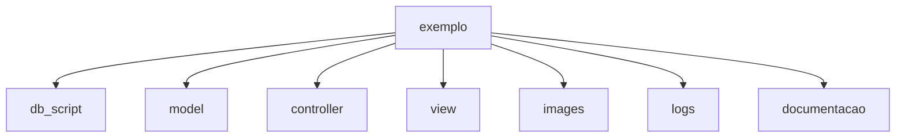
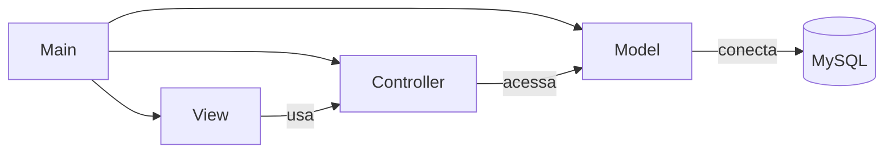
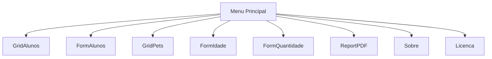
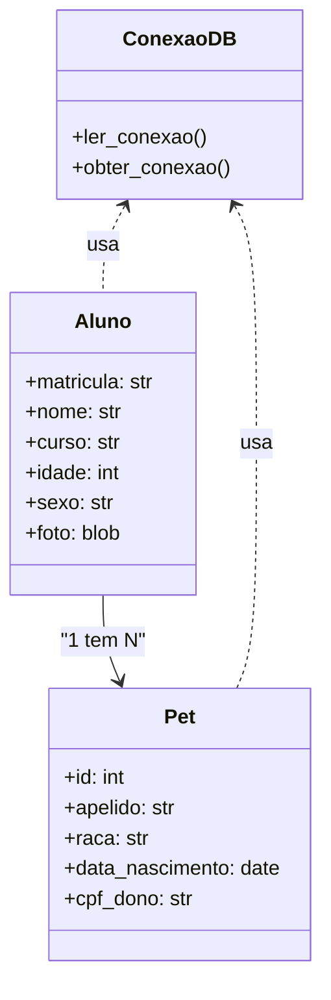

# Projeto exemplo de CRUD em Python

- [Projeto exemplo de CRUD em Python](#projeto-exemplo-de-crud-em-python)
- [1. Descrição](#1-descrição)
- [2. Detalhes da documentação](#2-detalhes-da-documentação)
- [3. Objetivo](#3-objetivo)
  - [3.1. Esta contido deste projeto](#31-esta-contido-deste-projeto)
  - [3.2. Descrição de pastas](#32-descrição-de-pastas)
  - [3.3. Algumas telas do sistema](#33-algumas-telas-do-sistema)
- [4. Diagramas UML](#4-diagramas-uml)
  - [📦 4.1. Diagrama de Pacotes](#-41-diagrama-de-pacotes)
  - [🧭 4.2. Diagrama de Navegação](#-42-diagrama-de-navegação)
  - [🧱 4.3. Diagrama de Classes Simplificado](#-43-diagrama-de-classes-simplificado)


---
# 1. Descrição

Projeto usado como exemplo na disciplina de Engenharia de Software e programação, este projeto apresenta várias situações que podem ser tratadas no desenvolvimento de um sistema com foco no uso de CRUD em aplicações comerciais e podem ser abordadas em disciplinas como programação, banco de dados e engenharia de software.

---
# 2. Detalhes da documentação

Na pasta documentacao estão os detalhes de cada elemento deste projeto descritos no arquivo **documentacao.md**. A documentação gerada na pasta documentacao foi feita rodando o arquivo documentador.py.

Para rodar este projeto, rode o arquivo main.py em qualquer IDE Python, por exemplo sugerimos a IDE [Spyder](https://www.spyder-ide.org/).

Este projeto usa uma estrutura de pastas no estilo MVC, coloque o projeto dentro de uma pasta na rais do seu drive, por exemplo C:\exemplo.

---
# 3. Objetivo

```
Fornecer um projeto de exemplo ou template para que se possam 
fazer adaptações futuras em outras situações com um código básico.
```

## 3.1. Esta contido deste projeto

```
Grid, forms, mestre-detalhes, documentação de código, 
docstrings, funções, relatórios, forms modais, script sql, acesso 
a dados no mysql, geração de eventos, geração de logs, gravação de 
imagens no banco de dados, gráficos, exportação de dados, etc.
```

Diagrama de sub pastas do projeto:



Na raiz do projeto temos 3 arquivos:

* main.py o programa principal
* logs.py o gerador de logs das ações feitas dentro do programa
* documentador.py o gerador de documentação em formato markdown

## 3.2. Descrição de pastas

**controller**: Contém a lógica de negócio e controladores que intermediam entre a interface gráfica e o banco de dados.

**db_script**: Armazena os scripts SQL para criação das tabelas do banco de dados.

**documentacao**: Guarda os arquivos de documentação técnica do projeto, como o documentacao.md.

**images**: Contém recursos visuais do sistema, como a imagem de fundo wallpaper.jpg.

**logs**: Registra eventos e atividades do sistema em arquivos como logs.csv.

**model**: Implementa a conexão e configuração com o banco de dados.

**view**: Define as interfaces gráficas da aplicação utilizando [CustomTkinter](https://github.com/TomSchimansky/CustomTkinter).

## 3.3. Algumas telas do sistema


---
# 4. Diagramas UML

## 📦 4.1. Diagrama de Pacotes



## 🧭 4.2. Diagrama de Navegação



## 🧱 4.3. Diagrama de Classes Simplificado



