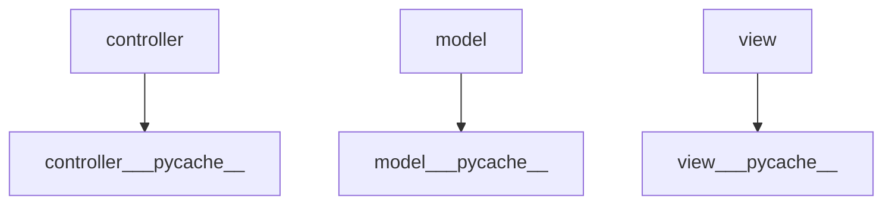
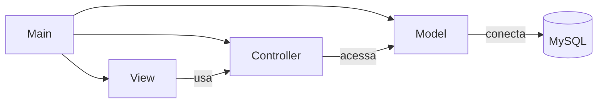
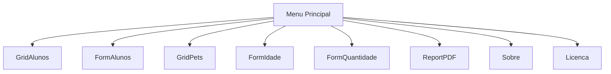
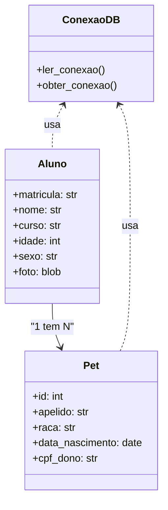

<!--
==============================================================================
Nome do Arquivo: documentacao.md - Documentação Técnica Consolidada
Descrição: Este arquivo documenta toda a estrutura, funcionalidades e scripts
           do sistema de gerenciamento de alunos e pets.
Autor: Nome do aluno
Data de Geração: 2025-06-10
Hora de Geração: 20:40:28
==============================================================================
-->

# 📚 Documentação do Projeto

## 🗂️ Estrutura de Pastas



## 📁 Pasta `db_script/`

### 📄 alunos.sql

```sql
#
# Structure for table "alunos"
#

CREATE TABLE `alunos` (
  `matricula` varchar(20) COLLATE utf8mb4_general_ci NOT NULL,
  `nome` varchar(100) COLLATE utf8mb4_general_ci DEFAULT NULL,
  `cpf` varchar(11) COLLATE utf8mb4_general_ci DEFAULT NULL,
  `curso` varchar(100) COLLATE utf8mb4_general_ci DEFAULT NULL,
  `sexo` varchar(1) COLLATE utf8mb4_general_ci DEFAULT NULL,
  `idade` int DEFAULT NULL,
  `foto` longblob,
  `observacao` varchar(255) COLLATE utf8mb4_general_ci DEFAULT NULL,
  PRIMARY KEY (`matricula`)
) ENGINE=InnoDB DEFAULT CHARSET=utf8mb4 COLLATE=utf8mb4_general_ci;

```

### 📄 pets.sql

```sql
#
# Structure for table "pets"
#

CREATE TABLE `pets` (
  `Id` int NOT NULL AUTO_INCREMENT,
  `apelido` varchar(20) COLLATE utf8mb4_general_ci DEFAULT NULL,
  `raca` varchar(20) COLLATE utf8mb4_general_ci DEFAULT NULL,
  `data_nascimento` date DEFAULT NULL,
  `foto` longblob,
  `cpf` int DEFAULT NULL,
  PRIMARY KEY (`Id`)
) ENGINE=InnoDB AUTO_INCREMENT=9 DEFAULT CHARSET=utf8mb4 COLLATE=utf8mb4_general_ci;

```


## 📁 Pasta `model/`

### 📄 conexao_db.py

```py
# -*- coding: utf-8 -*-
# ==============================================================================
# Nome do Script: conexao_db.py - Gerenciamento de Conexão com o Banco de Dados
# Descrição: Este script lê as configurações de conexão em arquivo .con e
#            estabelece a conexão com o banco de dados MySQL.
#
# Autor: Nome do aluno
# Data de Criação: 
# Hora de Criação: 
#
# Dependências:
# - mysql-connector-python: Para conectar ao MySQL.
# - os: Para manipulação de caminhos de arquivos.
#
# Uso: Tenha o arquivo 'conexao.con' na mesma pasta deste script.
# ==============================================================================

# model/conexao_db.py
# Conexão com o MySQL lendo as configurações do arquivo conexao.con

# model/conexao_db.py
import mysql.connector
import os

def ler_conexao(arquivo='conexao.con'):
    """Lê as configurações de conexão a partir do arquivo .con dentro da mesma pasta."""
    # Descobre o diretório onde este script (conexao_db.py) está localizado
    pasta_atual = os.path.dirname(__file__)
    # Junta esse diretório com o nome do arquivo
    caminho_completo = os.path.join(pasta_atual, arquivo)

    config = {}
    with open(caminho_completo, 'r', encoding='utf-8') as f:
        for linha in f:
            if '=' in linha:
                chave, valor = linha.strip().strip(';').split('=')
                config[chave.strip()] = valor.strip().strip("'")
    return config

def obter_conexao():
    """Estabelece a conexão com o banco de dados usando as configurações lidas."""
    config = ler_conexao()  # por padrão, 'conexao.con'
    try:
        conn = mysql.connector.connect(
            host=config['host'],
            port=config['port'],
            database=config['database'],
            user=config['user'],
            password=config['password']
        )
        return conn
    except mysql.connector.Error as e:
        print(f"Erro de conexão: {e}")
        raise


```

### 📄 __init__.py

```py

```


## 📁 Pasta `controller/`

### 📄 aluno_controller.py

```py
# -*- coding: utf-8 -*-
# ==============================================================================
# Nome do Script: aluno_controller.py - Operações CRUD para Alunos
# Descrição: Este script fornece funções para criar, ler, atualizar e excluir
#            registros de alunos no banco de dados.
#
# Autor: Nome do aluno
# Data de Criação:
# Hora de Criação:
#
# Dependências:
# - model.conexao_db: Para obter a conexão com o banco de dados.
#
# Uso: Este módulo deve ser importado pelos componentes da camada de view e
#      controller para manipulação de dados de alunos.
# ==============================================================================

# controller/aluno_controller.py
# Operações CRUD para Alunos

from model.conexao_db import obter_conexao


def obter_alunos():
    """Retorna a lista de alunos cadastrados."""
    conn = obter_conexao()
    cursor = conn.cursor(dictionary=True)
    cursor.execute("SELECT matricula, nome, cpf, curso, idade, sexo FROM alunos")
    alunos = cursor.fetchall()
    cursor.close()
    conn.close()
    return alunos

def obter_aluno_por_matricula(matricula):
    """Retorna os dados de um aluno específico."""
    conn = obter_conexao()
    cursor = conn.cursor(dictionary=True)
    cursor.execute("SELECT * FROM alunos WHERE matricula = %s", (matricula,))
    aluno = cursor.fetchone()
    cursor.close()
    conn.close()
    return aluno

def salvar_aluno(dados):
    """Insere ou atualiza um aluno no banco."""
    conn = obter_conexao()
    cursor = conn.cursor()
    if dados.get("matricula"):
        # Atualiza se a matrícula já existe
        cursor.execute("""
            UPDATE alunos SET nome=%s, curso=%s, idade=%s, sexo=%s, foto=%s WHERE matricula=%s
        """, (dados["nome"], dados["curso"], dados["idade"], dados["foto"], dados["sexo"], dados["matricula"]))
    else:
        # Insere um novo aluno
        cursor.execute("""
            INSERT INTO alunos (matricula, nome, curso, idade, foto, sexo) VALUES (%s, %s, %s, %s, %s, %s)
        """, (dados["matricula"], dados["nome"], dados["curso"], dados["idade"], dados["foto"], dados["sexo"]))
    conn.commit()
    cursor.close()
    conn.close()

def deletar_aluno(matricula):
    """Remove um aluno do banco."""
    conn = obter_conexao()
    cursor = conn.cursor()
    cursor.execute("DELETE FROM alunos WHERE matricula = %s", (matricula,))
    conn.commit()
    cursor.close()
    conn.close()

def contar_alunos():
    """Conta o total de alunos cadastrados."""
    conn = obter_conexao()
    cursor = conn.cursor()
    cursor.execute("SELECT COUNT(*) FROM alunos")
    total = cursor.fetchone()[0]
    cursor.close()
    conn.close()
    return total

def obter_idades_alunos():
    """Retorna as idades dos alunos para análise de gráficos."""
    conn = obter_conexao()
    cursor = conn.cursor()
    cursor.execute("SELECT idade FROM alunos")
    idades = [row[0] for row in cursor.fetchall()]
    cursor.close()
    conn.close()
    return idades

```

### 📄 grafico_controller.py

```py
# -*- coding: utf-8 -*-
# ==============================================================================
# Nome do Script: grafico_controller.py - Controlador para gráficos de idade e quantidade de alunos
# Descrição: Este script agrupa e conta alunos por faixa etária para geração
#            de gráficos estatísticos, bem como conta o total de alunos.
#
# Autor: Nome do aluno
# Data de Criação:
# Hora de Criação:
#
# Dependências:
# - model.conexao_db: Para obter a conexão com o banco de dados.
#
# Uso: Este módulo deve ser importado pela camada de view para renderizar gráficos
#      baseados em dados de alunos.
# ==============================================================================

# controller/grafico_controller.py
# Controlador para gráficos de idade e quantidade de alunos

from model.conexao_db import obter_conexao


def contar_alunos_por_faixa_etaria():
    """Conta alunos agrupados por faixa etária."""
    conn = obter_conexao()
    cursor = conn.cursor(dictionary=True)
    query = """
    SELECT 
        CASE
            WHEN idade BETWEEN 18 AND 25 THEN '18-25'
            WHEN idade BETWEEN 26 AND 30 THEN '26-30'
            WHEN idade BETWEEN 31 AND 40 THEN '31-40'
            WHEN idade BETWEEN 41 AND 50 THEN '41-50'
            ELSE '51+'
        END AS faixa_etaria,
        COUNT(*) AS quantidade
    FROM alunos
    GROUP BY faixa_etaria
    """
    cursor.execute(query)
    dados = cursor.fetchall()
    cursor.close()
    conn.close()
    return dados

def contar_total_alunos():
    """Conta o total de alunos cadastrados."""
    conn = obter_conexao()
    cursor = conn.cursor()
    cursor.execute("SELECT COUNT(*) FROM alunos")
    total = cursor.fetchone()[0]
    cursor.close()
    conn.close()
    return total

```

### 📄 pet_controller.py

```py
# controller/pet_controller.py
from model.conexao_db import obter_conexao

def obter_pets():
    conn = obter_conexao()
    cursor = conn.cursor(dictionary=True)
    cursor.execute("SELECT * FROM pets")
    pets = cursor.fetchall()
    cursor.close()
    conn.close()
    return pets

def obter_pet_por_id(pet_id):
    conn = obter_conexao()
    cursor = conn.cursor(dictionary=True)
    cursor.execute("SELECT * FROM pets WHERE id = %s", (pet_id,))
    pet = cursor.fetchone()
    cursor.close()
    conn.close()
    return pet

def salvar_pet(dados):
    conn = obter_conexao()
    cursor = conn.cursor()
    if dados.get("id"):
        cursor.execute("UPDATE pets SET apelido=%s, raca=%s, data_nascimento=%s, cpf=%s, foto=%s WHERE id=%s",
                       (dados["apelido"], dados["raca"], dados["data_nascimento"], dados["cpf"], dados["foto"], dados["id"]))
    else:
        cursor.execute("INSERT INTO pets (apelido, raca, data_nascimento, cpf, foto) VALUES (%s, %s, %s, %s, %s)",
                       (dados["apelido"], dados["raca"], dados["data_nascimento"], dados["cpf"], dados["foto"]))
    conn.commit()
    cursor.close()
    conn.close()

def deletar_pet(pet_id):
    conn = obter_conexao()
    cursor = conn.cursor()
    cursor.execute("DELETE FROM pets WHERE id = %s", (pet_id,))
    conn.commit()
    cursor.close()
    conn.close()

```

### 📄 relatorio_controller.py

```py
# -*- coding: utf-8 -*-
# ==============================================================================
# Nome do Script: relatorio_controller.py - Controlador para geração de relatórios PDF
# Descrição: Este script coleta dados de alunos do banco de dados para gerações
#            de relatórios em formato PDF.
#
# Autor: Nome do aluno
# Data de Criação:
# Hora de Criação:
#
# Dependências:
# - model.conexao_db: Para obter a conexão com o banco de dados.
#
# Uso: Este módulo deve ser importado pela camada de view para gerar relatórios PDF.
# ==============================================================================

# controller/relatorio_controller.py
# Controlador para geração de relatórios PDF

from model.conexao_db import obter_conexao


def obter_dados_relatorio():
    """Coleta os dados de alunos para o relatório."""
    conn = obter_conexao()
    cursor = conn.cursor(dictionary=True)
    cursor.execute("SELECT matricula, nome, curso, idade, sexo FROM alunos")
    alunos = cursor.fetchall()
    cursor.close()
    conn.close()
    return alunos

```


## 📁 Pasta `view/`

### 📄 aaaaaaform_idade_alunos.py

```py
# -*- coding: utf-8 -*-
# ==============================================================================
# Nome do Script: form_idade_alunos.py - Gráfico de Idade dos Alunos
# Descrição: Este script gera um gráfico de barras mostrando a distribuição
#            de idades dos alunos cadastrados no banco de dados.
#
# Autor: Nome do aluno
# Data de Criação: 
# Hora de Criação: 
#
# Dependências:
# - customtkinter: Para criação da interface gráfica.
# - matplotlib: Para geração de gráficos.
# - controller.aluno_controller: Para obter dados de idades dos alunos.
#
# Uso: Execute a partir da janela principal para visualizar o gráfico de idades.
# ==============================================================================

# view/form_idade_alunos.py
# Gráfico de Idade dos Alunos

import customtkinter as ctk
from matplotlib.backends.backend_tkagg import FigureCanvasTkAgg
import matplotlib.pyplot as plt
from controller.aluno_controller import obter_idades_alunos

class FormIdadeAlunos(ctk.CTkToplevel):
    def __init__(self, master=None):
        super().__init__(master)
        self.title("Gráfico de Idades dos Alunos")
        self.geometry("600x400")

        # Busca os dados
        idades = obter_idades_alunos()
        faixas = ["18-25", "26-30", "31-40", "41-50", "51+"]
        qtd_idades = [0, 0, 0, 0, 0]

        # Contagem por faixa etária
        for idade in idades:
    if idade is None:
        continue
    if 18 <= idade <= 25:
        qtd_idades[0] += 1
    elif 26 <= idade <= 30:
        qtd_idades[1] += 1
    elif 31 <= idade <= 40:
        qtd_idades[2] += 1
    elif 41 <= idade <= 50:
        qtd_idades[3] += 1
    else:
        qtd_idades[4] += 1
        if idade is None:
            continue
            if 18 <= idade <= 25:
                qtd_idades[0] += 1
            elif 26 <= idade <= 30:
                qtd_idades[1] += 1
            elif 31 <= idade <= 40:
                qtd_idades[2] += 1
            elif 41 <= idade <= 50:
                qtd_idades[3] += 1
            else:
                qtd_idades[4] += 1

        # Plotar o gráfico
        fig, ax = plt.subplots()
        ax.bar(faixas, qtd_idades)
        ax.set_title("Distribuição de Idade dos Alunos")
        ax.set_xlabel("Faixa Etária")
        ax.set_ylabel("Quantidade")

        # Inserir no Tkinter
        canvas = FigureCanvasTkAgg(fig, master=self)
        canvas.get_tk_widget().pack(fill="both", expand=True)
        canvas.draw()

        # Centraliza a janela
        self._center_window()

    def _center_window(self):
        self.update_idletasks()
        w = 600
        h = 400
        sw = self.winfo_screenwidth()
        sh = self.winfo_screenheight()
        x = (sw // 2) - (w // 2)
        y = (sh // 2) - (h // 2)
        self.geometry(f"{w}x{h}+{x}+{y}")
```

### 📄 form_alunos.py

```py
# -*- coding: utf-8 -*-
# ==============================================================================
# Nome do Script: form_alunos.py - Formulário de cadastro e edição de aluno
# Descrição: Este script exibe um formulário modal para operações CRUD de aluno,
#            incluindo seleção e exibição de foto 3×4.
#
# Autor: Nome do aluno
# Data de Criação: 
# Hora de Criação: 
#
# Dependências:
# - customtkinter: Para criação da interface gráfica.
# - PIL: Para manipulação e redimensionamento de imagens.
# - controller.aluno_controller: Para operações de banco de dados de alunos.
#
# Uso: Abra a grade de alunos e clique em 'Adicionar' ou 'Editar' para usar este formulário.
# ==============================================================================

# view/form_alunos.py
# Formulário modal para operações CRUD de aluno com exibição de foto 3×4 e logging

import os, sys
root_dir = os.path.abspath(os.path.join(os.path.dirname(__file__), os.pardir))
if root_dir not in sys.path:
    sys.path.insert(0, root_dir)

import customtkinter as ctk
from tkinter import filedialog, messagebox
from controller.aluno_controller import salvar_aluno, obter_aluno_por_matricula, deletar_aluno
from PIL import Image, ImageTk
from io import BytesIO
from logger import log_event

class FormAlunos(ctk.CTkToplevel):
    """
    Janela modal para cadastro, edição e visualização de alunos.
    Permite inserir, atualizar, excluir, limpar e cancelar operações de CRUD,
    além de selecionar e exibir foto 3x4 do aluno.

    Parâmetros:
        master: Janela principal que chama este formulário.
        matricula: Matrícula do aluno para edição (opcional).
        atualizar_callback: Função callback para atualizar a lista após salvar/editar.
    """

    def __init__(self, master=None, matricula=None, atualizar_callback=None):
        """
        Inicializa o formulário de aluno, montando todos os campos de entrada,
        botões de ação e carregando dados se for edição.
        """
        super().__init__(master)
        log_event("form_alunos", "__init__")
        self.title("Cadastro de Aluno")
        self.geometry("420x640")
        self.resizable(False, False)
        self.matricula = matricula
        self.atualizar_callback = atualizar_callback
        self.foto_bytes = None
        self._photo_image = None  # Referência para ImageTk

        # Torna este form modal
        self.transient(master)
        self.grab_set()

        # ─── Campos de entrada ─────────────────────────────────────────────────

        # Matrícula
        ctk.CTkLabel(self, text="Matrícula:", anchor="w").pack(fill="x", padx=20, pady=(20, 0))
        self.entry_matricula = ctk.CTkEntry(self)
        self.entry_matricula.pack(fill="x", padx=20, pady=(0, 10))

        # Nome
        ctk.CTkLabel(self, text="Nome:", anchor="w").pack(fill="x", padx=20, pady=(10, 0))
        self.entry_nome = ctk.CTkEntry(self)
        self.entry_nome.pack(fill="x", padx=20, pady=(0, 10))

        # Curso
        ctk.CTkLabel(self, text="Curso:", anchor="w").pack(fill="x", padx=20, pady=(10, 0))
        self.entry_curso = ctk.CTkEntry(self)
        self.entry_curso.pack(fill="x", padx=20, pady=(0, 10))

        # Sexo
        ctk.CTkLabel(self, text="Sexo:", anchor="w").pack(fill="x", padx=20, pady=(10, 0))
        self.option_sexo = ctk.CTkComboBox(self, values=["Masculino", "Feminino"])
        self.option_sexo.pack(fill="x", padx=20, pady=(0, 10))

        # Idade
        ctk.CTkLabel(self, text="Idade:", anchor="w").pack(fill="x", padx=20, pady=(10, 0))
        self.entry_idade = ctk.CTkEntry(self)
        self.entry_idade.pack(fill="x", padx=20, pady=(0, 10))

        # ─── Exibição de Foto 3×4 ───────────────────────────────────────────────
        ctk.CTkLabel(self, text="Foto 3×4:", anchor="w").pack(fill="x", padx=20, pady=(10, 0))

        self.photo_label = ctk.CTkLabel(self, text="Sem foto", width=120, height=160)
        self.photo_label.pack(padx=20, pady=(0, 10))

        self.botao_foto = ctk.CTkButton(self, text="Selecionar Foto", command=self.selecionar_foto)
        self.botao_foto.pack(pady=(0, 20))

        # ─── Botões CRUD ────────────────────────────────────────────────────────
        botoes_frame = ctk.CTkFrame(self)
        botoes_frame.pack(pady=(10, 10))

        self.botao_inserir = ctk.CTkButton(botoes_frame, text="Inserir", width=80, command=self.inserir)
        self.botao_inserir.grid(row=0, column=0, padx=5)

        self.botao_atualizar = ctk.CTkButton(botoes_frame, text="Atualizar", width=80, command=self.atualizar)
        self.botao_atualizar.grid(row=0, column=1, padx=5)

        self.botao_excluir = ctk.CTkButton(botoes_frame, text="Excluir", width=80, fg_color="red", command=self.excluir)
        self.botao_excluir.grid(row=0, column=2, padx=5)

        self.botao_limpar = ctk.CTkButton(botoes_frame, text="Limpar", width=80, command=self.limpar_campos)
        self.botao_limpar.grid(row=0, column=3, padx=5)

        self.botao_cancelar = ctk.CTkButton(botoes_frame, text="Cancelar", width=80, command=self.destroy)
        self.botao_cancelar.grid(row=0, column=4, padx=5)

        # Se for edição (já recebeu matrícula), carrega dados
        if self.matricula:
            self.carregar_dados()
            self.entry_matricula.configure(state="disabled")
        else:
            # Novo cadastro: desabilita botão Excluir
            self.botao_excluir.configure(state="disabled")

        # Centraliza a janela
        self._center_window()

    def _center_window(self):
        """
        Centraliza a janela no centro da tela do usuário.
        """
        self.update_idletasks()
        w = 500
        h = 700
        sw = self.winfo_screenwidth()
        sh = self.winfo_screenheight()
        x = (sw // 2) - (w // 2)
        y = (sh // 2) - (h // 2)
        self.geometry(f"{w}x{h}+{x}+{y}")

    def selecionar_foto(self):
        """
        Permite ao usuário selecionar uma foto 3x4 do aluno.
        Redimensiona, exibe e armazena a foto em memória.
        """
        log_event("form_alunos", "selecionar_foto")
        caminho = filedialog.askopenfilename(
            filetypes=[("Imagens", "*.jpg *.jpeg *.png")],
            title="Selecione uma foto 3×4"
        )
        if not caminho:
            return
        try:
            img = Image.open(caminho)
            img = img.resize((120, 160), Image.LANCZOS)
            self._photo_image = ImageTk.PhotoImage(img)
            self.photo_label.configure(image=self._photo_image, text="")
            with open(caminho, "rb") as f:
                self.foto_bytes = f.read()
        except Exception as e:
            messagebox.showerror("Erro", f"Falha ao processar imagem: {e}")
            self.foto_bytes = None

    def carregar_dados(self):
        """
        Carrega os dados do aluno selecionado para edição, preenchendo os campos do formulário.
        Também carrega a foto do aluno, se existir.
        """
        log_event("form_alunos", "carregar_dados")
        aluno = obter_aluno_por_matricula(self.matricula)
        if not aluno:
            return
        self.entry_matricula.insert(0, aluno["matricula"])
        self.entry_nome.insert(0, aluno["nome"])
        self.entry_curso.insert(0, aluno["curso"])
        self.entry_idade.insert(0, aluno["idade"])
        self.option_sexo.set(aluno.get("sexo", ""))
        foto_bytes = aluno.get("foto", None)
        if foto_bytes:
            try:
                img = Image.open(BytesIO(foto_bytes))
                img = img.resize((120, 160), Image.LANCZOS)
                self._photo_image = ImageTk.PhotoImage(img)
                self.photo_label.configure(image=self._photo_image, text="")
                self.foto_bytes = foto_bytes
            except Exception as e:
                messagebox.showwarning("Aviso", f"Falha ao exibir foto salva: {e}")
                self.foto_bytes = None

    def salvar(self):
        """
        Salva ou atualiza os dados do aluno no banco de dados.
        Valida os campos obrigatórios e exibe mensagens modais de sucesso ou erro.
        """
        log_event("form_alunos", "salvar")
        matricula = self.entry_matricula.get().strip()
        nome = self.entry_nome.get().strip()
        curso = self.entry_curso.get().strip()
        idade = self.entry_idade.get().strip()

        if not all([matricula, nome, curso, idade]):
            messagebox.showwarning("Validação", "Preencha todos os campos antes de salvar.")
            return

        dados = {
            "matricula": matricula,
            "nome": nome,
            "curso": curso,
            "idade": idade,
            "sexo": self.option_sexo.get(),
            "foto": self.foto_bytes
        }

        try:
            salvar_aluno(dados)
            messagebox.showinfo("Sucesso", "Dados do aluno salvos com sucesso.")
            if not self.matricula:
                self.entry_matricula.configure(state="disabled")
                self.matricula = matricula
                self.botao_excluir.configure(state="normal")
            if self.atualizar_callback:
                self.atualizar_callback()
        except Exception as e:
            messagebox.showerror("Erro", f"Falha ao salvar aluno: {e}")

    def excluir(self):
        """
        Exclui o aluno atual do banco de dados após confirmação do usuário.
        """
        log_event("form_alunos", "excluir")
        if not self.matricula:
            return
        resposta = messagebox.askyesno("Confirmar Exclusão", "Deseja realmente excluir este aluno?")
        if not resposta:
            return
        try:
            deletar_aluno(self.matricula)
            messagebox.showinfo("Sucesso", "Aluno excluído com sucesso.")
            if self.atualizar_callback:
                self.atualizar_callback()
            self.destroy()
        except Exception as e:
            messagebox.showerror("Erro", f"Falha ao excluir aluno: {e}")

    def limpar_campos(self):
        """
        Limpa todos os campos do formulário, reseta imagem e estados dos botões.
        """
        log_event("form_alunos", "limpar_campos")
        self.entry_matricula.configure(state="normal")
        self.entry_matricula.delete(0, "end")
        self.entry_nome.delete(0, "end")
        self.entry_curso.delete(0, "end")
        self.entry_idade.delete(0, "end")
        self.option_sexo.set("")
        self.photo_label.configure(image=None, text="Sem foto")
        self.foto_bytes = None
        self._photo_image = None
        self.botao_excluir.configure(state="disabled")
        self.matricula = None

    def inserir(self):
        """
        Realiza o cadastro de um novo aluno usando os dados preenchidos no formulário.
        """
        log_event("form_alunos", "inserir")
        self._salvar_novo()

    def atualizar(self):
        """
        Atualiza os dados do aluno existente no banco de dados.
        """
        log_event("form_alunos", "atualizar")
        if not self.matricula:
            messagebox.showwarning("Aviso", "Nenhum aluno carregado para atualizar.")
            return
        self._salvar_existente()

    def _salvar_novo(self):
        """
        Salva um novo aluno no banco de dados.
        """
        matricula = self.entry_matricula.get().strip()
        nome = self.entry_nome.get().strip()
        curso = self.entry_curso.get().strip()
        idade = self.entry_idade.get().strip()
        sexo = "M" if self.option_sexo.get() == "Masculino" else "F"

        if not all([matricula, nome, curso, idade]):
            messagebox.showwarning("Validação", "Preencha todos os campos antes de salvar.")
            return

        dados = {
            "matricula": matricula,
            "nome": nome,
            "curso": curso,
            "idade": idade,
            "sexo": sexo,
            "foto": self.foto_bytes
        }

        try:
            salvar_aluno(dados)
            messagebox.showinfo("Sucesso", "Aluno inserido com sucesso.")
            self.matricula = matricula
            if self.atualizar_callback:
                self.atualizar_callback()
        except Exception as e:
            messagebox.showerror("Erro", f"Falha ao inserir aluno: {e}")

    def _salvar_existente(self):
        """
        Atualiza os dados de um aluno já existente no banco de dados.
        """
        nome = self.entry_nome.get().strip()
        curso = self.entry_curso.get().strip()
        idade = self.entry_idade.get().strip()
        sexo = "M" if self.option_sexo.get() == "Masculino" else "F"

        if not all([self.matricula, nome, curso, idade]):
            messagebox.showwarning("Validação", "Preencha todos os campos antes de atualizar.")
            return

        dados = {
            "matricula": self.matricula,
            "nome": nome,
            "curso": curso,
            "idade": idade,
            "sexo": sexo,
            "foto": self.foto_bytes
        }

        try:
            salvar_aluno(dados)
            messagebox.showinfo("Sucesso", "Aluno atualizado com sucesso.")
            if self.atualizar_callback:
                self.atualizar_callback()
        except Exception as e:
            messagebox.showerror("Erro", f"Falha ao atualizar aluno: {e}")

```

### 📄 form_idade_alunos.py

```py
# -*- coding: utf-8 -*-
# ==============================================================================
# Nome do Script: form_idade_alunos.py - Gráfico de Idade dos Alunos
# Descrição: Este script gera um gráfico de barras mostrando a distribuição
#            de idades dos alunos cadastrados no banco de dados.
#
# Autor: Nome do aluno
# Data de Criação: 
# Hora de Criação: 
#
# Dependências:
# - customtkinter: Para criação da interface gráfica.
# - matplotlib: Para geração de gráficos.
# - controller.aluno_controller: Para obter dados de idades dos alunos.
#
# Uso: Execute a partir da janela principal para visualizar o gráfico de idades.
# ==============================================================================

# view/form_idade_alunos.py
# Gráfico de Idade dos Alunos

import customtkinter as ctk
from matplotlib.backends.backend_tkagg import FigureCanvasTkAgg
import matplotlib.pyplot as plt
from controller.aluno_controller import obter_idades_alunos

class FormIdadeAlunos(ctk.CTkToplevel):
    def __init__(self, master=None):
        super().__init__(master)
        self.title("Gráfico de Idades dos Alunos")
        self.geometry("600x400")

        # Busca os dados
        idades = obter_idades_alunos()
        faixas = ["18-25", "26-30", "31-40", "41-50", "51+"]
        qtd_idades = [0, 0, 0, 0, 0]
        for idade in idades:
            if idade is None:
                continue
            if 18 <= idade <= 25:
                qtd_idades[0] += 1
            elif 26 <= idade <= 30:
                qtd_idades[1] += 1
            elif 31 <= idade <= 40:
                qtd_idades[2] += 1
            elif 41 <= idade <= 50:
                qtd_idades[3] += 1
            else:
                qtd_idades[4] += 1
        fig, ax = plt.subplots()
        ax.bar(faixas, qtd_idades)
        ax.set_title("Distribuição de Idade dos Alunos")
        ax.set_xlabel("Faixa Etária")
        ax.set_ylabel("Quantidade")

        # Inserir no Tkinter
        canvas = FigureCanvasTkAgg(fig, master=self)
        canvas.get_tk_widget().pack(fill="both", expand=True)
        canvas.draw()

        # Centraliza a janela
        self._center_window()

    def _center_window(self):
        self.update_idletasks()
        w = 600
        h = 400
        sw = self.winfo_screenwidth()
        sh = self.winfo_screenheight()
        x = (sw // 2) - (w // 2)
        y = (sh // 2) - (h // 2)
        self.geometry(f"{w}x{h}+{x}+{y}")
```

### 📄 form_licenca.py

```py
# -*- coding: utf-8 -*-
# ==============================================================================
# Nome do Script: form_licenca.py - Tela de informações da licença
# Descrição: Este script exibe informações sobre a licença de uso do software,
#            incluindo termos e direitos de uso.
#
# Autor: Nome do aluno
# Data de Criação: 
# Hora de Criação: 
#
# Dependências:
# - customtkinter: Para criação da interface gráfica.
#
# Uso: Execute a partir da janela principal no menu 'Sobre' para exibir esta tela.
# ==============================================================================

# view/form_licenca.py
# Tela de informações sobre a Licença de Uso

import customtkinter as ctk

class FormLicenca(ctk.CTkToplevel):
    def __init__(self, master=None):
        super().__init__(master)
        self.title("Licença de Uso")
        self.geometry("500x400")

        ctk.CTkLabel(self, text="""Este software é de uso acadêmico e educacional.
                     O código é aberto para estudos e melhorias.
                     Proibida a distribuição comercial sem autorização.
                     © 2025 - Sistema de Gerenciamento de Alunos""" ,
                     font=("Arial", 12)).pack(pady=10)
        ctk.CTkLabel(self, text="""Este é um software de exemplo para demonstração de tela de licença.""", font=("Arial", 12)).pack(pady=10)
        ctk.CTkButton(self, text="Fechar", command=self.destroy).pack(pady=20)

        # Centraliza a janela
        self._center_window()

    def _center_window(self):
        self.update_idletasks()
        w = 500
        h = 400
        sw = self.winfo_screenwidth()
        sh = self.winfo_screenheight()
        x = (sw // 2) - (w // 2)
        y = (sh // 2) - (h // 2)
        self.geometry(f"{w}x{h}+{x}+{y}")
```

### 📄 form_mestre_detalhe.py

```py

import customtkinter as ctk
from tkinter import messagebox
from controller.aluno_controller import obter_alunos
from controller.pet_controller import obter_pets
from tkinter import ttk

class FormMestreDetalhe(ctk.CTkToplevel):
    def __init__(self, master=None):
        super().__init__(master)
        self.title("Aluno e seus Pets")
        self.geometry("800x500")
        self.alunos = obter_alunos()
        self.indice = 0

        # Campos do aluno (mestre)
        ctk.CTkLabel(self, text="Nome:").pack(pady=(10,0))
        self.entry_nome = ctk.CTkEntry(self, state="disabled")
        self.entry_nome.pack(fill="x", padx=20)

        ctk.CTkLabel(self, text="Curso:").pack(pady=(10,0))
        self.entry_curso = ctk.CTkEntry(self, state="disabled")
        self.entry_curso.pack(fill="x", padx=20)

        ctk.CTkLabel(self, text="CPF:").pack(pady=(10,0))
        self.entry_cpf = ctk.CTkEntry(self, state="disabled")
        self.entry_cpf.pack(fill="x", padx=20)

        # Botões de navegação
        nav_frame = ctk.CTkFrame(self)
        nav_frame.pack(pady=10)
        ctk.CTkButton(nav_frame, text="<< Anterior", command=self.anterior).pack(side="left", padx=10)
        ctk.CTkButton(nav_frame, text="Próximo >>", command=self.proximo).pack(side="left", padx=10)

        # Detalhe: Tabela de Pets
        ctk.CTkLabel(self, text="Pets do aluno:").pack(pady=(20, 0))
        self.tree_pets = ttk.Treeview(self, columns=("id", "apelido", "raca", "data_nascimento"), show="headings")
        for col in self.tree_pets["columns"]:
            self.tree_pets.heading(col, text=col.capitalize())
        self.tree_pets.pack(fill="both", expand=True, padx=20, pady=(5, 20))

        self._center_window()
        self.mostrar_aluno()

    def _center_window(self):
        self.update_idletasks()
        w = 800
        h = 500
        sw = self.winfo_screenwidth()
        sh = self.winfo_screenheight()
        x = (sw // 2) - (w // 2)
        y = (sh // 2) - (h // 2)
        self.geometry(f"{w}x{h}+{x}+{y}")

    def mostrar_aluno(self):
        if not self.alunos:
            return
        aluno = self.alunos[self.indice]
        self.entry_nome.configure(state="normal")
        self.entry_nome.delete(0, "end")
        self.entry_nome.insert(0, aluno["nome"])
        self.entry_nome.configure(state="disabled")

        self.entry_curso.configure(state="normal")
        self.entry_curso.delete(0, "end")
        self.entry_curso.insert(0, aluno["curso"])
        self.entry_curso.configure(state="disabled")

        self.entry_cpf.configure(state="normal")
        self.entry_cpf.delete(0, "end")
        self.entry_cpf.insert(0, aluno["cpf"])
        self.entry_cpf.configure(state="disabled")

        self.mostrar_pets(aluno["cpf"])

    def mostrar_pets(self, cpf):
        self.tree_pets.delete(*self.tree_pets.get_children())
        for pet in obter_pets():
            if str(pet["cpf"]) == str(cpf):
                self.tree_pets.insert("", "end", values=(pet["Id"], pet["apelido"], pet["raca"], pet["data_nascimento"]))

    def proximo(self):
        if self.indice < len(self.alunos) - 1:
            self.indice += 1
            self.mostrar_aluno()

    def anterior(self):
        if self.indice > 0:
            self.indice -= 1
            self.mostrar_aluno()

```

### 📄 form_pets.py

```py
# view/form_pets.py
import os, sys
root_dir = os.path.abspath(os.path.join(os.path.dirname(__file__), os.pardir))
if root_dir not in sys.path:
    sys.path.insert(0, root_dir)

import customtkinter as ctk
from tkinter import filedialog, messagebox
from controller.pet_controller import salvar_pet, obter_pet_por_id, deletar_pet
from PIL import Image, ImageTk
from io import BytesIO
from logger import log_event

class FormPets(ctk.CTkToplevel):
    def __init__(self, master=None, pet_id=None, atualizar_callback=None):
        super().__init__(master)
        log_event("form_pets", "__init__")
        self.title("Cadastro de Pet")
        self.geometry("600x700")
        self.resizable(False, False)
        self.pet_id = pet_id
        self.atualizar_callback = atualizar_callback
        self.foto_bytes = None
        self._photo_image = None

        self.transient(master)
        self.grab_set()

        ctk.CTkLabel(self, text="Apelido:", anchor="w").pack(fill="x", padx=20, pady=(20, 0))
        self.entry_apelido = ctk.CTkEntry(self)
        self.entry_apelido.pack(fill="x", padx=20, pady=(0, 10))

        ctk.CTkLabel(self, text="Raça:", anchor="w").pack(fill="x", padx=20, pady=(10, 0))
        self.entry_raca = ctk.CTkEntry(self)
        self.entry_raca.pack(fill="x", padx=20, pady=(0, 10))

        ctk.CTkLabel(self, text="Data de Nascimento (YYYY-MM-DD):", anchor="w").pack(fill="x", padx=20, pady=(10, 0))
        self.entry_nascimento = ctk.CTkEntry(self)
        self.entry_nascimento.pack(fill="x", padx=20, pady=(0, 10))

        ctk.CTkLabel(self, text="CPF do dono:", anchor="w").pack(fill="x", padx=20, pady=(10, 0))
        self.entry_cpf = ctk.CTkEntry(self)
        self.entry_cpf.pack(fill="x", padx=20, pady=(0, 10))

        ctk.CTkLabel(self, text="Foto:", anchor="w").pack(fill="x", padx=20, pady=(10, 0))
        self.photo_label = ctk.CTkLabel(self, text="Sem foto", width=120, height=160)
        self.photo_label.pack(padx=20, pady=(0, 10))
        self.botao_foto = ctk.CTkButton(self, text="Selecionar Foto", command=self.selecionar_foto)
        self.botao_foto.pack(pady=(0, 20))

        botoes_frame = ctk.CTkFrame(self)
        botoes_frame.pack(pady=(0, 10))

        self.botao_salvar = ctk.CTkButton(botoes_frame, text="Salvar", command=self.salvar)
        self.botao_salvar.grid(row=0, column=0, padx=5)
        self.botao_excluir = ctk.CTkButton(botoes_frame, text="Excluir", fg_color="red", command=self.excluir)
        self.botao_excluir.grid(row=0, column=1, padx=5)
        self.botao_cancelar = ctk.CTkButton(botoes_frame, text="Cancelar", command=self.destroy)
        self.botao_cancelar.grid(row=0, column=2, padx=5)

        if self.pet_id:
            self.carregar_dados()
        else:
            self.botao_excluir.configure(state="disabled")

        self._center_window()

    def _center_window(self):
        self.update_idletasks()
        w = 600
        h = 700
        sw = self.winfo_screenwidth()
        sh = self.winfo_screenheight()
        x = (sw // 2) - (w // 2)
        y = (sh // 2) - (h // 2)
        self.geometry(f"{w}x{h}+{x}+{y}")

    def selecionar_foto(self):
        caminho = filedialog.askopenfilename(filetypes=[("Imagens", "*.jpg *.jpeg *.png")], title="Selecionar Foto")
        if not caminho:
            return
        try:
            img = Image.open(caminho)
            img = img.resize((120, 160), Image.LANCZOS)
            self._photo_image = ImageTk.PhotoImage(img)
            self.photo_label.configure(image=self._photo_image, text="")
            with open(caminho, "rb") as f:
                self.foto_bytes = f.read()
        except Exception as e:
            messagebox.showerror("Erro", f"Erro ao carregar imagem: {e}")

    def carregar_dados(self):
        pet = obter_pet_por_id(self.pet_id)
        if not pet:
            return
        self.entry_apelido.insert(0, pet["apelido"])
        self.entry_raca.insert(0, pet["raca"])
        self.entry_nascimento.insert(0, pet["data_nascimento"])
        self.entry_cpf.insert(0, pet["cpf"])
        foto = pet["foto"]
        if foto:
            try:
                img = Image.open(BytesIO(foto))
                img = img.resize((120, 160), Image.LANCZOS)
                self._photo_image = ImageTk.PhotoImage(img)
                self.photo_label.configure(image=self._photo_image, text="")
                self.foto_bytes = foto
            except:
                pass

    def salvar(self):
        dados = {
            "id": self.pet_id,
            "apelido": self.entry_apelido.get().strip(),
            "raca": self.entry_raca.get().strip(),
            "data_nascimento": self.entry_nascimento.get().strip(),
            "cpf": self.entry_cpf.get().strip(),
            "foto": self.foto_bytes
        }
        salvar_pet(dados)
        if self.atualizar_callback:
            self.atualizar_callback()
        self.destroy()

    def excluir(self):
        if not self.pet_id:
            return
        if messagebox.askyesno("Confirmação", "Deseja realmente excluir este pet?"):
            deletar_pet(self.pet_id)
            if self.atualizar_callback:
                self.atualizar_callback()
            self.destroy()

```

### 📄 form_quantidade_alunos.py

```py
# -*- coding: utf-8 -*-
# ==============================================================================
# Nome do Script: form_quantidade_alunos.py - Gráfico de Quantidade de Alunos
# Descrição: Este script gera um gráfico de barras mostrando o número total de
#            alunos cadastrados no banco de dados.
#
# Autor: Nome do aluno
# Data de Criação: 
# Hora de Criação: 
#
# Dependências:
# - customtkinter: Para criação da interface gráfica.
# - matplotlib: Para geração de gráficos.
# - controller.aluno_controller: Para obter contagem de alunos.
#
# Uso: Execute a partir da janela principal para visualizar o gráfico de quantidade.
# ==============================================================================

# view/form_quantidade_alunos.py
# Gráfico de Quantidade de Alunos

import customtkinter as ctk
from matplotlib.backends.backend_tkagg import FigureCanvasTkAgg
import matplotlib.pyplot as plt
from controller.aluno_controller import contar_alunos

class FormQuantidadeAlunos(ctk.CTkToplevel):
    def __init__(self, master=None):
        super().__init__(master)
        self.title("Gráfico de Quantidade de Alunos")
        self.geometry("500x400")

        # Busca os dados
        total_alunos = contar_alunos()

        # Plotar o gráfico
        fig, ax = plt.subplots()
        ax.bar(["Alunos"], [total_alunos])
        ax.set_title("Quantidade Total de Alunos")
        ax.set_ylabel("Total")

        # Inserir no Tkinter
        canvas = FigureCanvasTkAgg(fig, master=self)
        canvas.get_tk_widget().pack(fill="both", expand=True)
        canvas.draw()

        # Centraliza a janela
        self._center_window()

    def _center_window(self):
        self.update_idletasks()
        w = 500
        h = 400
        sw = self.winfo_screenwidth()
        sh = self.winfo_screenheight()
        x = (sw // 2) - (w // 2)
        y = (sh // 2) - (h // 2)
        self.geometry(f"{w}x{h}+{x}+{y}")
```

### 📄 form_report_alunos.py

```py
# -*- coding: utf-8 -*-
# ==============================================================================
# Nome do Script: form_report_alunos.py - Gerador de Relatório de Alunos em PDF
# Descrição: Este script permite gerar um relatório em PDF com a lista de alunos
#            cadastrados, salvando-o no disco.
#
# Autor: Nome do aluno
# Data de Criação: 
# Hora de Criação: 
#
# Dependências:
# - customtkinter: Para criação da interface gráfica.
# - fpdf: Para geração de arquivos PDF.
# - controller.aluno_controller: Para obter dados de alunos.
#
# Uso: Execute a partir da janela principal no menu 'Relatórios' para gerar o PDF.
# ==============================================================================

# view/form_report_alunos.py
# Geração de relatório em PDF com a lista de alunos

import customtkinter as ctk
from fpdf import FPDF
from tkinter import messagebox
from controller.aluno_controller import obter_alunos

class FormReportAlunos(ctk.CTkToplevel):
    def __init__(self, master=None):
        super().__init__(master)
        self.title("Relatório de Alunos")
        self.geometry("400x200")

        ctk.CTkLabel(self, text="Gerar Relatório de Alunos", font=("Arial", 16)).pack(pady=20)
        ctk.CTkButton(self, text="Gerar PDF", command=self.gerar_pdf).pack(pady=10)
        ctk.CTkButton(self, text="Fechar", command=self.destroy).pack(pady=10)

        # Centraliza a janela
        self._center_window()

    def _center_window(self):
        self.update_idletasks()
        w = 400
        h = 200
        sw = self.winfo_screenwidth()
        sh = self.winfo_screenheight()
        x = (sw // 2) - (w // 2)
        y = (sh // 2) - (h // 2)
        self.geometry(f"{w}x{h}+{x}+{y}")

    def gerar_pdf(self):
        alunos = obter_alunos()
        if not alunos:
            messagebox.showinfo("Informação", "Não há alunos cadastrados para gerar o relatório.")
            return

        pdf = FPDF()
        pdf.add_page()
        pdf.set_font("Arial", size=12)
        pdf.cell(200, 10, txt="Relatório de Alunos", ln=True, align="C")
        pdf.ln(10)

        # Cabeçalhos
        pdf.cell(40, 10, "Matrícula", border=1)
        pdf.cell(60, 10, "Nome", border=1)
        pdf.cell(40, 10, "Curso", border=1)
        pdf.cell(20, 10, "Idade", border=1)
        pdf.cell(20, 10, "Sexo", border=1)
        pdf.ln()

        # Dados dos alunos
        for aluno in alunos:
            pdf.cell(40, 10, aluno["matricula"], border=1)
            pdf.cell(60, 10, aluno["nome"], border=1)
            pdf.cell(40, 10, aluno["curso"], border=1)
            pdf.cell(20, 10, str(aluno["idade"]), border=1)
            pdf.cell(20, 10, aluno.get("sexo", ""), border=1)
            pdf.ln()

        # Salvar o arquivo PDF
        pdf.output("relatorio_alunos.pdf")
        messagebox.showinfo("Sucesso", "Relatório gerado com sucesso!")
```

### 📄 form_sobre.py

```py
# -*- coding: utf-8 -*-
# ==============================================================================
# Nome do Script: form_sobre.py - Tela 'Sobre o Sistema'
# Descrição: Este script exibe informações gerais sobre o sistema de gerenciamento
#            de alunos, como versão, desenvolvedor e funcionalidades.
#
# Autor: Nome do aluno
# Data de Criação: 
# Hora de Criação: 
#
# Dependências:
# - customtkinter: Para criação da interface gráfica.
#
# Uso: Execute a partir da janela principal no menu 'Sobre' para exibir esta tela.
# ==============================================================================

# view/form_sobre.py
# Tela de informações "Sobre o Sistema"

import customtkinter as ctk

class FormSobre(ctk.CTkToplevel):
    def __init__(self, master=None):
        super().__init__(master)
        self.title("Sobre o Sistema")
        self.geometry("500x400")

        ctk.CTkLabel(self, text="Sistema de Gerenciamento de Alunos", font=("Arial", 18)).pack(pady=20)
        ctk.CTkLabel(self, text="""Desenvolvido para facilitar o controle de alunos.
                                 Interface moderna em CustomTkinter.
                                 Conexão com banco de dados MySQL.
                                 CRUD completo, gráficos e relatórios.""" ,
                                 font=("Arial", 12)).pack(pady=10)

        ctk.CTkButton(self, text="Fechar", command=self.destroy).pack(pady=20)

        # Centraliza a janela
        self._center_window()

    def _center_window(self):
        self.update_idletasks()
        w = 500
        h = 400
        sw = self.winfo_screenwidth()
        sh = self.winfo_screenheight()
        x = (sw // 2) - (w // 2)
        y = (sh // 2) - (h // 2)
        self.geometry(f"{w}x{h}+{x}+{y}")
```

### 📄 grid_alunos.py

```py
# -*- coding: utf-8 -*-
# ==============================================================================
# Nome do Script: grid_alunos.py - Grade de Alunos
# Descrição: Este script exibe uma grade (Treeview) listando todos os alunos
#            e fornece botões para adicionar, editar, excluir ou fechar.
#
# Autor: Nome do aluno
# Data de Criação: 
# Hora de Criação: 
#
# Dependências:
# - customtkinter: Para criação da interface gráfica.
# - tkinter.ttk: Para widget Treeview.
# - controller.aluno_controller: Para operações de banco de dados de alunos.
# - view.form_alunos: Para abrir o formulário de cadastro/edição.
# - logger: Para registro de logs de eventos.
#
# Uso: Execute a partir da janela principal no menu 'Arquivo' para visualizar a grade.
# ==============================================================================

# view/grid_alunos.py
# Grid de alunos com listagem, botões de CRUD e logging

import os, sys
# Garante que a raiz do projeto (pasta exemplo2/) esteja no sys.path
root_dir = os.path.abspath(os.path.join(os.path.dirname(__file__), os.pardir))
if root_dir not in sys.path:
    sys.path.insert(0, root_dir)

import customtkinter as ctk
from tkinter import ttk, messagebox
from controller.aluno_controller import obter_alunos, deletar_aluno
from view.form_alunos import FormAlunos
from logger import log_event

class GridAlunos(ctk.CTkToplevel):
    def __init__(self, master=None):
        super().__init__(master)
        log_event("grid_alunos", "__init__")
        self.title("Lista de Alunos")
        self.geometry("800x400")

        # Título
        ctk.CTkLabel(self, text="Alunos Cadastrados", font=("Arial", 16)).pack(pady=10)

        # Grid
        self.tree = ttk.Treeview(
            self,
            columns=("matricula", "nome", "curso", "idade", "sexo"),
            show="headings"
        )
        self.tree.heading("matricula", text="Matrícula")
        self.tree.heading("nome", text="Nome")
        self.tree.heading("curso", text="Curso")
        self.tree.heading("idade", text="Idade")
        self.tree.heading("sexo", text="Sexo")
        self.tree.pack(fill="both", expand=True, padx=10, pady=10)
        self.tree.bind("<Double-1>", self.editar_selecionado)

        # Botões
        frame = ctk.CTkFrame(self)
        frame.pack(pady=10)

        ctk.CTkButton(frame, text="Adicionar", command=self.adicionar).pack(side="left", padx=5)
        ctk.CTkButton(frame, text="Editar", command=self.editar_selecionado).pack(side="left", padx=5)
        ctk.CTkButton(frame, text="Excluir", command=self.excluir).pack(side="left", padx=5)
        ctk.CTkButton(frame, text="Fechar", command=self.destroy).pack(side="left", padx=5)

        self.atualizar_lista()

        # Centraliza a janela
        self._center_window()

    def _center_window(self):
        self.update_idletasks()
        w = 800
        h = 400
        sw = self.winfo_screenwidth()
        sh = self.winfo_screenheight()
        x = (sw // 2) - (w // 2)
        y = (sh // 2) - (h // 2)
        self.geometry(f"{w}x{h}+{x}+{y}")

    def atualizar_lista(self):
        log_event("grid_alunos", "atualizar_lista")
        for i in self.tree.get_children():
            self.tree.delete(i)
        for aluno in obter_alunos():
            self.tree.insert(
                "",
                "end",
                values=(
                    aluno["matricula"],
                    aluno["nome"],
                    aluno["curso"],
                    aluno["idade"], aluno.get("sexo", "")
                )
            )

    def adicionar(self):
        log_event("grid_alunos", "adicionar")
        FormAlunos(self, atualizar_callback=self.atualizar_lista)

    def editar_selecionado(self, event=None):
        log_event("grid_alunos", "editar_selecionado")
        item = self.tree.focus()
        if not item:
            messagebox.showwarning("Seleção", "Selecione um aluno.")
            return
        matricula = self.tree.item(item)["values"][0]
        FormAlunos(self, matricula=matricula, atualizar_callback=self.atualizar_lista)

    def excluir(self):
        log_event("grid_alunos", "excluir")
        item = self.tree.focus()
        if not item:
            messagebox.showwarning("Seleção", "Selecione um aluno.")
            return
        matricula = self.tree.item(item)["values"][0]
        if messagebox.askyesno("Confirmação", f"Deseja excluir o aluno {matricula}?"):
            deletar_aluno(matricula)
            self.atualizar_lista()

```

### 📄 grid_pets.py

```py
# view/grid_pets.py
import customtkinter as ctk
from tkinter import ttk, messagebox
from controller.pet_controller import obter_pets, deletar_pet
from view.form_pets import FormPets
from logger import log_event

class GridPets(ctk.CTkToplevel):
    def __init__(self, master=None):
        super().__init__(master)
        log_event("grid_pets", "__init__")
        self.title("Lista de Pets")
        self.geometry("800x400")

        ctk.CTkLabel(self, text="Pets Cadastrados", font=("Arial", 16)).pack(pady=10)

        self.tree = ttk.Treeview(self, columns=("id", "apelido", "raca", "data_nascimento", "cpf"), show="headings")
        for col in self.tree["columns"]:
            self.tree.heading(col, text=col.capitalize())
        self.tree.pack(fill="both", expand=True, padx=10, pady=10)
        self.tree.bind("<Double-1>", self.editar_selecionado)

        frame = ctk.CTkFrame(self)
        frame.pack(pady=10)

        ctk.CTkButton(frame, text="Adicionar", command=self.adicionar).pack(side="left", padx=5)
        ctk.CTkButton(frame, text="Editar", command=self.editar_selecionado).pack(side="left", padx=5)
        ctk.CTkButton(frame, text="Excluir", command=self.excluir).pack(side="left", padx=5)
        ctk.CTkButton(frame, text="Fechar", command=self.destroy).pack(side="left", padx=5)

        self.atualizar_lista()
        self._center_window()

    def _center_window(self):
        self.update_idletasks()
        w = 800
        h = 400
        sw = self.winfo_screenwidth()
        sh = self.winfo_screenheight()
        x = (sw // 2) - (w // 2)
        y = (sh // 2) - (h // 2)
        self.geometry(f"{w}x{h}+{x}+{y}")

    def atualizar_lista(self):
        for i in self.tree.get_children():
            self.tree.delete(i)
        for pet in obter_pets():
            self.tree.insert("", "end", values=(pet["Id"], pet["apelido"], pet["raca"], pet["data_nascimento"], pet["cpf"]))

    def adicionar(self):
        FormPets(self, atualizar_callback=self.atualizar_lista)

    def editar_selecionado(self, event=None):
        item = self.tree.focus()
        if not item:
            messagebox.showwarning("Seleção", "Selecione um pet.")
            return
        pet_id = self.tree.item(item)["values"][0]
        FormPets(self, pet_id=pet_id, atualizar_callback=self.atualizar_lista)

    def excluir(self):
        item = self.tree.focus()
        if not item:
            messagebox.showwarning("Seleção", "Selecione um pet.")
            return
        pet_id = self.tree.item(item)["values"][0]
        if messagebox.askyesno("Confirmação", "Deseja excluir este pet?"):
            deletar_pet(pet_id)
            self.atualizar_lista()

```

### 📄 report_alunos.py

```py
# -*- coding: utf-8 -*-
# ==============================================================================
# Nome do Script: report_alunos.py - Gerador de Relatório de Alunos
# Descrição: Este script gera um relatório em PDF contendo dados de alunos
#            e salva o arquivo 'relatorio_alunos.pdf'.
#
# Autor: Nome do aluno
# Data de Criação: 
# Hora de Criação: 
#
# Dependências:
# - customtkinter: Para criação da interface gráfica.
# - fpdf: Para geração de arquivos PDF.
# - tkinter.messagebox: Para exibir mensagens de sucesso ou erro.
# - controller.aluno_controller: Para obter dados de alunos.
#
# Uso: Execute a partir da janela principal no menu 'Relatórios' para gerar o PDF.
# ==============================================================================

# view/report_alunos.py
# Geração de relatório em PDF com a lista de alunos

import customtkinter as ctk
from fpdf import FPDF
from tkinter import messagebox
from controller.aluno_controller import obter_alunos

class ReportAlunos(ctk.CTkToplevel):
    def __init__(self, master=None):
        super().__init__(master)
        self.title("Relatório de Alunos")
        # Define tamanho fixo
        self.geometry("400x200")

        ctk.CTkLabel(self, text="Gerar Relatório de Alunos", font=("Arial", 16)).pack(pady=20)
        ctk.CTkButton(self, text="Gerar PDF", command=self.gerar_pdf).pack(pady=10)
        ctk.CTkButton(self, text="Fechar", command=self.destroy).pack(pady=10)

        # Centraliza a janela
        self._center_window()

    def _center_window(self):
        self.update_idletasks()
        w = 400
        h = 200
        sw = self.winfo_screenwidth()
        sh = self.winfo_screenheight()
        x = (sw // 2) - (w // 2)
        y = (sh // 2) - (h // 2)
        self.geometry(f"{w}x{h}+{x}+{y}")

    def gerar_pdf(self):
        alunos = obter_alunos()
        if not alunos:
            messagebox.showinfo("Informação", "Não há alunos cadastrados para gerar o relatório.")
            return

        pdf = FPDF()
        pdf.add_page()
        pdf.set_font("Arial", size=12)
        pdf.cell(200, 10, txt="Relatório de Alunos", ln=True, align="C")
        pdf.ln(10)

        # Cabeçalhos
        pdf.cell(40, 10, "Matrícula", border=1)
        pdf.cell(60, 10, "Nome", border=1)
        pdf.cell(40, 10, "Curso", border=1)
        pdf.cell(20, 10, "Idade", border=1)
        pdf.cell(20, 10, "Sexo", border=1)
        pdf.ln()

        # Dados dos alunos
        for aluno in alunos:
            pdf.cell(40, 10, aluno["matricula"], border=1)
            pdf.cell(60, 10, aluno["nome"], border=1)
            pdf.cell(40, 10, aluno["curso"], border=1)
            pdf.cell(20, 10, str(aluno["idade"]), border=1)
            pdf.cell(20, 10, aluno.get("sexo", ""), border=1)
            pdf.ln()

        # Salvar o arquivo PDF
        pdf.output("relatorio_alunos.pdf")
        messagebox.showinfo("Sucesso", "Relatório gerado com sucesso!")
```

### 📄 _form_idade_alunos.py

```py
# -*- coding: utf-8 -*-
# ==============================================================================
# Nome do Script: form_idade_alunos.py - Gráfico de Idade dos Alunos
# Descrição: Este script gera um gráfico de barras mostrando a distribuição
#            de idades dos alunos cadastrados no banco de dados.
#
# Autor: Nome do aluno
# Data de Criação: 
# Hora de Criação: 
#
# Dependências:
# - customtkinter: Para criação da interface gráfica.
# - matplotlib: Para geração de gráficos.
# - controller.aluno_controller: Para obter dados de idades dos alunos.
#
# Uso: Execute a partir da janela principal para visualizar o gráfico de idades.
# ==============================================================================

# view/form_idade_alunos.py
# Gráfico de Idade dos Alunos

import customtkinter as ctk
from matplotlib.backends.backend_tkagg import FigureCanvasTkAgg
import matplotlib.pyplot as plt
from controller.aluno_controller import obter_idades_alunos

class FormIdadeAlunos(ctk.CTkToplevel):
    def __init__(self, master=None):
        super().__init__(master)
        self.title("Gráfico de Idades dos Alunos")
        self.geometry("600x400")

        # Busca os dados
        idades = obter_idades_alunos()
        faixas = ["18-25", "26-30", "31-40", "41-50", "51+"]
        qtd_idades = [0, 0, 0, 0, 0]

        # Contagem por faixa etária
        for idade in idades:
    if idade is None:
        continue
    if 18 <= idade <= 25:
        qtd_idades[0] += 1
    elif 26 <= idade <= 30:
        qtd_idades[1] += 1
    elif 31 <= idade <= 40:
        qtd_idades[2] += 1
    elif 41 <= idade <= 50:
        qtd_idades[3] += 1
    else:
        qtd_idades[4] += 1
        if idade is None:
            continue
            if 18 <= idade <= 25:
                qtd_idades[0] += 1
            elif 26 <= idade <= 30:
                qtd_idades[1] += 1
            elif 31 <= idade <= 40:
                qtd_idades[2] += 1
            elif 41 <= idade <= 50:
                qtd_idades[3] += 1
            else:
                qtd_idades[4] += 1

        # Plotar o gráfico
        fig, ax = plt.subplots()
        ax.bar(faixas, qtd_idades)
        ax.set_title("Distribuição de Idade dos Alunos")
        ax.set_xlabel("Faixa Etária")
        ax.set_ylabel("Quantidade")

        # Inserir no Tkinter
        canvas = FigureCanvasTkAgg(fig, master=self)
        canvas.get_tk_widget().pack(fill="both", expand=True)
        canvas.draw()

        # Centraliza a janela
        self._center_window()

    def _center_window(self):
        self.update_idletasks()
        w = 600
        h = 400
        sw = self.winfo_screenwidth()
        sh = self.winfo_screenheight()
        x = (sw // 2) - (w // 2)
        y = (sh // 2) - (h // 2)
        self.geometry(f"{w}x{h}+{x}+{y}")
```

### 📄 __form_idade_alunos.py

```py
# -*- coding: utf-8 -*-
# ==============================================================================
# Nome do Script: form_idade_alunos.py - Gráfico de Idade dos Alunos
# Descrição: Este script gera um gráfico de barras mostrando a distribuição
#            de idades dos alunos cadastrados no banco de dados.
#
# Autor: Nome do aluno
# Data de Criação: 
# Hora de Criação: 
#
# Dependências:
# - customtkinter: Para criação da interface gráfica.
# - matplotlib: Para geração de gráficos.
# - controller.aluno_controller: Para obter dados de idades dos alunos.
#
# Uso: Execute a partir da janela principal para visualizar o gráfico de idades.
# ==============================================================================

# view/form_idade_alunos.py
# Gráfico de Idade dos Alunos

import customtkinter as ctk
from matplotlib.backends.backend_tkagg import FigureCanvasTkAgg
import matplotlib.pyplot as plt
from controller.aluno_controller import obter_idades_alunos

class FormIdadeAlunos(ctk.CTkToplevel):
    def __init__(self, master=None):
        super().__init__(master)
        self.title("Gráfico de Idades dos Alunos")
        self.geometry("600x400")

        # Busca os dados
        idades = obter_idades_alunos()
        faixas = ["18-25", "26-30", "31-40", "41-50", "51+"]
        qtd_idades = [0, 0, 0, 0, 0]

        # Contagem por faixa etária
        for idade in idades:
			if idade is None:
				continue
			if 18 <= idade <= 25:
				qtd_idades[0] += 1
			elif 26 <= idade <= 30:
				qtd_idades[1] += 1
			elif 31 <= idade <= 40:
				qtd_idades[2] += 1
			elif 41 <= idade <= 50:
				qtd_idades[3] += 1
			else:
				qtd_idades[4] += 1


        # Plotar o gráfico
        fig, ax = plt.subplots()
        ax.bar(faixas, qtd_idades)
        ax.set_title("Distribuição de Idade dos Alunos")
        ax.set_xlabel("Faixa Etária")
        ax.set_ylabel("Quantidade")

        # Inserir no Tkinter
        canvas = FigureCanvasTkAgg(fig, master=self)
        canvas.get_tk_widget().pack(fill="both", expand=True)
        canvas.draw()

        # Centraliza a janela
        self._center_window()

    def _center_window(self):
        self.update_idletasks()
        w = 600
        h = 400
        sw = self.winfo_screenwidth()
        sh = self.winfo_screenheight()
        x = (sw // 2) - (w // 2)
        y = (sh // 2) - (h // 2)
        self.geometry(f"{w}x{h}+{x}+{y}")
```

### 📄 ___form_idade_alunos.py

```py
# -*- coding: utf-8 -*-
# ==============================================================================
# Nome do Script: form_idade_alunos.py - Gráfico de Idade dos Alunos
# Descrição: Este script gera um gráfico de barras mostrando a distribuição
#            de idades dos alunos cadastrados no banco de dados.
#
# Autor: Nome do aluno
# Data de Criação: 
# Hora de Criação: 
#
# Dependências:
# - customtkinter: Para criação da interface gráfica.
# - matplotlib: Para geração de gráficos.
# - controller.aluno_controller: Para obter dados de idades dos alunos.
#
# Uso: Execute a partir da janela principal para visualizar o gráfico de idades.
# ==============================================================================

# view/form_idade_alunos.py
# Gráfico de Idade dos Alunos

import customtkinter as ctk
from matplotlib.backends.backend_tkagg import FigureCanvasTkAgg
import matplotlib.pyplot as plt
from controller.aluno_controller import obter_idades_alunos

class FormIdadeAlunos(ctk.CTkToplevel):
    def __init__(self, master=None):
        super().__init__(master)
        self.title("Gráfico de Idades dos Alunos")
        self.geometry("600x400")

        # Busca os dados
        idades = obter_idades_alunos()
        faixas = ["18-25", "26-30", "31-40", "41-50", "51+"]
        qtd_idades = [0, 0, 0, 0, 0]

        # Contagem por faixa etária
        for idade in idades:
        if idade is None:
            continue
            if 18 <= idade <= 25:
                qtd_idades[0] += 1
            elif 26 <= idade <= 30:
                qtd_idades[1] += 1
            elif 31 <= idade <= 40:
                qtd_idades[2] += 1
            elif 41 <= idade <= 50:
                qtd_idades[3] += 1
            else:
                qtd_idades[4] += 1

        # Plotar o gráfico
        fig, ax = plt.subplots()
        ax.bar(faixas, qtd_idades)
        ax.set_title("Distribuição de Idade dos Alunos")
        ax.set_xlabel("Faixa Etária")
        ax.set_ylabel("Quantidade")

        # Inserir no Tkinter
        canvas = FigureCanvasTkAgg(fig, master=self)
        canvas.get_tk_widget().pack(fill="both", expand=True)
        canvas.draw()

        # Centraliza a janela
        self._center_window()

    def _center_window(self):
        self.update_idletasks()
        w = 600
        h = 400
        sw = self.winfo_screenwidth()
        sh = self.winfo_screenheight()
        x = (sw // 2) - (w // 2)
        y = (sh // 2) - (h // 2)
        self.geometry(f"{w}x{h}+{x}+{y}")
```


## 📁 Pasta `images/`


## 📁 Pasta `logs/`


## 📁 Pasta `documentacao/`

### 📄 documentacao.md

```md
<!--
==============================================================================
Nome do Arquivo: documentacao.md - Documentação Técnica Consolidada
Descrição: Este arquivo documenta toda a estrutura, funcionalidades e scripts
           do sistema de gerenciamento de alunos e pets.
Autor: Nome do aluno
Data de Geração: 2025-06-10
Hora de Geração: 18:27:18
==============================================================================
-->


- [📚 Documentação do Projeto](#-documentação-do-projeto)
  - [🗂️ Estrutura de Pastas](#️-estrutura-de-pastas)
  - [📁 Pasta `db_script/`](#-pasta-db_script)
    - [📄 alunos.sql](#-alunossql)
    - [📄 pets.sql](#-petssql)
  - [📁 Pasta `model/`](#-pasta-model)
    - [📄 conexao\_db.py](#-conexao_dbpy)
    - [📄 __init__.py](#-initpy)
  - [📁 Pasta `controller/`](#-pasta-controller)
    - [📄 aluno\_controller.py](#-aluno_controllerpy)
    - [📄 grafico\_controller.py](#-grafico_controllerpy)
    - [📄 pet\_controller.py](#-pet_controllerpy)
    - [📄 relatorio\_controller.py](#-relatorio_controllerpy)
  - [📁 Pasta `view/`](#-pasta-view)
    - [📄 form\_alunos.py](#-form_alunospy)
    - [📄 form\_idade\_alunos.py](#-form_idade_alunospy)
    - [📄 form\_licenca.py](#-form_licencapy)
    - [📄 form\_mestre\_detalhe.py](#-form_mestre_detalhepy)
    - [📄 form\_pets.py](#-form_petspy)
    - [📄 form\_quantidade\_alunos.py](#-form_quantidade_alunospy)
    - [📄 form\_report\_alunos.py](#-form_report_alunospy)
    - [📄 form\_sobre.py](#-form_sobrepy)
    - [📄 grid\_alunos.py](#-grid_alunospy)
    - [📄 grid\_pets.py](#-grid_petspy)
    - [📄 report\_alunos.py](#-report_alunospy)
  - [📁 Pasta `images/`](#-pasta-images)
  - [📁 Pasta `logs/`](#-pasta-logs)
  - [📁 Pasta `documentacao/`](#-pasta-documentacao)
    - [📄 documentacao.md](#-documentacaomd)
  - [📁 Pasta `db_script/`](#-pasta-db_script-1)
    - [📄 alunos.sql](#-alunossql-1)
    - [📄 pets.sql](#-petssql-1)
  - [📁 Pasta `model/`](#-pasta-model-1)
    - [📄 conexao\_db.py](#-conexao_dbpy-1)
    - [📄 __init__.py](#-initpy-1)
  - [📁 Pasta `controller/`](#-pasta-controller-1)
    - [📄 aluno\_controller.py](#-aluno_controllerpy-1)
    - [📄 grafico\_controller.py](#-grafico_controllerpy-1)
    - [📄 pet\_controller.py](#-pet_controllerpy-1)
    - [📄 relatorio\_controller.py](#-relatorio_controllerpy-1)
  - [📁 Pasta `view/`](#-pasta-view-1)
    - [📄 form\_alunos.py](#-form_alunospy-1)
    - [📄 form\_idade\_alunos.py](#-form_idade_alunospy-1)
    - [📄 form\_licenca.py](#-form_licencapy-1)
    - [📄 form\_mestre\_detalhe.py](#-form_mestre_detalhepy-1)
    - [📄 form\_pets.py](#-form_petspy-1)
    - [📄 form\_quantidade\_alunos.py](#-form_quantidade_alunospy-1)
    - [📄 form\_report\_alunos.py](#-form_report_alunospy-1)
    - [📄 form\_sobre.py](#-form_sobrepy-1)
    - [📄 grid\_alunos.py](#-grid_alunospy-1)
    - [📄 grid\_pets.py](#-grid_petspy-1)
    - [📄 report\_alunos.py](#-report_alunospy-1)
  - [📁 Pasta `images/`](#-pasta-images-1)
  - [📁 Pasta `logs/`](#-pasta-logs-1)
  - [📁 Pasta `documentacao/`](#-pasta-documentacao-1)
    - [📌 Notas Finais](#-notas-finais)
    - [🧭 Diagrama de Navegação](#-diagrama-de-navegação)
    - [🧱 Diagrama de Classes Simplificado](#-diagrama-de-classes-simplificado)
    - [📌 Notas Finais](#-notas-finais-1)


# 📚 Documentação do Projeto

## 🗂️ Estrutura de Pastas

```mermaid
graph TD
```

## 📁 Pasta `db_script/`

### 📄 alunos.sql

```sql
#
# Structure for table "alunos"
#

CREATE TABLE `alunos` (
  `matricula` varchar(20) COLLATE utf8mb4_general_ci NOT NULL,
  `nome` varchar(100) COLLATE utf8mb4_general_ci DEFAULT NULL,
  `cpf` varchar(11) COLLATE utf8mb4_general_ci DEFAULT NULL,
  `curso` varchar(100) COLLATE utf8mb4_general_ci DEFAULT NULL,
  `sexo` varchar(1) COLLATE utf8mb4_general_ci DEFAULT NULL,
  `idade` int DEFAULT NULL,
  `foto` longblob,
  `observacao` varchar(255) COLLATE utf8mb4_general_ci DEFAULT NULL,
  PRIMARY KEY (`matricula`)
) ENGINE=InnoDB DEFAULT CHARSET=utf8mb4 COLLATE=utf8mb4_general_ci;

```

### 📄 pets.sql

```sql
#
# Structure for table "pets"
#

CREATE TABLE `pets` (
  `Id` int NOT NULL AUTO_INCREMENT,
  `apelido` varchar(20) COLLATE utf8mb4_general_ci DEFAULT NULL,
  `raca` varchar(20) COLLATE utf8mb4_general_ci DEFAULT NULL,
  `data_nascimento` date DEFAULT NULL,
  `foto` longblob,
  `cpf` int DEFAULT NULL,
  PRIMARY KEY (`Id`)
) ENGINE=InnoDB AUTO_INCREMENT=9 DEFAULT CHARSET=utf8mb4 COLLATE=utf8mb4_general_ci;

```


## 📁 Pasta `model/`

### 📄 conexao_db.py

```py
# -*- coding: utf-8 -*-
# ==============================================================================
# Nome do Script: conexao_db.py - Gerenciamento de Conexão com o Banco de Dados
# Descrição: Este script lê as configurações de conexão em arquivo .con e
#            estabelece a conexão com o banco de dados MySQL.
#
# Autor: Nome do aluno
# Data de Criação: 
# Hora de Criação: 
#
# Dependências:
# - mysql-connector-python: Para conectar ao MySQL.
# - os: Para manipulação de caminhos de arquivos.
#
# Uso: Tenha o arquivo 'conexao.con' na mesma pasta deste script.
# ==============================================================================

# model/conexao_db.py
# Conexão com o MySQL lendo as configurações do arquivo conexao.con

# model/conexao_db.py
import mysql.connector
import os

def ler_conexao(arquivo='conexao.con'):
    """Lê as configurações de conexão a partir do arquivo .con dentro da mesma pasta."""
    # Descobre o diretório onde este script (conexao_db.py) está localizado
    pasta_atual = os.path.dirname(__file__)
    # Junta esse diretório com o nome do arquivo
    caminho_completo = os.path.join(pasta_atual, arquivo)

    config = {}
    with open(caminho_completo, 'r', encoding='utf-8') as f:
        for linha in f:
            if '=' in linha:
                chave, valor = linha.strip().strip(';').split('=')
                config[chave.strip()] = valor.strip().strip("'")
    return config

def obter_conexao():
    """Estabelece a conexão com o banco de dados usando as configurações lidas."""
    config = ler_conexao()  # por padrão, 'conexao.con'
    try:
        conn = mysql.connector.connect(
            host=config['host'],
            port=config['port'],
            database=config['database'],
            user=config['user'],
            password=config['password']
        )
        return conn
    except mysql.connector.Error as e:
        print(f"Erro de conexão: {e}")
        raise


```

### 📄 __init__.py

```py

```


## 📁 Pasta `controller/`

### 📄 aluno_controller.py

```py
# -*- coding: utf-8 -*-
# ==============================================================================
# Nome do Script: aluno_controller.py - Operações CRUD para Alunos
# Descrição: Este script fornece funções para criar, ler, atualizar e excluir
#            registros de alunos no banco de dados.
#
# Autor: Nome do aluno
# Data de Criação:
# Hora de Criação:
#
# Dependências:
# - model.conexao_db: Para obter a conexão com o banco de dados.
#
# Uso: Este módulo deve ser importado pelos componentes da camada de view e
#      controller para manipulação de dados de alunos.
# ==============================================================================

# controller/aluno_controller.py
# Operações CRUD para Alunos

from model.conexao_db import obter_conexao


def obter_alunos():
    """Retorna a lista de alunos cadastrados."""
    conn = obter_conexao()
    cursor = conn.cursor(dictionary=True)
    cursor.execute("SELECT matricula, nome, cpf, curso, idade, sexo FROM alunos")
    alunos = cursor.fetchall()
    cursor.close()
    conn.close()
    return alunos

def obter_aluno_por_matricula(matricula):
    """Retorna os dados de um aluno específico."""
    conn = obter_conexao()
    cursor = conn.cursor(dictionary=True)
    cursor.execute("SELECT * FROM alunos WHERE matricula = %s", (matricula,))
    aluno = cursor.fetchone()
    cursor.close()
    conn.close()
    return aluno

def salvar_aluno(dados):
    """Insere ou atualiza um aluno no banco."""
    conn = obter_conexao()
    cursor = conn.cursor()
    if dados.get("matricula"):
        # Atualiza se a matrícula já existe
        cursor.execute("""
            UPDATE alunos SET nome=%s, curso=%s, idade=%s, sexo=%s, foto=%s WHERE matricula=%s
        """, (dados["nome"], dados["curso"], dados["idade"], dados["foto"], dados["sexo"], dados["matricula"]))
    else:
        # Insere um novo aluno
        cursor.execute("""
            INSERT INTO alunos (matricula, nome, curso, idade, foto, sexo) VALUES (%s, %s, %s, %s, %s, %s)
        """, (dados["matricula"], dados["nome"], dados["curso"], dados["idade"], dados["foto"], dados["sexo"]))
    conn.commit()
    cursor.close()
    conn.close()

def deletar_aluno(matricula):
    """Remove um aluno do banco."""
    conn = obter_conexao()
    cursor = conn.cursor()
    cursor.execute("DELETE FROM alunos WHERE matricula = %s", (matricula,))
    conn.commit()
    cursor.close()
    conn.close()

def contar_alunos():
    """Conta o total de alunos cadastrados."""
    conn = obter_conexao()
    cursor = conn.cursor()
    cursor.execute("SELECT COUNT(*) FROM alunos")
    total = cursor.fetchone()[0]
    cursor.close()
    conn.close()
    return total

def obter_idades_alunos():
    """Retorna as idades dos alunos para análise de gráficos."""
    conn = obter_conexao()
    cursor = conn.cursor()
    cursor.execute("SELECT idade FROM alunos")
    idades = [row[0] for row in cursor.fetchall()]
    cursor.close()
    conn.close()
    return idades

```

### 📄 grafico_controller.py

```py
# -*- coding: utf-8 -*-
# ==============================================================================
# Nome do Script: grafico_controller.py - Controlador para gráficos de idade e quantidade de alunos
# Descrição: Este script agrupa e conta alunos por faixa etária para geração
#            de gráficos estatísticos, bem como conta o total de alunos.
#
# Autor: Nome do aluno
# Data de Criação:
# Hora de Criação:
#
# Dependências:
# - model.conexao_db: Para obter a conexão com o banco de dados.
#
# Uso: Este módulo deve ser importado pela camada de view para renderizar gráficos
#      baseados em dados de alunos.
# ==============================================================================

# controller/grafico_controller.py
# Controlador para gráficos de idade e quantidade de alunos

from model.conexao_db import obter_conexao


def contar_alunos_por_faixa_etaria():
    """Conta alunos agrupados por faixa etária."""
    conn = obter_conexao()
    cursor = conn.cursor(dictionary=True)
    query = """
    SELECT 
        CASE
            WHEN idade BETWEEN 18 AND 25 THEN '18-25'
            WHEN idade BETWEEN 26 AND 30 THEN '26-30'
            WHEN idade BETWEEN 31 AND 40 THEN '31-40'
            WHEN idade BETWEEN 41 AND 50 THEN '41-50'
            ELSE '51+'
        END AS faixa_etaria,
        COUNT(*) AS quantidade
    FROM alunos
    GROUP BY faixa_etaria
    """
    cursor.execute(query)
    dados = cursor.fetchall()
    cursor.close()
    conn.close()
    return dados

def contar_total_alunos():
    """Conta o total de alunos cadastrados."""
    conn = obter_conexao()
    cursor = conn.cursor()
    cursor.execute("SELECT COUNT(*) FROM alunos")
    total = cursor.fetchone()[0]
    cursor.close()
    conn.close()
    return total

```

### 📄 pet_controller.py

```py
# controller/pet_controller.py
from model.conexao_db import obter_conexao

def obter_pets():
    conn = obter_conexao()
    cursor = conn.cursor(dictionary=True)
    cursor.execute("SELECT * FROM pets")
    pets = cursor.fetchall()
    cursor.close()
    conn.close()
    return pets

def obter_pet_por_id(pet_id):
    conn = obter_conexao()
    cursor = conn.cursor(dictionary=True)
    cursor.execute("SELECT * FROM pets WHERE id = %s", (pet_id,))
    pet = cursor.fetchone()
    cursor.close()
    conn.close()
    return pet

def salvar_pet(dados):
    conn = obter_conexao()
    cursor = conn.cursor()
    if dados.get("id"):
        cursor.execute("UPDATE pets SET apelido=%s, raca=%s, data_nascimento=%s, cpf=%s, foto=%s WHERE id=%s",
                       (dados["apelido"], dados["raca"], dados["data_nascimento"], dados["cpf"], dados["foto"], dados["id"]))
    else:
        cursor.execute("INSERT INTO pets (apelido, raca, data_nascimento, cpf, foto) VALUES (%s, %s, %s, %s, %s)",
                       (dados["apelido"], dados["raca"], dados["data_nascimento"], dados["cpf"], dados["foto"]))
    conn.commit()
    cursor.close()
    conn.close()

def deletar_pet(pet_id):
    conn = obter_conexao()
    cursor = conn.cursor()
    cursor.execute("DELETE FROM pets WHERE id = %s", (pet_id,))
    conn.commit()
    cursor.close()
    conn.close()

```

### 📄 relatorio_controller.py

```py
# -*- coding: utf-8 -*-
# ==============================================================================
# Nome do Script: relatorio_controller.py - Controlador para geração de relatórios PDF
# Descrição: Este script coleta dados de alunos do banco de dados para gerações
#            de relatórios em formato PDF.
#
# Autor: Nome do aluno
# Data de Criação:
# Hora de Criação:
#
# Dependências:
# - model.conexao_db: Para obter a conexão com o banco de dados.
#
# Uso: Este módulo deve ser importado pela camada de view para gerar relatórios PDF.
# ==============================================================================

# controller/relatorio_controller.py
# Controlador para geração de relatórios PDF

from model.conexao_db import obter_conexao


def obter_dados_relatorio():
    """Coleta os dados de alunos para o relatório."""
    conn = obter_conexao()
    cursor = conn.cursor(dictionary=True)
    cursor.execute("SELECT matricula, nome, curso, idade, sexo FROM alunos")
    alunos = cursor.fetchall()
    cursor.close()
    conn.close()
    return alunos

```


## 📁 Pasta `view/`

### 📄 form_alunos.py

```py
# -*- coding: utf-8 -*-
# ==============================================================================
# Nome do Script: form_alunos.py - Formulário de cadastro e edição de aluno
# Descrição: Este script exibe um formulário modal para operações CRUD de aluno,
#            incluindo seleção e exibição de foto 3×4.
#
# Autor: Nome do aluno
# Data de Criação: 
# Hora de Criação: 
#
# Dependências:
# - customtkinter: Para criação da interface gráfica.
# - PIL: Para manipulação e redimensionamento de imagens.
# - controller.aluno_controller: Para operações de banco de dados de alunos.
#
# Uso: Abra a grade de alunos e clique em 'Adicionar' ou 'Editar' para usar este formulário.
# ==============================================================================

# view/form_alunos.py
# Formulário modal para operações CRUD de aluno com exibição de foto 3×4 e logging

import os, sys
root_dir = os.path.abspath(os.path.join(os.path.dirname(__file__), os.pardir))
if root_dir not in sys.path:
    sys.path.insert(0, root_dir)

import customtkinter as ctk
from tkinter import filedialog, messagebox
from controller.aluno_controller import salvar_aluno, obter_aluno_por_matricula, deletar_aluno
from PIL import Image, ImageTk
from io import BytesIO
from logger import log_event

class FormAlunos(ctk.CTkToplevel):
    """
    Janela modal para cadastro, edição e visualização de alunos.
    Permite inserir, atualizar, excluir, limpar e cancelar operações de CRUD,
    além de selecionar e exibir foto 3x4 do aluno.

    Parâmetros:
        master: Janela principal que chama este formulário.
        matricula: Matrícula do aluno para edição (opcional).
        atualizar_callback: Função callback para atualizar a lista após salvar/editar.
    """

    def __init__(self, master=None, matricula=None, atualizar_callback=None):
        """
        Inicializa o formulário de aluno, montando todos os campos de entrada,
        botões de ação e carregando dados se for edição.
        """
        super().__init__(master)
        log_event("form_alunos", "__init__")
        self.title("Cadastro de Aluno")
        self.geometry("420x640")
        self.resizable(False, False)
        self.matricula = matricula
        self.atualizar_callback = atualizar_callback
        self.foto_bytes = None
        self._photo_image = None  # Referência para ImageTk

        # Torna este form modal
        self.transient(master)
        self.grab_set()

        # ─── Campos de entrada ─────────────────────────────────────────────────

        # Matrícula
        ctk.CTkLabel(self, text="Matrícula:", anchor="w").pack(fill="x", padx=20, pady=(20, 0))
        self.entry_matricula = ctk.CTkEntry(self)
        self.entry_matricula.pack(fill="x", padx=20, pady=(0, 10))

        # Nome
        ctk.CTkLabel(self, text="Nome:", anchor="w").pack(fill="x", padx=20, pady=(10, 0))
        self.entry_nome = ctk.CTkEntry(self)
        self.entry_nome.pack(fill="x", padx=20, pady=(0, 10))

        # Curso
        ctk.CTkLabel(self, text="Curso:", anchor="w").pack(fill="x", padx=20, pady=(10, 0))
        self.entry_curso = ctk.CTkEntry(self)
        self.entry_curso.pack(fill="x", padx=20, pady=(0, 10))

        # Sexo
        ctk.CTkLabel(self, text="Sexo:", anchor="w").pack(fill="x", padx=20, pady=(10, 0))
        self.option_sexo = ctk.CTkComboBox(self, values=["Masculino", "Feminino"])
        self.option_sexo.pack(fill="x", padx=20, pady=(0, 10))

        # Idade
        ctk.CTkLabel(self, text="Idade:", anchor="w").pack(fill="x", padx=20, pady=(10, 0))
        self.entry_idade = ctk.CTkEntry(self)
        self.entry_idade.pack(fill="x", padx=20, pady=(0, 10))

        # ─── Exibição de Foto 3×4 ───────────────────────────────────────────────
        ctk.CTkLabel(self, text="Foto 3×4:", anchor="w").pack(fill="x", padx=20, pady=(10, 0))

        self.photo_label = ctk.CTkLabel(self, text="Sem foto", width=120, height=160)
        self.photo_label.pack(padx=20, pady=(0, 10))

        self.botao_foto = ctk.CTkButton(self, text="Selecionar Foto", command=self.selecionar_foto)
        self.botao_foto.pack(pady=(0, 20))

        # ─── Botões CRUD ────────────────────────────────────────────────────────
        botoes_frame = ctk.CTkFrame(self)
        botoes_frame.pack(pady=(10, 10))

        self.botao_inserir = ctk.CTkButton(botoes_frame, text="Inserir", width=80, command=self.inserir)
        self.botao_inserir.grid(row=0, column=0, padx=5)

        self.botao_atualizar = ctk.CTkButton(botoes_frame, text="Atualizar", width=80, command=self.atualizar)
        self.botao_atualizar.grid(row=0, column=1, padx=5)

        self.botao_excluir = ctk.CTkButton(botoes_frame, text="Excluir", width=80, fg_color="red", command=self.excluir)
        self.botao_excluir.grid(row=0, column=2, padx=5)

        self.botao_limpar = ctk.CTkButton(botoes_frame, text="Limpar", width=80, command=self.limpar_campos)
        self.botao_limpar.grid(row=0, column=3, padx=5)

        self.botao_cancelar = ctk.CTkButton(botoes_frame, text="Cancelar", width=80, command=self.destroy)
        self.botao_cancelar.grid(row=0, column=4, padx=5)

        # Se for edição (já recebeu matrícula), carrega dados
        if self.matricula:
            self.carregar_dados()
            self.entry_matricula.configure(state="disabled")
        else:
            # Novo cadastro: desabilita botão Excluir
            self.botao_excluir.configure(state="disabled")

        # Centraliza a janela
        self._center_window()

    def _center_window(self):
        """
        Centraliza a janela no centro da tela do usuário.
        """
        self.update_idletasks()
        w = 500
        h = 700
        sw = self.winfo_screenwidth()
        sh = self.winfo_screenheight()
        x = (sw // 2) - (w // 2)
        y = (sh // 2) - (h // 2)
        self.geometry(f"{w}x{h}+{x}+{y}")

    def selecionar_foto(self):
        """
        Permite ao usuário selecionar uma foto 3x4 do aluno.
        Redimensiona, exibe e armazena a foto em memória.
        """
        log_event("form_alunos", "selecionar_foto")
        caminho = filedialog.askopenfilename(
            filetypes=[("Imagens", "*.jpg *.jpeg *.png")],
            title="Selecione uma foto 3×4"
        )
        if not caminho:
            return
        try:
            img = Image.open(caminho)
            img = img.resize((120, 160), Image.LANCZOS)
            self._photo_image = ImageTk.PhotoImage(img)
            self.photo_label.configure(image=self._photo_image, text="")
            with open(caminho, "rb") as f:
                self.foto_bytes = f.read()
        except Exception as e:
            messagebox.showerror("Erro", f"Falha ao processar imagem: {e}")
            self.foto_bytes = None

    def carregar_dados(self):
        """
        Carrega os dados do aluno selecionado para edição, preenchendo os campos do formulário.
        Também carrega a foto do aluno, se existir.
        """
        log_event("form_alunos", "carregar_dados")
        aluno = obter_aluno_por_matricula(self.matricula)
        if not aluno:
            return
        self.entry_matricula.insert(0, aluno["matricula"])
        self.entry_nome.insert(0, aluno["nome"])
        self.entry_curso.insert(0, aluno["curso"])
        self.entry_idade.insert(0, aluno["idade"])
        self.option_sexo.set(aluno.get("sexo", ""))
        foto_bytes = aluno.get("foto", None)
        if foto_bytes:
            try:
                img = Image.open(BytesIO(foto_bytes))
                img = img.resize((120, 160), Image.LANCZOS)
                self._photo_image = ImageTk.PhotoImage(img)
                self.photo_label.configure(image=self._photo_image, text="")
                self.foto_bytes = foto_bytes
            except Exception as e:
                messagebox.showwarning("Aviso", f"Falha ao exibir foto salva: {e}")
                self.foto_bytes = None

    def salvar(self):
        """
        Salva ou atualiza os dados do aluno no banco de dados.
        Valida os campos obrigatórios e exibe mensagens modais de sucesso ou erro.
        """
        log_event("form_alunos", "salvar")
        matricula = self.entry_matricula.get().strip()
        nome = self.entry_nome.get().strip()
        curso = self.entry_curso.get().strip()
        idade = self.entry_idade.get().strip()

        if not all([matricula, nome, curso, idade]):
            messagebox.showwarning("Validação", "Preencha todos os campos antes de salvar.")
            return

        dados = {
            "matricula": matricula,
            "nome": nome,
            "curso": curso,
            "idade": idade,
            "sexo": self.option_sexo.get(),
            "foto": self.foto_bytes
        }

        try:
            salvar_aluno(dados)
            messagebox.showinfo("Sucesso", "Dados do aluno salvos com sucesso.")
            if not self.matricula:
                self.entry_matricula.configure(state="disabled")
                self.matricula = matricula
                self.botao_excluir.configure(state="normal")
            if self.atualizar_callback:
                self.atualizar_callback()
        except Exception as e:
            messagebox.showerror("Erro", f"Falha ao salvar aluno: {e}")

    def excluir(self):
        """
        Exclui o aluno atual do banco de dados após confirmação do usuário.
        """
        log_event("form_alunos", "excluir")
        if not self.matricula:
            return
        resposta = messagebox.askyesno("Confirmar Exclusão", "Deseja realmente excluir este aluno?")
        if not resposta:
            return
        try:
            deletar_aluno(self.matricula)
            messagebox.showinfo("Sucesso", "Aluno excluído com sucesso.")
            if self.atualizar_callback:
                self.atualizar_callback()
            self.destroy()
        except Exception as e:
            messagebox.showerror("Erro", f"Falha ao excluir aluno: {e}")

    def limpar_campos(self):
        """
        Limpa todos os campos do formulário, reseta imagem e estados dos botões.
        """
        log_event("form_alunos", "limpar_campos")
        self.entry_matricula.configure(state="normal")
        self.entry_matricula.delete(0, "end")
        self.entry_nome.delete(0, "end")
        self.entry_curso.delete(0, "end")
        self.entry_idade.delete(0, "end")
        self.option_sexo.set("")
        self.photo_label.configure(image=None, text="Sem foto")
        self.foto_bytes = None
        self._photo_image = None
        self.botao_excluir.configure(state="disabled")
        self.matricula = None

    def inserir(self):
        """
        Realiza o cadastro de um novo aluno usando os dados preenchidos no formulário.
        """
        log_event("form_alunos", "inserir")
        self._salvar_novo()

    def atualizar(self):
        """
        Atualiza os dados do aluno existente no banco de dados.
        """
        log_event("form_alunos", "atualizar")
        if not self.matricula:
            messagebox.showwarning("Aviso", "Nenhum aluno carregado para atualizar.")
            return
        self._salvar_existente()

    def _salvar_novo(self):
        """
        Salva um novo aluno no banco de dados.
        """
        matricula = self.entry_matricula.get().strip()
        nome = self.entry_nome.get().strip()
        curso = self.entry_curso.get().strip()
        idade = self.entry_idade.get().strip()
        sexo = "M" if self.option_sexo.get() == "Masculino" else "F"

        if not all([matricula, nome, curso, idade]):
            messagebox.showwarning("Validação", "Preencha todos os campos antes de salvar.")
            return

        dados = {
            "matricula": matricula,
            "nome": nome,
            "curso": curso,
            "idade": idade,
            "sexo": sexo,
            "foto": self.foto_bytes
        }

        try:
            salvar_aluno(dados)
            messagebox.showinfo("Sucesso", "Aluno inserido com sucesso.")
            self.matricula = matricula
            if self.atualizar_callback:
                self.atualizar_callback()
        except Exception as e:
            messagebox.showerror("Erro", f"Falha ao inserir aluno: {e}")

    def _salvar_existente(self):
        """
        Atualiza os dados de um aluno já existente no banco de dados.
        """
        nome = self.entry_nome.get().strip()
        curso = self.entry_curso.get().strip()
        idade = self.entry_idade.get().strip()
        sexo = "M" if self.option_sexo.get() == "Masculino" else "F"

        if not all([self.matricula, nome, curso, idade]):
            messagebox.showwarning("Validação", "Preencha todos os campos antes de atualizar.")
            return

        dados = {
            "matricula": self.matricula,
            "nome": nome,
            "curso": curso,
            "idade": idade,
            "sexo": sexo,
            "foto": self.foto_bytes
        }

        try:
            salvar_aluno(dados)
            messagebox.showinfo("Sucesso", "Aluno atualizado com sucesso.")
            if self.atualizar_callback:
                self.atualizar_callback()
        except Exception as e:
            messagebox.showerror("Erro", f"Falha ao atualizar aluno: {e}")

```

### 📄 form_idade_alunos.py

```py
# -*- coding: utf-8 -*-
# ==============================================================================
# Nome do Script: form_idade_alunos.py - Gráfico de Idade dos Alunos
# Descrição: Este script gera um gráfico de barras mostrando a distribuição
#            de idades dos alunos cadastrados no banco de dados.
#
# Autor: Nome do aluno
# Data de Criação: 
# Hora de Criação: 
#
# Dependências:
# - customtkinter: Para criação da interface gráfica.
# - matplotlib: Para geração de gráficos.
# - controller.aluno_controller: Para obter dados de idades dos alunos.
#
# Uso: Execute a partir da janela principal para visualizar o gráfico de idades.
# ==============================================================================

# view/form_idade_alunos.py
# Gráfico de Idade dos Alunos

import customtkinter as ctk
from matplotlib.backends.backend_tkagg import FigureCanvasTkAgg
import matplotlib.pyplot as plt
from controller.aluno_controller import obter_idades_alunos

class FormIdadeAlunos(ctk.CTkToplevel):
    def __init__(self, master=None):
        super().__init__(master)
        self.title("Gráfico de Idades dos Alunos")
        self.geometry("600x400")

        # Busca os dados
        idades = obter_idades_alunos()
        faixas = ["18-25", "26-30", "31-40", "41-50", "51+"]
        qtd_idades = [0, 0, 0, 0, 0]

        # Contagem por faixa etária
        for idade in idades:
            if 18 <= idade <= 25:
                qtd_idades[0] += 1
            elif 26 <= idade <= 30:
                qtd_idades[1] += 1
            elif 31 <= idade <= 40:
                qtd_idades[2] += 1
            elif 41 <= idade <= 50:
                qtd_idades[3] += 1
            else:
                qtd_idades[4] += 1

        # Plotar o gráfico
        fig, ax = plt.subplots()
        ax.bar(faixas, qtd_idades)
        ax.set_title("Distribuição de Idade dos Alunos")
        ax.set_xlabel("Faixa Etária")
        ax.set_ylabel("Quantidade")

        # Inserir no Tkinter
        canvas = FigureCanvasTkAgg(fig, master=self)
        canvas.get_tk_widget().pack(fill="both", expand=True)
        canvas.draw()

        # Centraliza a janela
        self._center_window()

    def _center_window(self):
        self.update_idletasks()
        w = 600
        h = 400
        sw = self.winfo_screenwidth()
        sh = self.winfo_screenheight()
        x = (sw // 2) - (w // 2)
        y = (sh // 2) - (h // 2)
        self.geometry(f"{w}x{h}+{x}+{y}")
```

### 📄 form_licenca.py

```py
# -*- coding: utf-8 -*-
# ==============================================================================
# Nome do Script: form_licenca.py - Tela de informações da licença
# Descrição: Este script exibe informações sobre a licença de uso do software,
#            incluindo termos e direitos de uso.
#
# Autor: Nome do aluno
# Data de Criação: 
# Hora de Criação: 
#
# Dependências:
# - customtkinter: Para criação da interface gráfica.
#
# Uso: Execute a partir da janela principal no menu 'Sobre' para exibir esta tela.
# ==============================================================================

# view/form_licenca.py
# Tela de informações sobre a Licença de Uso

import customtkinter as ctk

class FormLicenca(ctk.CTkToplevel):
    def __init__(self, master=None):
        super().__init__(master)
        self.title("Licença de Uso")
        self.geometry("500x400")

        ctk.CTkLabel(self, text="""Este software é de uso acadêmico e educacional.
                     O código é aberto para estudos e melhorias.
                     Proibida a distribuição comercial sem autorização.
                     © 2025 - Sistema de Gerenciamento de Alunos""" ,
                     font=("Arial", 12)).pack(pady=10)
        ctk.CTkLabel(self, text="""Este é um software de exemplo para demonstração de tela de licença.""", font=("Arial", 12)).pack(pady=10)
        ctk.CTkButton(self, text="Fechar", command=self.destroy).pack(pady=20)

        # Centraliza a janela
        self._center_window()

    def _center_window(self):
        self.update_idletasks()
        w = 500
        h = 400
        sw = self.winfo_screenwidth()
        sh = self.winfo_screenheight()
        x = (sw // 2) - (w // 2)
        y = (sh // 2) - (h // 2)
        self.geometry(f"{w}x{h}+{x}+{y}")
```

### 📄 form_mestre_detalhe.py

```py

import customtkinter as ctk
from tkinter import messagebox
from controller.aluno_controller import obter_alunos
from controller.pet_controller import obter_pets
from tkinter import ttk

class FormMestreDetalhe(ctk.CTkToplevel):
    def __init__(self, master=None):
        super().__init__(master)
        self.title("Aluno e seus Pets")
        self.geometry("800x500")
        self.alunos = obter_alunos()
        self.indice = 0

        # Campos do aluno (mestre)
        ctk.CTkLabel(self, text="Nome:").pack(pady=(10,0))
        self.entry_nome = ctk.CTkEntry(self, state="disabled")
        self.entry_nome.pack(fill="x", padx=20)

        ctk.CTkLabel(self, text="Curso:").pack(pady=(10,0))
        self.entry_curso = ctk.CTkEntry(self, state="disabled")
        self.entry_curso.pack(fill="x", padx=20)

        ctk.CTkLabel(self, text="CPF:").pack(pady=(10,0))
        self.entry_cpf = ctk.CTkEntry(self, state="disabled")
        self.entry_cpf.pack(fill="x", padx=20)

        # Botões de navegação
        nav_frame = ctk.CTkFrame(self)
        nav_frame.pack(pady=10)
        ctk.CTkButton(nav_frame, text="<< Anterior", command=self.anterior).pack(side="left", padx=10)
        ctk.CTkButton(nav_frame, text="Próximo >>", command=self.proximo).pack(side="left", padx=10)

        # Detalhe: Tabela de Pets
        ctk.CTkLabel(self, text="Pets do aluno:").pack(pady=(20, 0))
        self.tree_pets = ttk.Treeview(self, columns=("id", "apelido", "raca", "data_nascimento"), show="headings")
        for col in self.tree_pets["columns"]:
            self.tree_pets.heading(col, text=col.capitalize())
        self.tree_pets.pack(fill="both", expand=True, padx=20, pady=(5, 20))

        self._center_window()
        self.mostrar_aluno()

    def _center_window(self):
        self.update_idletasks()
        w = 800
        h = 500
        sw = self.winfo_screenwidth()
        sh = self.winfo_screenheight()
        x = (sw // 2) - (w // 2)
        y = (sh // 2) - (h // 2)
        self.geometry(f"{w}x{h}+{x}+{y}")

    def mostrar_aluno(self):
        if not self.alunos:
            return
        aluno = self.alunos[self.indice]
        self.entry_nome.configure(state="normal")
        self.entry_nome.delete(0, "end")
        self.entry_nome.insert(0, aluno["nome"])
        self.entry_nome.configure(state="disabled")

        self.entry_curso.configure(state="normal")
        self.entry_curso.delete(0, "end")
        self.entry_curso.insert(0, aluno["curso"])
        self.entry_curso.configure(state="disabled")

        self.entry_cpf.configure(state="normal")
        self.entry_cpf.delete(0, "end")
        self.entry_cpf.insert(0, aluno["cpf"])
        self.entry_cpf.configure(state="disabled")

        self.mostrar_pets(aluno["cpf"])

    def mostrar_pets(self, cpf):
        self.tree_pets.delete(*self.tree_pets.get_children())
        for pet in obter_pets():
            if str(pet["cpf"]) == str(cpf):
                self.tree_pets.insert("", "end", values=(pet["Id"], pet["apelido"], pet["raca"], pet["data_nascimento"]))

    def proximo(self):
        if self.indice < len(self.alunos) - 1:
            self.indice += 1
            self.mostrar_aluno()

    def anterior(self):
        if self.indice > 0:
            self.indice -= 1
            self.mostrar_aluno()

```

### 📄 form_pets.py

```py
# view/form_pets.py
import os, sys
root_dir = os.path.abspath(os.path.join(os.path.dirname(__file__), os.pardir))
if root_dir not in sys.path:
    sys.path.insert(0, root_dir)

import customtkinter as ctk
from tkinter import filedialog, messagebox
from controller.pet_controller import salvar_pet, obter_pet_por_id, deletar_pet
from PIL import Image, ImageTk
from io import BytesIO
from logger import log_event

class FormPets(ctk.CTkToplevel):
    def __init__(self, master=None, pet_id=None, atualizar_callback=None):
        super().__init__(master)
        log_event("form_pets", "__init__")
        self.title("Cadastro de Pet")
        self.geometry("600x700")
        self.resizable(False, False)
        self.pet_id = pet_id
        self.atualizar_callback = atualizar_callback
        self.foto_bytes = None
        self._photo_image = None

        self.transient(master)
        self.grab_set()

        ctk.CTkLabel(self, text="Apelido:", anchor="w").pack(fill="x", padx=20, pady=(20, 0))
        self.entry_apelido = ctk.CTkEntry(self)
        self.entry_apelido.pack(fill="x", padx=20, pady=(0, 10))

        ctk.CTkLabel(self, text="Raça:", anchor="w").pack(fill="x", padx=20, pady=(10, 0))
        self.entry_raca = ctk.CTkEntry(self)
        self.entry_raca.pack(fill="x", padx=20, pady=(0, 10))

        ctk.CTkLabel(self, text="Data de Nascimento (YYYY-MM-DD):", anchor="w").pack(fill="x", padx=20, pady=(10, 0))
        self.entry_nascimento = ctk.CTkEntry(self)
        self.entry_nascimento.pack(fill="x", padx=20, pady=(0, 10))

        ctk.CTkLabel(self, text="CPF do dono:", anchor="w").pack(fill="x", padx=20, pady=(10, 0))
        self.entry_cpf = ctk.CTkEntry(self)
        self.entry_cpf.pack(fill="x", padx=20, pady=(0, 10))

        ctk.CTkLabel(self, text="Foto:", anchor="w").pack(fill="x", padx=20, pady=(10, 0))
        self.photo_label = ctk.CTkLabel(self, text="Sem foto", width=120, height=160)
        self.photo_label.pack(padx=20, pady=(0, 10))
        self.botao_foto = ctk.CTkButton(self, text="Selecionar Foto", command=self.selecionar_foto)
        self.botao_foto.pack(pady=(0, 20))

        botoes_frame = ctk.CTkFrame(self)
        botoes_frame.pack(pady=(0, 10))

        self.botao_salvar = ctk.CTkButton(botoes_frame, text="Salvar", command=self.salvar)
        self.botao_salvar.grid(row=0, column=0, padx=5)
        self.botao_excluir = ctk.CTkButton(botoes_frame, text="Excluir", fg_color="red", command=self.excluir)
        self.botao_excluir.grid(row=0, column=1, padx=5)
        self.botao_cancelar = ctk.CTkButton(botoes_frame, text="Cancelar", command=self.destroy)
        self.botao_cancelar.grid(row=0, column=2, padx=5)

        if self.pet_id:
            self.carregar_dados()
        else:
            self.botao_excluir.configure(state="disabled")

        self._center_window()

    def _center_window(self):
        self.update_idletasks()
        w = 600
        h = 700
        sw = self.winfo_screenwidth()
        sh = self.winfo_screenheight()
        x = (sw // 2) - (w // 2)
        y = (sh // 2) - (h // 2)
        self.geometry(f"{w}x{h}+{x}+{y}")

    def selecionar_foto(self):
        caminho = filedialog.askopenfilename(filetypes=[("Imagens", "*.jpg *.jpeg *.png")], title="Selecionar Foto")
        if not caminho:
            return
        try:
            img = Image.open(caminho)
            img = img.resize((120, 160), Image.LANCZOS)
            self._photo_image = ImageTk.PhotoImage(img)
            self.photo_label.configure(image=self._photo_image, text="")
            with open(caminho, "rb") as f:
                self.foto_bytes = f.read()
        except Exception as e:
            messagebox.showerror("Erro", f"Erro ao carregar imagem: {e}")

    def carregar_dados(self):
        pet = obter_pet_por_id(self.pet_id)
        if not pet:
            return
        self.entry_apelido.insert(0, pet["apelido"])
        self.entry_raca.insert(0, pet["raca"])
        self.entry_nascimento.insert(0, pet["data_nascimento"])
        self.entry_cpf.insert(0, pet["cpf"])
        foto = pet["foto"]
        if foto:
            try:
                img = Image.open(BytesIO(foto))
                img = img.resize((120, 160), Image.LANCZOS)
                self._photo_image = ImageTk.PhotoImage(img)
                self.photo_label.configure(image=self._photo_image, text="")
                self.foto_bytes = foto
            except:
                pass

    def salvar(self):
        dados = {
            "id": self.pet_id,
            "apelido": self.entry_apelido.get().strip(),
            "raca": self.entry_raca.get().strip(),
            "data_nascimento": self.entry_nascimento.get().strip(),
            "cpf": self.entry_cpf.get().strip(),
            "foto": self.foto_bytes
        }
        salvar_pet(dados)
        if self.atualizar_callback:
            self.atualizar_callback()
        self.destroy()

    def excluir(self):
        if not self.pet_id:
            return
        if messagebox.askyesno("Confirmação", "Deseja realmente excluir este pet?"):
            deletar_pet(self.pet_id)
            if self.atualizar_callback:
                self.atualizar_callback()
            self.destroy()

```

### 📄 form_quantidade_alunos.py

```py
# -*- coding: utf-8 -*-
# ==============================================================================
# Nome do Script: form_quantidade_alunos.py - Gráfico de Quantidade de Alunos
# Descrição: Este script gera um gráfico de barras mostrando o número total de
#            alunos cadastrados no banco de dados.
#
# Autor: Nome do aluno
# Data de Criação: 
# Hora de Criação: 
#
# Dependências:
# - customtkinter: Para criação da interface gráfica.
# - matplotlib: Para geração de gráficos.
# - controller.aluno_controller: Para obter contagem de alunos.
#
# Uso: Execute a partir da janela principal para visualizar o gráfico de quantidade.
# ==============================================================================

# view/form_quantidade_alunos.py
# Gráfico de Quantidade de Alunos

import customtkinter as ctk
from matplotlib.backends.backend_tkagg import FigureCanvasTkAgg
import matplotlib.pyplot as plt
from controller.aluno_controller import contar_alunos

class FormQuantidadeAlunos(ctk.CTkToplevel):
    def __init__(self, master=None):
        super().__init__(master)
        self.title("Gráfico de Quantidade de Alunos")
        self.geometry("500x400")

        # Busca os dados
        total_alunos = contar_alunos()

        # Plotar o gráfico
        fig, ax = plt.subplots()
        ax.bar(["Alunos"], [total_alunos])
        ax.set_title("Quantidade Total de Alunos")
        ax.set_ylabel("Total")

        # Inserir no Tkinter
        canvas = FigureCanvasTkAgg(fig, master=self)
        canvas.get_tk_widget().pack(fill="both", expand=True)
        canvas.draw()

        # Centraliza a janela
        self._center_window()

    def _center_window(self):
        self.update_idletasks()
        w = 500
        h = 400
        sw = self.winfo_screenwidth()
        sh = self.winfo_screenheight()
        x = (sw // 2) - (w // 2)
        y = (sh // 2) - (h // 2)
        self.geometry(f"{w}x{h}+{x}+{y}")
```

### 📄 form_report_alunos.py

```py
# -*- coding: utf-8 -*-
# ==============================================================================
# Nome do Script: form_report_alunos.py - Gerador de Relatório de Alunos em PDF
# Descrição: Este script permite gerar um relatório em PDF com a lista de alunos
#            cadastrados, salvando-o no disco.
#
# Autor: Nome do aluno
# Data de Criação: 
# Hora de Criação: 
#
# Dependências:
# - customtkinter: Para criação da interface gráfica.
# - fpdf: Para geração de arquivos PDF.
# - controller.aluno_controller: Para obter dados de alunos.
#
# Uso: Execute a partir da janela principal no menu 'Relatórios' para gerar o PDF.
# ==============================================================================

# view/form_report_alunos.py
# Geração de relatório em PDF com a lista de alunos

import customtkinter as ctk
from fpdf import FPDF
from tkinter import messagebox
from controller.aluno_controller import obter_alunos

class FormReportAlunos(ctk.CTkToplevel):
    def __init__(self, master=None):
        super().__init__(master)
        self.title("Relatório de Alunos")
        self.geometry("400x200")

        ctk.CTkLabel(self, text="Gerar Relatório de Alunos", font=("Arial", 16)).pack(pady=20)
        ctk.CTkButton(self, text="Gerar PDF", command=self.gerar_pdf).pack(pady=10)
        ctk.CTkButton(self, text="Fechar", command=self.destroy).pack(pady=10)

        # Centraliza a janela
        self._center_window()

    def _center_window(self):
        self.update_idletasks()
        w = 400
        h = 200
        sw = self.winfo_screenwidth()
        sh = self.winfo_screenheight()
        x = (sw // 2) - (w // 2)
        y = (sh // 2) - (h // 2)
        self.geometry(f"{w}x{h}+{x}+{y}")

    def gerar_pdf(self):
        alunos = obter_alunos()
        if not alunos:
            messagebox.showinfo("Informação", "Não há alunos cadastrados para gerar o relatório.")
            return

        pdf = FPDF()
        pdf.add_page()
        pdf.set_font("Arial", size=12)
        pdf.cell(200, 10, txt="Relatório de Alunos", ln=True, align="C")
        pdf.ln(10)

        # Cabeçalhos
        pdf.cell(40, 10, "Matrícula", border=1)
        pdf.cell(60, 10, "Nome", border=1)
        pdf.cell(40, 10, "Curso", border=1)
        pdf.cell(20, 10, "Idade", border=1)
        pdf.cell(20, 10, "Sexo", border=1)
        pdf.ln()

        # Dados dos alunos
        for aluno in alunos:
            pdf.cell(40, 10, aluno["matricula"], border=1)
            pdf.cell(60, 10, aluno["nome"], border=1)
            pdf.cell(40, 10, aluno["curso"], border=1)
            pdf.cell(20, 10, str(aluno["idade"]), border=1)
            pdf.cell(20, 10, aluno.get("sexo", ""), border=1)
            pdf.ln()

        # Salvar o arquivo PDF
        pdf.output("relatorio_alunos.pdf")
        messagebox.showinfo("Sucesso", "Relatório gerado com sucesso!")
```

### 📄 form_sobre.py

```py
# -*- coding: utf-8 -*-
# ==============================================================================
# Nome do Script: form_sobre.py - Tela 'Sobre o Sistema'
# Descrição: Este script exibe informações gerais sobre o sistema de gerenciamento
#            de alunos, como versão, desenvolvedor e funcionalidades.
#
# Autor: Nome do aluno
# Data de Criação: 
# Hora de Criação: 
#
# Dependências:
# - customtkinter: Para criação da interface gráfica.
#
# Uso: Execute a partir da janela principal no menu 'Sobre' para exibir esta tela.
# ==============================================================================

# view/form_sobre.py
# Tela de informações "Sobre o Sistema"

import customtkinter as ctk

class FormSobre(ctk.CTkToplevel):
    def __init__(self, master=None):
        super().__init__(master)
        self.title("Sobre o Sistema")
        self.geometry("500x400")

        ctk.CTkLabel(self, text="Sistema de Gerenciamento de Alunos", font=("Arial", 18)).pack(pady=20)
        ctk.CTkLabel(self, text="""Desenvolvido para facilitar o controle de alunos.
                                 Interface moderna em CustomTkinter.
                                 Conexão com banco de dados MySQL.
                                 CRUD completo, gráficos e relatórios.""" ,
                                 font=("Arial", 12)).pack(pady=10)

        ctk.CTkButton(self, text="Fechar", command=self.destroy).pack(pady=20)

        # Centraliza a janela
        self._center_window()

    def _center_window(self):
        self.update_idletasks()
        w = 500
        h = 400
        sw = self.winfo_screenwidth()
        sh = self.winfo_screenheight()
        x = (sw // 2) - (w // 2)
        y = (sh // 2) - (h // 2)
        self.geometry(f"{w}x{h}+{x}+{y}")
```

### 📄 grid_alunos.py

```py
# -*- coding: utf-8 -*-
# ==============================================================================
# Nome do Script: grid_alunos.py - Grade de Alunos
# Descrição: Este script exibe uma grade (Treeview) listando todos os alunos
#            e fornece botões para adicionar, editar, excluir ou fechar.
#
# Autor: Nome do aluno
# Data de Criação: 
# Hora de Criação: 
#
# Dependências:
# - customtkinter: Para criação da interface gráfica.
# - tkinter.ttk: Para widget Treeview.
# - controller.aluno_controller: Para operações de banco de dados de alunos.
# - view.form_alunos: Para abrir o formulário de cadastro/edição.
# - logger: Para registro de logs de eventos.
#
# Uso: Execute a partir da janela principal no menu 'Arquivo' para visualizar a grade.
# ==============================================================================

# view/grid_alunos.py
# Grid de alunos com listagem, botões de CRUD e logging

import os, sys
# Garante que a raiz do projeto (pasta exemplo2/) esteja no sys.path
root_dir = os.path.abspath(os.path.join(os.path.dirname(__file__), os.pardir))
if root_dir not in sys.path:
    sys.path.insert(0, root_dir)

import customtkinter as ctk
from tkinter import ttk, messagebox
from controller.aluno_controller import obter_alunos, deletar_aluno
from view.form_alunos import FormAlunos
from logger import log_event

class GridAlunos(ctk.CTkToplevel):
    def __init__(self, master=None):
        super().__init__(master)
        log_event("grid_alunos", "__init__")
        self.title("Lista de Alunos")
        self.geometry("800x400")

        # Título
        ctk.CTkLabel(self, text="Alunos Cadastrados", font=("Arial", 16)).pack(pady=10)

        # Grid
        self.tree = ttk.Treeview(
            self,
            columns=("matricula", "nome", "curso", "idade", "sexo"),
            show="headings"
        )
        self.tree.heading("matricula", text="Matrícula")
        self.tree.heading("nome", text="Nome")
        self.tree.heading("curso", text="Curso")
        self.tree.heading("idade", text="Idade")
        self.tree.heading("sexo", text="Sexo")
        self.tree.pack(fill="both", expand=True, padx=10, pady=10)
        self.tree.bind("<Double-1>", self.editar_selecionado)

        # Botões
        frame = ctk.CTkFrame(self)
        frame.pack(pady=10)

        ctk.CTkButton(frame, text="Adicionar", command=self.adicionar).pack(side="left", padx=5)
        ctk.CTkButton(frame, text="Editar", command=self.editar_selecionado).pack(side="left", padx=5)
        ctk.CTkButton(frame, text="Excluir", command=self.excluir).pack(side="left", padx=5)
        ctk.CTkButton(frame, text="Fechar", command=self.destroy).pack(side="left", padx=5)

        self.atualizar_lista()

        # Centraliza a janela
        self._center_window()

    def _center_window(self):
        self.update_idletasks()
        w = 800
        h = 400
        sw = self.winfo_screenwidth()
        sh = self.winfo_screenheight()
        x = (sw // 2) - (w // 2)
        y = (sh // 2) - (h // 2)
        self.geometry(f"{w}x{h}+{x}+{y}")

    def atualizar_lista(self):
        log_event("grid_alunos", "atualizar_lista")
        for i in self.tree.get_children():
            self.tree.delete(i)
        for aluno in obter_alunos():
            self.tree.insert(
                "",
                "end",
                values=(
                    aluno["matricula"],
                    aluno["nome"],
                    aluno["curso"],
                    aluno["idade"], aluno.get("sexo", "")
                )
            )

    def adicionar(self):
        log_event("grid_alunos", "adicionar")
        FormAlunos(self, atualizar_callback=self.atualizar_lista)

    def editar_selecionado(self, event=None):
        log_event("grid_alunos", "editar_selecionado")
        item = self.tree.focus()
        if not item:
            messagebox.showwarning("Seleção", "Selecione um aluno.")
            return
        matricula = self.tree.item(item)["values"][0]
        FormAlunos(self, matricula=matricula, atualizar_callback=self.atualizar_lista)

    def excluir(self):
        log_event("grid_alunos", "excluir")
        item = self.tree.focus()
        if not item:
            messagebox.showwarning("Seleção", "Selecione um aluno.")
            return
        matricula = self.tree.item(item)["values"][0]
        if messagebox.askyesno("Confirmação", f"Deseja excluir o aluno {matricula}?"):
            deletar_aluno(matricula)
            self.atualizar_lista()

```

### 📄 grid_pets.py

```py
# view/grid_pets.py
import customtkinter as ctk
from tkinter import ttk, messagebox
from controller.pet_controller import obter_pets, deletar_pet
from view.form_pets import FormPets
from logger import log_event

class GridPets(ctk.CTkToplevel):
    def __init__(self, master=None):
        super().__init__(master)
        log_event("grid_pets", "__init__")
        self.title("Lista de Pets")
        self.geometry("800x400")

        ctk.CTkLabel(self, text="Pets Cadastrados", font=("Arial", 16)).pack(pady=10)

        self.tree = ttk.Treeview(self, columns=("id", "apelido", "raca", "data_nascimento", "cpf"), show="headings")
        for col in self.tree["columns"]:
            self.tree.heading(col, text=col.capitalize())
        self.tree.pack(fill="both", expand=True, padx=10, pady=10)
        self.tree.bind("<Double-1>", self.editar_selecionado)

        frame = ctk.CTkFrame(self)
        frame.pack(pady=10)

        ctk.CTkButton(frame, text="Adicionar", command=self.adicionar).pack(side="left", padx=5)
        ctk.CTkButton(frame, text="Editar", command=self.editar_selecionado).pack(side="left", padx=5)
        ctk.CTkButton(frame, text="Excluir", command=self.excluir).pack(side="left", padx=5)
        ctk.CTkButton(frame, text="Fechar", command=self.destroy).pack(side="left", padx=5)

        self.atualizar_lista()
        self._center_window()

    def _center_window(self):
        self.update_idletasks()
        w = 800
        h = 400
        sw = self.winfo_screenwidth()
        sh = self.winfo_screenheight()
        x = (sw // 2) - (w // 2)
        y = (sh // 2) - (h // 2)
        self.geometry(f"{w}x{h}+{x}+{y}")

    def atualizar_lista(self):
        for i in self.tree.get_children():
            self.tree.delete(i)
        for pet in obter_pets():
            self.tree.insert("", "end", values=(pet["Id"], pet["apelido"], pet["raca"], pet["data_nascimento"], pet["cpf"]))

    def adicionar(self):
        FormPets(self, atualizar_callback=self.atualizar_lista)

    def editar_selecionado(self, event=None):
        item = self.tree.focus()
        if not item:
            messagebox.showwarning("Seleção", "Selecione um pet.")
            return
        pet_id = self.tree.item(item)["values"][0]
        FormPets(self, pet_id=pet_id, atualizar_callback=self.atualizar_lista)

    def excluir(self):
        item = self.tree.focus()
        if not item:
            messagebox.showwarning("Seleção", "Selecione um pet.")
            return
        pet_id = self.tree.item(item)["values"][0]
        if messagebox.askyesno("Confirmação", "Deseja excluir este pet?"):
            deletar_pet(pet_id)
            self.atualizar_lista()

```

### 📄 report_alunos.py

```py
# -*- coding: utf-8 -*-
# ==============================================================================
# Nome do Script: report_alunos.py - Gerador de Relatório de Alunos
# Descrição: Este script gera um relatório em PDF contendo dados de alunos
#            e salva o arquivo 'relatorio_alunos.pdf'.
#
# Autor: Nome do aluno
# Data de Criação: 
# Hora de Criação: 
#
# Dependências:
# - customtkinter: Para criação da interface gráfica.
# - fpdf: Para geração de arquivos PDF.
# - tkinter.messagebox: Para exibir mensagens de sucesso ou erro.
# - controller.aluno_controller: Para obter dados de alunos.
#
# Uso: Execute a partir da janela principal no menu 'Relatórios' para gerar o PDF.
# ==============================================================================

# view/report_alunos.py
# Geração de relatório em PDF com a lista de alunos

import customtkinter as ctk
from fpdf import FPDF
from tkinter import messagebox
from controller.aluno_controller import obter_alunos

class ReportAlunos(ctk.CTkToplevel):
    def __init__(self, master=None):
        super().__init__(master)
        self.title("Relatório de Alunos")
        # Define tamanho fixo
        self.geometry("400x200")

        ctk.CTkLabel(self, text="Gerar Relatório de Alunos", font=("Arial", 16)).pack(pady=20)
        ctk.CTkButton(self, text="Gerar PDF", command=self.gerar_pdf).pack(pady=10)
        ctk.CTkButton(self, text="Fechar", command=self.destroy).pack(pady=10)

        # Centraliza a janela
        self._center_window()

    def _center_window(self):
        self.update_idletasks()
        w = 400
        h = 200
        sw = self.winfo_screenwidth()
        sh = self.winfo_screenheight()
        x = (sw // 2) - (w // 2)
        y = (sh // 2) - (h // 2)
        self.geometry(f"{w}x{h}+{x}+{y}")

    def gerar_pdf(self):
        alunos = obter_alunos()
        if not alunos:
            messagebox.showinfo("Informação", "Não há alunos cadastrados para gerar o relatório.")
            return

        pdf = FPDF()
        pdf.add_page()
        pdf.set_font("Arial", size=12)
        pdf.cell(200, 10, txt="Relatório de Alunos", ln=True, align="C")
        pdf.ln(10)

        # Cabeçalhos
        pdf.cell(40, 10, "Matrícula", border=1)
        pdf.cell(60, 10, "Nome", border=1)
        pdf.cell(40, 10, "Curso", border=1)
        pdf.cell(20, 10, "Idade", border=1)
        pdf.cell(20, 10, "Sexo", border=1)
        pdf.ln()

        # Dados dos alunos
        for aluno in alunos:
            pdf.cell(40, 10, aluno["matricula"], border=1)
            pdf.cell(60, 10, aluno["nome"], border=1)
            pdf.cell(40, 10, aluno["curso"], border=1)
            pdf.cell(20, 10, str(aluno["idade"]), border=1)
            pdf.cell(20, 10, aluno.get("sexo", ""), border=1)
            pdf.ln()

        # Salvar o arquivo PDF
        pdf.output("relatorio_alunos.pdf")
        messagebox.showinfo("Sucesso", "Relatório gerado com sucesso!")
```


## 📁 Pasta `images/`


## 📁 Pasta `logs/`


## 📁 Pasta `documentacao/`

### 📄 documentacao.md

```md
<!--
==============================================================================
Nome do Arquivo: documentacao.md - Documentação Técnica Consolidada
Descrição: Este arquivo documenta toda a estrutura, funcionalidades e scripts
           do sistema de gerenciamento de alunos e pets.
Autor: Nome do aluno
Data de Geração: 2025-06-10
Hora de Geração: 18:22:11
==============================================================================
-->

# 📚 Documentação do Projeto

## 🗂️ Estrutura de Pastas

```mermaid
graph TD
```

## 📁 Pasta `db_script/`

### 📄 alunos.sql

```sql
#
# Structure for table "alunos"
#

CREATE TABLE `alunos` (
  `matricula` varchar(20) COLLATE utf8mb4_general_ci NOT NULL,
  `nome` varchar(100) COLLATE utf8mb4_general_ci DEFAULT NULL,
  `cpf` varchar(11) COLLATE utf8mb4_general_ci DEFAULT NULL,
  `curso` varchar(100) COLLATE utf8mb4_general_ci DEFAULT NULL,
  `sexo` varchar(1) COLLATE utf8mb4_general_ci DEFAULT NULL,
  `idade` int DEFAULT NULL,
  `foto` longblob,
  `observacao` varchar(255) COLLATE utf8mb4_general_ci DEFAULT NULL,
  PRIMARY KEY (`matricula`)
) ENGINE=InnoDB DEFAULT CHARSET=utf8mb4 COLLATE=utf8mb4_general_ci;

```

### 📄 pets.sql

```sql
#
# Structure for table "pets"
#

CREATE TABLE `pets` (
  `Id` int NOT NULL AUTO_INCREMENT,
  `apelido` varchar(20) COLLATE utf8mb4_general_ci DEFAULT NULL,
  `raca` varchar(20) COLLATE utf8mb4_general_ci DEFAULT NULL,
  `data_nascimento` date DEFAULT NULL,
  `foto` longblob,
  `cpf` int DEFAULT NULL,
  PRIMARY KEY (`Id`)
) ENGINE=InnoDB AUTO_INCREMENT=9 DEFAULT CHARSET=utf8mb4 COLLATE=utf8mb4_general_ci;

```


## 📁 Pasta `model/`

### 📄 conexao_db.py

```py
# -*- coding: utf-8 -*-
# ==============================================================================
# Nome do Script: conexao_db.py - Gerenciamento de Conexão com o Banco de Dados
# Descrição: Este script lê as configurações de conexão em arquivo .con e
#            estabelece a conexão com o banco de dados MySQL.
#
# Autor: Nome do aluno
# Data de Criação: 
# Hora de Criação: 
#
# Dependências:
# - mysql-connector-python: Para conectar ao MySQL.
# - os: Para manipulação de caminhos de arquivos.
#
# Uso: Tenha o arquivo 'conexao.con' na mesma pasta deste script.
# ==============================================================================

# model/conexao_db.py
# Conexão com o MySQL lendo as configurações do arquivo conexao.con

# model/conexao_db.py
import mysql.connector
import os

def ler_conexao(arquivo='conexao.con'):
    """Lê as configurações de conexão a partir do arquivo .con dentro da mesma pasta."""
    # Descobre o diretório onde este script (conexao_db.py) está localizado
    pasta_atual = os.path.dirname(__file__)
    # Junta esse diretório com o nome do arquivo
    caminho_completo = os.path.join(pasta_atual, arquivo)

    config = {}
    with open(caminho_completo, 'r', encoding='utf-8') as f:
        for linha in f:
            if '=' in linha:
                chave, valor = linha.strip().strip(';').split('=')
                config[chave.strip()] = valor.strip().strip("'")
    return config

def obter_conexao():
    """Estabelece a conexão com o banco de dados usando as configurações lidas."""
    config = ler_conexao()  # por padrão, 'conexao.con'
    try:
        conn = mysql.connector.connect(
            host=config['host'],
            port=config['port'],
            database=config['database'],
            user=config['user'],
            password=config['password']
        )
        return conn
    except mysql.connector.Error as e:
        print(f"Erro de conexão: {e}")
        raise


```

### 📄 __init__.py

```py

```


## 📁 Pasta `controller/`

### 📄 aluno_controller.py

```py
# -*- coding: utf-8 -*-
# ==============================================================================
# Nome do Script: aluno_controller.py - Operações CRUD para Alunos
# Descrição: Este script fornece funções para criar, ler, atualizar e excluir
#            registros de alunos no banco de dados.
#
# Autor: Nome do aluno
# Data de Criação:
# Hora de Criação:
#
# Dependências:
# - model.conexao_db: Para obter a conexão com o banco de dados.
#
# Uso: Este módulo deve ser importado pelos componentes da camada de view e
#      controller para manipulação de dados de alunos.
# ==============================================================================

# controller/aluno_controller.py
# Operações CRUD para Alunos

from model.conexao_db import obter_conexao


def obter_alunos():
    """Retorna a lista de alunos cadastrados."""
    conn = obter_conexao()
    cursor = conn.cursor(dictionary=True)
    cursor.execute("SELECT matricula, nome, cpf, curso, idade, sexo FROM alunos")
    alunos = cursor.fetchall()
    cursor.close()
    conn.close()
    return alunos

def obter_aluno_por_matricula(matricula):
    """Retorna os dados de um aluno específico."""
    conn = obter_conexao()
    cursor = conn.cursor(dictionary=True)
    cursor.execute("SELECT * FROM alunos WHERE matricula = %s", (matricula,))
    aluno = cursor.fetchone()
    cursor.close()
    conn.close()
    return aluno

def salvar_aluno(dados):
    """Insere ou atualiza um aluno no banco."""
    conn = obter_conexao()
    cursor = conn.cursor()
    if dados.get("matricula"):
        # Atualiza se a matrícula já existe
        cursor.execute("""
            UPDATE alunos SET nome=%s, curso=%s, idade=%s, sexo=%s, foto=%s WHERE matricula=%s
        """, (dados["nome"], dados["curso"], dados["idade"], dados["foto"], dados["sexo"], dados["matricula"]))
    else:
        # Insere um novo aluno
        cursor.execute("""
            INSERT INTO alunos (matricula, nome, curso, idade, foto, sexo) VALUES (%s, %s, %s, %s, %s, %s)
        """, (dados["matricula"], dados["nome"], dados["curso"], dados["idade"], dados["foto"], dados["sexo"]))
    conn.commit()
    cursor.close()
    conn.close()

def deletar_aluno(matricula):
    """Remove um aluno do banco."""
    conn = obter_conexao()
    cursor = conn.cursor()
    cursor.execute("DELETE FROM alunos WHERE matricula = %s", (matricula,))
    conn.commit()
    cursor.close()
    conn.close()

def contar_alunos():
    """Conta o total de alunos cadastrados."""
    conn = obter_conexao()
    cursor = conn.cursor()
    cursor.execute("SELECT COUNT(*) FROM alunos")
    total = cursor.fetchone()[0]
    cursor.close()
    conn.close()
    return total

def obter_idades_alunos():
    """Retorna as idades dos alunos para análise de gráficos."""
    conn = obter_conexao()
    cursor = conn.cursor()
    cursor.execute("SELECT idade FROM alunos")
    idades = [row[0] for row in cursor.fetchall()]
    cursor.close()
    conn.close()
    return idades

```

### 📄 grafico_controller.py

```py
# -*- coding: utf-8 -*-
# ==============================================================================
# Nome do Script: grafico_controller.py - Controlador para gráficos de idade e quantidade de alunos
# Descrição: Este script agrupa e conta alunos por faixa etária para geração
#            de gráficos estatísticos, bem como conta o total de alunos.
#
# Autor: Nome do aluno
# Data de Criação:
# Hora de Criação:
#
# Dependências:
# - model.conexao_db: Para obter a conexão com o banco de dados.
#
# Uso: Este módulo deve ser importado pela camada de view para renderizar gráficos
#      baseados em dados de alunos.
# ==============================================================================

# controller/grafico_controller.py
# Controlador para gráficos de idade e quantidade de alunos

from model.conexao_db import obter_conexao


def contar_alunos_por_faixa_etaria():
    """Conta alunos agrupados por faixa etária."""
    conn = obter_conexao()
    cursor = conn.cursor(dictionary=True)
    query = """
    SELECT 
        CASE
            WHEN idade BETWEEN 18 AND 25 THEN '18-25'
            WHEN idade BETWEEN 26 AND 30 THEN '26-30'
            WHEN idade BETWEEN 31 AND 40 THEN '31-40'
            WHEN idade BETWEEN 41 AND 50 THEN '41-50'
            ELSE '51+'
        END AS faixa_etaria,
        COUNT(*) AS quantidade
    FROM alunos
    GROUP BY faixa_etaria
    """
    cursor.execute(query)
    dados = cursor.fetchall()
    cursor.close()
    conn.close()
    return dados

def contar_total_alunos():
    """Conta o total de alunos cadastrados."""
    conn = obter_conexao()
    cursor = conn.cursor()
    cursor.execute("SELECT COUNT(*) FROM alunos")
    total = cursor.fetchone()[0]
    cursor.close()
    conn.close()
    return total

```

### 📄 pet_controller.py

```py
# controller/pet_controller.py
from model.conexao_db import obter_conexao

def obter_pets():
    conn = obter_conexao()
    cursor = conn.cursor(dictionary=True)
    cursor.execute("SELECT * FROM pets")
    pets = cursor.fetchall()
    cursor.close()
    conn.close()
    return pets

def obter_pet_por_id(pet_id):
    conn = obter_conexao()
    cursor = conn.cursor(dictionary=True)
    cursor.execute("SELECT * FROM pets WHERE id = %s", (pet_id,))
    pet = cursor.fetchone()
    cursor.close()
    conn.close()
    return pet

def salvar_pet(dados):
    conn = obter_conexao()
    cursor = conn.cursor()
    if dados.get("id"):
        cursor.execute("UPDATE pets SET apelido=%s, raca=%s, data_nascimento=%s, cpf=%s, foto=%s WHERE id=%s",
                       (dados["apelido"], dados["raca"], dados["data_nascimento"], dados["cpf"], dados["foto"], dados["id"]))
    else:
        cursor.execute("INSERT INTO pets (apelido, raca, data_nascimento, cpf, foto) VALUES (%s, %s, %s, %s, %s)",
                       (dados["apelido"], dados["raca"], dados["data_nascimento"], dados["cpf"], dados["foto"]))
    conn.commit()
    cursor.close()
    conn.close()

def deletar_pet(pet_id):
    conn = obter_conexao()
    cursor = conn.cursor()
    cursor.execute("DELETE FROM pets WHERE id = %s", (pet_id,))
    conn.commit()
    cursor.close()
    conn.close()

```

### 📄 relatorio_controller.py

```py
# -*- coding: utf-8 -*-
# ==============================================================================
# Nome do Script: relatorio_controller.py - Controlador para geração de relatórios PDF
# Descrição: Este script coleta dados de alunos do banco de dados para gerações
#            de relatórios em formato PDF.
#
# Autor: Nome do aluno
# Data de Criação:
# Hora de Criação:
#
# Dependências:
# - model.conexao_db: Para obter a conexão com o banco de dados.
#
# Uso: Este módulo deve ser importado pela camada de view para gerar relatórios PDF.
# ==============================================================================

# controller/relatorio_controller.py
# Controlador para geração de relatórios PDF

from model.conexao_db import obter_conexao


def obter_dados_relatorio():
    """Coleta os dados de alunos para o relatório."""
    conn = obter_conexao()
    cursor = conn.cursor(dictionary=True)
    cursor.execute("SELECT matricula, nome, curso, idade, sexo FROM alunos")
    alunos = cursor.fetchall()
    cursor.close()
    conn.close()
    return alunos

```


## 📁 Pasta `view/`

### 📄 form_alunos.py

```py
# -*- coding: utf-8 -*-
# ==============================================================================
# Nome do Script: form_alunos.py - Formulário de cadastro e edição de aluno
# Descrição: Este script exibe um formulário modal para operações CRUD de aluno,
#            incluindo seleção e exibição de foto 3×4.
#
# Autor: Nome do aluno
# Data de Criação: 
# Hora de Criação: 
#
# Dependências:
# - customtkinter: Para criação da interface gráfica.
# - PIL: Para manipulação e redimensionamento de imagens.
# - controller.aluno_controller: Para operações de banco de dados de alunos.
#
# Uso: Abra a grade de alunos e clique em 'Adicionar' ou 'Editar' para usar este formulário.
# ==============================================================================

# view/form_alunos.py
# Formulário modal para operações CRUD de aluno com exibição de foto 3×4 e logging

import os, sys
root_dir = os.path.abspath(os.path.join(os.path.dirname(__file__), os.pardir))
if root_dir not in sys.path:
    sys.path.insert(0, root_dir)

import customtkinter as ctk
from tkinter import filedialog, messagebox
from controller.aluno_controller import salvar_aluno, obter_aluno_por_matricula, deletar_aluno
from PIL import Image, ImageTk
from io import BytesIO
from logger import log_event

class FormAlunos(ctk.CTkToplevel):
    """
    Janela modal para cadastro, edição e visualização de alunos.
    Permite inserir, atualizar, excluir, limpar e cancelar operações de CRUD,
    além de selecionar e exibir foto 3x4 do aluno.

    Parâmetros:
        master: Janela principal que chama este formulário.
        matricula: Matrícula do aluno para edição (opcional).
        atualizar_callback: Função callback para atualizar a lista após salvar/editar.
    """

    def __init__(self, master=None, matricula=None, atualizar_callback=None):
        """
        Inicializa o formulário de aluno, montando todos os campos de entrada,
        botões de ação e carregando dados se for edição.
        """
        super().__init__(master)
        log_event("form_alunos", "__init__")
        self.title("Cadastro de Aluno")
        self.geometry("420x640")
        self.resizable(False, False)
        self.matricula = matricula
        self.atualizar_callback = atualizar_callback
        self.foto_bytes = None
        self._photo_image = None  # Referência para ImageTk

        # Torna este form modal
        self.transient(master)
        self.grab_set()

        # ─── Campos de entrada ─────────────────────────────────────────────────

        # Matrícula
        ctk.CTkLabel(self, text="Matrícula:", anchor="w").pack(fill="x", padx=20, pady=(20, 0))
        self.entry_matricula = ctk.CTkEntry(self)
        self.entry_matricula.pack(fill="x", padx=20, pady=(0, 10))

        # Nome
        ctk.CTkLabel(self, text="Nome:", anchor="w").pack(fill="x", padx=20, pady=(10, 0))
        self.entry_nome = ctk.CTkEntry(self)
        self.entry_nome.pack(fill="x", padx=20, pady=(0, 10))

        # Curso
        ctk.CTkLabel(self, text="Curso:", anchor="w").pack(fill="x", padx=20, pady=(10, 0))
        self.entry_curso = ctk.CTkEntry(self)
        self.entry_curso.pack(fill="x", padx=20, pady=(0, 10))

        # Sexo
        ctk.CTkLabel(self, text="Sexo:", anchor="w").pack(fill="x", padx=20, pady=(10, 0))
        self.option_sexo = ctk.CTkComboBox(self, values=["Masculino", "Feminino"])
        self.option_sexo.pack(fill="x", padx=20, pady=(0, 10))

        # Idade
        ctk.CTkLabel(self, text="Idade:", anchor="w").pack(fill="x", padx=20, pady=(10, 0))
        self.entry_idade = ctk.CTkEntry(self)
        self.entry_idade.pack(fill="x", padx=20, pady=(0, 10))

        # ─── Exibição de Foto 3×4 ───────────────────────────────────────────────
        ctk.CTkLabel(self, text="Foto 3×4:", anchor="w").pack(fill="x", padx=20, pady=(10, 0))

        self.photo_label = ctk.CTkLabel(self, text="Sem foto", width=120, height=160)
        self.photo_label.pack(padx=20, pady=(0, 10))

        self.botao_foto = ctk.CTkButton(self, text="Selecionar Foto", command=self.selecionar_foto)
        self.botao_foto.pack(pady=(0, 20))

        # ─── Botões CRUD ────────────────────────────────────────────────────────
        botoes_frame = ctk.CTkFrame(self)
        botoes_frame.pack(pady=(10, 10))

        self.botao_inserir = ctk.CTkButton(botoes_frame, text="Inserir", width=80, command=self.inserir)
        self.botao_inserir.grid(row=0, column=0, padx=5)

        self.botao_atualizar = ctk.CTkButton(botoes_frame, text="Atualizar", width=80, command=self.atualizar)
        self.botao_atualizar.grid(row=0, column=1, padx=5)

        self.botao_excluir = ctk.CTkButton(botoes_frame, text="Excluir", width=80, fg_color="red", command=self.excluir)
        self.botao_excluir.grid(row=0, column=2, padx=5)

        self.botao_limpar = ctk.CTkButton(botoes_frame, text="Limpar", width=80, command=self.limpar_campos)
        self.botao_limpar.grid(row=0, column=3, padx=5)

        self.botao_cancelar = ctk.CTkButton(botoes_frame, text="Cancelar", width=80, command=self.destroy)
        self.botao_cancelar.grid(row=0, column=4, padx=5)

        # Se for edição (já recebeu matrícula), carrega dados
        if self.matricula:
            self.carregar_dados()
            self.entry_matricula.configure(state="disabled")
        else:
            # Novo cadastro: desabilita botão Excluir
            self.botao_excluir.configure(state="disabled")

        # Centraliza a janela
        self._center_window()

    def _center_window(self):
        """
        Centraliza a janela no centro da tela do usuário.
        """
        self.update_idletasks()
        w = 500
        h = 700
        sw = self.winfo_screenwidth()
        sh = self.winfo_screenheight()
        x = (sw // 2) - (w // 2)
        y = (sh // 2) - (h // 2)
        self.geometry(f"{w}x{h}+{x}+{y}")

    def selecionar_foto(self):
        """
        Permite ao usuário selecionar uma foto 3x4 do aluno.
        Redimensiona, exibe e armazena a foto em memória.
        """
        log_event("form_alunos", "selecionar_foto")
        caminho = filedialog.askopenfilename(
            filetypes=[("Imagens", "*.jpg *.jpeg *.png")],
            title="Selecione uma foto 3×4"
        )
        if not caminho:
            return
        try:
            img = Image.open(caminho)
            img = img.resize((120, 160), Image.LANCZOS)
            self._photo_image = ImageTk.PhotoImage(img)
            self.photo_label.configure(image=self._photo_image, text="")
            with open(caminho, "rb") as f:
                self.foto_bytes = f.read()
        except Exception as e:
            messagebox.showerror("Erro", f"Falha ao processar imagem: {e}")
            self.foto_bytes = None

    def carregar_dados(self):
        """
        Carrega os dados do aluno selecionado para edição, preenchendo os campos do formulário.
        Também carrega a foto do aluno, se existir.
        """
        log_event("form_alunos", "carregar_dados")
        aluno = obter_aluno_por_matricula(self.matricula)
        if not aluno:
            return
        self.entry_matricula.insert(0, aluno["matricula"])
        self.entry_nome.insert(0, aluno["nome"])
        self.entry_curso.insert(0, aluno["curso"])
        self.entry_idade.insert(0, aluno["idade"])
        self.option_sexo.set(aluno.get("sexo", ""))
        foto_bytes = aluno.get("foto", None)
        if foto_bytes:
            try:
                img = Image.open(BytesIO(foto_bytes))
                img = img.resize((120, 160), Image.LANCZOS)
                self._photo_image = ImageTk.PhotoImage(img)
                self.photo_label.configure(image=self._photo_image, text="")
                self.foto_bytes = foto_bytes
            except Exception as e:
                messagebox.showwarning("Aviso", f"Falha ao exibir foto salva: {e}")
                self.foto_bytes = None

    def salvar(self):
        """
        Salva ou atualiza os dados do aluno no banco de dados.
        Valida os campos obrigatórios e exibe mensagens modais de sucesso ou erro.
        """
        log_event("form_alunos", "salvar")
        matricula = self.entry_matricula.get().strip()
        nome = self.entry_nome.get().strip()
        curso = self.entry_curso.get().strip()
        idade = self.entry_idade.get().strip()

        if not all([matricula, nome, curso, idade]):
            messagebox.showwarning("Validação", "Preencha todos os campos antes de salvar.")
            return

        dados = {
            "matricula": matricula,
            "nome": nome,
            "curso": curso,
            "idade": idade,
            "sexo": self.option_sexo.get(),
            "foto": self.foto_bytes
        }

        try:
            salvar_aluno(dados)
            messagebox.showinfo("Sucesso", "Dados do aluno salvos com sucesso.")
            if not self.matricula:
                self.entry_matricula.configure(state="disabled")
                self.matricula = matricula
                self.botao_excluir.configure(state="normal")
            if self.atualizar_callback:
                self.atualizar_callback()
        except Exception as e:
            messagebox.showerror("Erro", f"Falha ao salvar aluno: {e}")

    def excluir(self):
        """
        Exclui o aluno atual do banco de dados após confirmação do usuário.
        """
        log_event("form_alunos", "excluir")
        if not self.matricula:
            return
        resposta = messagebox.askyesno("Confirmar Exclusão", "Deseja realmente excluir este aluno?")
        if not resposta:
            return
        try:
            deletar_aluno(self.matricula)
            messagebox.showinfo("Sucesso", "Aluno excluído com sucesso.")
            if self.atualizar_callback:
                self.atualizar_callback()
            self.destroy()
        except Exception as e:
            messagebox.showerror("Erro", f"Falha ao excluir aluno: {e}")

    def limpar_campos(self):
        """
        Limpa todos os campos do formulário, reseta imagem e estados dos botões.
        """
        log_event("form_alunos", "limpar_campos")
        self.entry_matricula.configure(state="normal")
        self.entry_matricula.delete(0, "end")
        self.entry_nome.delete(0, "end")
        self.entry_curso.delete(0, "end")
        self.entry_idade.delete(0, "end")
        self.option_sexo.set("")
        self.photo_label.configure(image=None, text="Sem foto")
        self.foto_bytes = None
        self._photo_image = None
        self.botao_excluir.configure(state="disabled")
        self.matricula = None

    def inserir(self):
        """
        Realiza o cadastro de um novo aluno usando os dados preenchidos no formulário.
        """
        log_event("form_alunos", "inserir")
        self._salvar_novo()

    def atualizar(self):
        """
        Atualiza os dados do aluno existente no banco de dados.
        """
        log_event("form_alunos", "atualizar")
        if not self.matricula:
            messagebox.showwarning("Aviso", "Nenhum aluno carregado para atualizar.")
            return
        self._salvar_existente()

    def _salvar_novo(self):
        """
        Salva um novo aluno no banco de dados.
        """
        matricula = self.entry_matricula.get().strip()
        nome = self.entry_nome.get().strip()
        curso = self.entry_curso.get().strip()
        idade = self.entry_idade.get().strip()
        sexo = "M" if self.option_sexo.get() == "Masculino" else "F"

        if not all([matricula, nome, curso, idade]):
            messagebox.showwarning("Validação", "Preencha todos os campos antes de salvar.")
            return

        dados = {
            "matricula": matricula,
            "nome": nome,
            "curso": curso,
            "idade": idade,
            "sexo": sexo,
            "foto": self.foto_bytes
        }

        try:
            salvar_aluno(dados)
            messagebox.showinfo("Sucesso", "Aluno inserido com sucesso.")
            self.matricula = matricula
            if self.atualizar_callback:
                self.atualizar_callback()
        except Exception as e:
            messagebox.showerror("Erro", f"Falha ao inserir aluno: {e}")

    def _salvar_existente(self):
        """
        Atualiza os dados de um aluno já existente no banco de dados.
        """
        nome = self.entry_nome.get().strip()
        curso = self.entry_curso.get().strip()
        idade = self.entry_idade.get().strip()
        sexo = "M" if self.option_sexo.get() == "Masculino" else "F"

        if not all([self.matricula, nome, curso, idade]):
            messagebox.showwarning("Validação", "Preencha todos os campos antes de atualizar.")
            return

        dados = {
            "matricula": self.matricula,
            "nome": nome,
            "curso": curso,
            "idade": idade,
            "sexo": sexo,
            "foto": self.foto_bytes
        }

        try:
            salvar_aluno(dados)
            messagebox.showinfo("Sucesso", "Aluno atualizado com sucesso.")
            if self.atualizar_callback:
                self.atualizar_callback()
        except Exception as e:
            messagebox.showerror("Erro", f"Falha ao atualizar aluno: {e}")

```

### 📄 form_idade_alunos.py

```py
# -*- coding: utf-8 -*-
# ==============================================================================
# Nome do Script: form_idade_alunos.py - Gráfico de Idade dos Alunos
# Descrição: Este script gera um gráfico de barras mostrando a distribuição
#            de idades dos alunos cadastrados no banco de dados.
#
# Autor: Nome do aluno
# Data de Criação: 
# Hora de Criação: 
#
# Dependências:
# - customtkinter: Para criação da interface gráfica.
# - matplotlib: Para geração de gráficos.
# - controller.aluno_controller: Para obter dados de idades dos alunos.
#
# Uso: Execute a partir da janela principal para visualizar o gráfico de idades.
# ==============================================================================

# view/form_idade_alunos.py
# Gráfico de Idade dos Alunos

import customtkinter as ctk
from matplotlib.backends.backend_tkagg import FigureCanvasTkAgg
import matplotlib.pyplot as plt
from controller.aluno_controller import obter_idades_alunos

class FormIdadeAlunos(ctk.CTkToplevel):
    def __init__(self, master=None):
        super().__init__(master)
        self.title("Gráfico de Idades dos Alunos")
        self.geometry("600x400")

        # Busca os dados
        idades = obter_idades_alunos()
        faixas = ["18-25", "26-30", "31-40", "41-50", "51+"]
        qtd_idades = [0, 0, 0, 0, 0]

        # Contagem por faixa etária
        for idade in idades:
            if 18 <= idade <= 25:
                qtd_idades[0] += 1
            elif 26 <= idade <= 30:
                qtd_idades[1] += 1
            elif 31 <= idade <= 40:
                qtd_idades[2] += 1
            elif 41 <= idade <= 50:
                qtd_idades[3] += 1
            else:
                qtd_idades[4] += 1

        # Plotar o gráfico
        fig, ax = plt.subplots()
        ax.bar(faixas, qtd_idades)
        ax.set_title("Distribuição de Idade dos Alunos")
        ax.set_xlabel("Faixa Etária")
        ax.set_ylabel("Quantidade")

        # Inserir no Tkinter
        canvas = FigureCanvasTkAgg(fig, master=self)
        canvas.get_tk_widget().pack(fill="both", expand=True)
        canvas.draw()

        # Centraliza a janela
        self._center_window()

    def _center_window(self):
        self.update_idletasks()
        w = 600
        h = 400
        sw = self.winfo_screenwidth()
        sh = self.winfo_screenheight()
        x = (sw // 2) - (w // 2)
        y = (sh // 2) - (h // 2)
        self.geometry(f"{w}x{h}+{x}+{y}")
```

### 📄 form_licenca.py

```py
# -*- coding: utf-8 -*-
# ==============================================================================
# Nome do Script: form_licenca.py - Tela de informações da licença
# Descrição: Este script exibe informações sobre a licença de uso do software,
#            incluindo termos e direitos de uso.
#
# Autor: Nome do aluno
# Data de Criação: 
# Hora de Criação: 
#
# Dependências:
# - customtkinter: Para criação da interface gráfica.
#
# Uso: Execute a partir da janela principal no menu 'Sobre' para exibir esta tela.
# ==============================================================================

# view/form_licenca.py
# Tela de informações sobre a Licença de Uso

import customtkinter as ctk

class FormLicenca(ctk.CTkToplevel):
    def __init__(self, master=None):
        super().__init__(master)
        self.title("Licença de Uso")
        self.geometry("500x400")

        ctk.CTkLabel(self, text="""Este software é de uso acadêmico e educacional.
                     O código é aberto para estudos e melhorias.
                     Proibida a distribuição comercial sem autorização.
                     © 2025 - Sistema de Gerenciamento de Alunos""" ,
                     font=("Arial", 12)).pack(pady=10)
        ctk.CTkLabel(self, text="""Este é um software de exemplo para demonstração de tela de licença.""", font=("Arial", 12)).pack(pady=10)
        ctk.CTkButton(self, text="Fechar", command=self.destroy).pack(pady=20)

        # Centraliza a janela
        self._center_window()

    def _center_window(self):
        self.update_idletasks()
        w = 500
        h = 400
        sw = self.winfo_screenwidth()
        sh = self.winfo_screenheight()
        x = (sw // 2) - (w // 2)
        y = (sh // 2) - (h // 2)
        self.geometry(f"{w}x{h}+{x}+{y}")
```

### 📄 form_mestre_detalhe.py

```py

import customtkinter as ctk
from tkinter import messagebox
from controller.aluno_controller import obter_alunos
from controller.pet_controller import obter_pets
from tkinter import ttk

class FormMestreDetalhe(ctk.CTkToplevel):
    def __init__(self, master=None):
        super().__init__(master)
        self.title("Aluno e seus Pets")
        self.geometry("800x500")
        self.alunos = obter_alunos()
        self.indice = 0

        # Campos do aluno (mestre)
        ctk.CTkLabel(self, text="Nome:").pack(pady=(10,0))
        self.entry_nome = ctk.CTkEntry(self, state="disabled")
        self.entry_nome.pack(fill="x", padx=20)

        ctk.CTkLabel(self, text="Curso:").pack(pady=(10,0))
        self.entry_curso = ctk.CTkEntry(self, state="disabled")
        self.entry_curso.pack(fill="x", padx=20)

        ctk.CTkLabel(self, text="CPF:").pack(pady=(10,0))
        self.entry_cpf = ctk.CTkEntry(self, state="disabled")
        self.entry_cpf.pack(fill="x", padx=20)

        # Botões de navegação
        nav_frame = ctk.CTkFrame(self)
        nav_frame.pack(pady=10)
        ctk.CTkButton(nav_frame, text="<< Anterior", command=self.anterior).pack(side="left", padx=10)
        ctk.CTkButton(nav_frame, text="Próximo >>", command=self.proximo).pack(side="left", padx=10)

        # Detalhe: Tabela de Pets
        ctk.CTkLabel(self, text="Pets do aluno:").pack(pady=(20, 0))
        self.tree_pets = ttk.Treeview(self, columns=("id", "apelido", "raca", "data_nascimento"), show="headings")
        for col in self.tree_pets["columns"]:
            self.tree_pets.heading(col, text=col.capitalize())
        self.tree_pets.pack(fill="both", expand=True, padx=20, pady=(5, 20))

        self._center_window()
        self.mostrar_aluno()

    def _center_window(self):
        self.update_idletasks()
        w = 800
        h = 500
        sw = self.winfo_screenwidth()
        sh = self.winfo_screenheight()
        x = (sw // 2) - (w // 2)
        y = (sh // 2) - (h // 2)
        self.geometry(f"{w}x{h}+{x}+{y}")

    def mostrar_aluno(self):
        if not self.alunos:
            return
        aluno = self.alunos[self.indice]
        self.entry_nome.configure(state="normal")
        self.entry_nome.delete(0, "end")
        self.entry_nome.insert(0, aluno["nome"])
        self.entry_nome.configure(state="disabled")

        self.entry_curso.configure(state="normal")
        self.entry_curso.delete(0, "end")
        self.entry_curso.insert(0, aluno["curso"])
        self.entry_curso.configure(state="disabled")

        self.entry_cpf.configure(state="normal")
        self.entry_cpf.delete(0, "end")
        self.entry_cpf.insert(0, aluno["cpf"])
        self.entry_cpf.configure(state="disabled")

        self.mostrar_pets(aluno["cpf"])

    def mostrar_pets(self, cpf):
        self.tree_pets.delete(*self.tree_pets.get_children())
        for pet in obter_pets():
            if str(pet["cpf"]) == str(cpf):
                self.tree_pets.insert("", "end", values=(pet["Id"], pet["apelido"], pet["raca"], pet["data_nascimento"]))

    def proximo(self):
        if self.indice < len(self.alunos) - 1:
            self.indice += 1
            self.mostrar_aluno()

    def anterior(self):
        if self.indice > 0:
            self.indice -= 1
            self.mostrar_aluno()

```

### 📄 form_pets.py

```py
# view/form_pets.py
import os, sys
root_dir = os.path.abspath(os.path.join(os.path.dirname(__file__), os.pardir))
if root_dir not in sys.path:
    sys.path.insert(0, root_dir)

import customtkinter as ctk
from tkinter import filedialog, messagebox
from controller.pet_controller import salvar_pet, obter_pet_por_id, deletar_pet
from PIL import Image, ImageTk
from io import BytesIO
from logger import log_event

class FormPets(ctk.CTkToplevel):
    def __init__(self, master=None, pet_id=None, atualizar_callback=None):
        super().__init__(master)
        log_event("form_pets", "__init__")
        self.title("Cadastro de Pet")
        self.geometry("600x700")
        self.resizable(False, False)
        self.pet_id = pet_id
        self.atualizar_callback = atualizar_callback
        self.foto_bytes = None
        self._photo_image = None

        self.transient(master)
        self.grab_set()

        ctk.CTkLabel(self, text="Apelido:", anchor="w").pack(fill="x", padx=20, pady=(20, 0))
        self.entry_apelido = ctk.CTkEntry(self)
        self.entry_apelido.pack(fill="x", padx=20, pady=(0, 10))

        ctk.CTkLabel(self, text="Raça:", anchor="w").pack(fill="x", padx=20, pady=(10, 0))
        self.entry_raca = ctk.CTkEntry(self)
        self.entry_raca.pack(fill="x", padx=20, pady=(0, 10))

        ctk.CTkLabel(self, text="Data de Nascimento (YYYY-MM-DD):", anchor="w").pack(fill="x", padx=20, pady=(10, 0))
        self.entry_nascimento = ctk.CTkEntry(self)
        self.entry_nascimento.pack(fill="x", padx=20, pady=(0, 10))

        ctk.CTkLabel(self, text="CPF do dono:", anchor="w").pack(fill="x", padx=20, pady=(10, 0))
        self.entry_cpf = ctk.CTkEntry(self)
        self.entry_cpf.pack(fill="x", padx=20, pady=(0, 10))

        ctk.CTkLabel(self, text="Foto:", anchor="w").pack(fill="x", padx=20, pady=(10, 0))
        self.photo_label = ctk.CTkLabel(self, text="Sem foto", width=120, height=160)
        self.photo_label.pack(padx=20, pady=(0, 10))
        self.botao_foto = ctk.CTkButton(self, text="Selecionar Foto", command=self.selecionar_foto)
        self.botao_foto.pack(pady=(0, 20))

        botoes_frame = ctk.CTkFrame(self)
        botoes_frame.pack(pady=(0, 10))

        self.botao_salvar = ctk.CTkButton(botoes_frame, text="Salvar", command=self.salvar)
        self.botao_salvar.grid(row=0, column=0, padx=5)
        self.botao_excluir = ctk.CTkButton(botoes_frame, text="Excluir", fg_color="red", command=self.excluir)
        self.botao_excluir.grid(row=0, column=1, padx=5)
        self.botao_cancelar = ctk.CTkButton(botoes_frame, text="Cancelar", command=self.destroy)
        self.botao_cancelar.grid(row=0, column=2, padx=5)

        if self.pet_id:
            self.carregar_dados()
        else:
            self.botao_excluir.configure(state="disabled")

        self._center_window()

    def _center_window(self):
        self.update_idletasks()
        w = 600
        h = 700
        sw = self.winfo_screenwidth()
        sh = self.winfo_screenheight()
        x = (sw // 2) - (w // 2)
        y = (sh // 2) - (h // 2)
        self.geometry(f"{w}x{h}+{x}+{y}")

    def selecionar_foto(self):
        caminho = filedialog.askopenfilename(filetypes=[("Imagens", "*.jpg *.jpeg *.png")], title="Selecionar Foto")
        if not caminho:
            return
        try:
            img = Image.open(caminho)
            img = img.resize((120, 160), Image.LANCZOS)
            self._photo_image = ImageTk.PhotoImage(img)
            self.photo_label.configure(image=self._photo_image, text="")
            with open(caminho, "rb") as f:
                self.foto_bytes = f.read()
        except Exception as e:
            messagebox.showerror("Erro", f"Erro ao carregar imagem: {e}")

    def carregar_dados(self):
        pet = obter_pet_por_id(self.pet_id)
        if not pet:
            return
        self.entry_apelido.insert(0, pet["apelido"])
        self.entry_raca.insert(0, pet["raca"])
        self.entry_nascimento.insert(0, pet["data_nascimento"])
        self.entry_cpf.insert(0, pet["cpf"])
        foto = pet["foto"]
        if foto:
            try:
                img = Image.open(BytesIO(foto))
                img = img.resize((120, 160), Image.LANCZOS)
                self._photo_image = ImageTk.PhotoImage(img)
                self.photo_label.configure(image=self._photo_image, text="")
                self.foto_bytes = foto
            except:
                pass

    def salvar(self):
        dados = {
            "id": self.pet_id,
            "apelido": self.entry_apelido.get().strip(),
            "raca": self.entry_raca.get().strip(),
            "data_nascimento": self.entry_nascimento.get().strip(),
            "cpf": self.entry_cpf.get().strip(),
            "foto": self.foto_bytes
        }
        salvar_pet(dados)
        if self.atualizar_callback:
            self.atualizar_callback()
        self.destroy()

    def excluir(self):
        if not self.pet_id:
            return
        if messagebox.askyesno("Confirmação", "Deseja realmente excluir este pet?"):
            deletar_pet(self.pet_id)
            if self.atualizar_callback:
                self.atualizar_callback()
            self.destroy()

```

### 📄 form_quantidade_alunos.py

```py
# -*- coding: utf-8 -*-
# ==============================================================================
# Nome do Script: form_quantidade_alunos.py - Gráfico de Quantidade de Alunos
# Descrição: Este script gera um gráfico de barras mostrando o número total de
#            alunos cadastrados no banco de dados.
#
# Autor: Nome do aluno
# Data de Criação: 
# Hora de Criação: 
#
# Dependências:
# - customtkinter: Para criação da interface gráfica.
# - matplotlib: Para geração de gráficos.
# - controller.aluno_controller: Para obter contagem de alunos.
#
# Uso: Execute a partir da janela principal para visualizar o gráfico de quantidade.
# ==============================================================================

# view/form_quantidade_alunos.py
# Gráfico de Quantidade de Alunos

import customtkinter as ctk
from matplotlib.backends.backend_tkagg import FigureCanvasTkAgg
import matplotlib.pyplot as plt
from controller.aluno_controller import contar_alunos

class FormQuantidadeAlunos(ctk.CTkToplevel):
    def __init__(self, master=None):
        super().__init__(master)
        self.title("Gráfico de Quantidade de Alunos")
        self.geometry("500x400")

        # Busca os dados
        total_alunos = contar_alunos()

        # Plotar o gráfico
        fig, ax = plt.subplots()
        ax.bar(["Alunos"], [total_alunos])
        ax.set_title("Quantidade Total de Alunos")
        ax.set_ylabel("Total")

        # Inserir no Tkinter
        canvas = FigureCanvasTkAgg(fig, master=self)
        canvas.get_tk_widget().pack(fill="both", expand=True)
        canvas.draw()

        # Centraliza a janela
        self._center_window()

    def _center_window(self):
        self.update_idletasks()
        w = 500
        h = 400
        sw = self.winfo_screenwidth()
        sh = self.winfo_screenheight()
        x = (sw // 2) - (w // 2)
        y = (sh // 2) - (h // 2)
        self.geometry(f"{w}x{h}+{x}+{y}")
```

### 📄 form_report_alunos.py

```py
# -*- coding: utf-8 -*-
# ==============================================================================
# Nome do Script: form_report_alunos.py - Gerador de Relatório de Alunos em PDF
# Descrição: Este script permite gerar um relatório em PDF com a lista de alunos
#            cadastrados, salvando-o no disco.
#
# Autor: Nome do aluno
# Data de Criação: 
# Hora de Criação: 
#
# Dependências:
# - customtkinter: Para criação da interface gráfica.
# - fpdf: Para geração de arquivos PDF.
# - controller.aluno_controller: Para obter dados de alunos.
#
# Uso: Execute a partir da janela principal no menu 'Relatórios' para gerar o PDF.
# ==============================================================================

# view/form_report_alunos.py
# Geração de relatório em PDF com a lista de alunos

import customtkinter as ctk
from fpdf import FPDF
from tkinter import messagebox
from controller.aluno_controller import obter_alunos

class FormReportAlunos(ctk.CTkToplevel):
    def __init__(self, master=None):
        super().__init__(master)
        self.title("Relatório de Alunos")
        self.geometry("400x200")

        ctk.CTkLabel(self, text="Gerar Relatório de Alunos", font=("Arial", 16)).pack(pady=20)
        ctk.CTkButton(self, text="Gerar PDF", command=self.gerar_pdf).pack(pady=10)
        ctk.CTkButton(self, text="Fechar", command=self.destroy).pack(pady=10)

        # Centraliza a janela
        self._center_window()

    def _center_window(self):
        self.update_idletasks()
        w = 400
        h = 200
        sw = self.winfo_screenwidth()
        sh = self.winfo_screenheight()
        x = (sw // 2) - (w // 2)
        y = (sh // 2) - (h // 2)
        self.geometry(f"{w}x{h}+{x}+{y}")

    def gerar_pdf(self):
        alunos = obter_alunos()
        if not alunos:
            messagebox.showinfo("Informação", "Não há alunos cadastrados para gerar o relatório.")
            return

        pdf = FPDF()
        pdf.add_page()
        pdf.set_font("Arial", size=12)
        pdf.cell(200, 10, txt="Relatório de Alunos", ln=True, align="C")
        pdf.ln(10)

        # Cabeçalhos
        pdf.cell(40, 10, "Matrícula", border=1)
        pdf.cell(60, 10, "Nome", border=1)
        pdf.cell(40, 10, "Curso", border=1)
        pdf.cell(20, 10, "Idade", border=1)
        pdf.cell(20, 10, "Sexo", border=1)
        pdf.ln()

        # Dados dos alunos
        for aluno in alunos:
            pdf.cell(40, 10, aluno["matricula"], border=1)
            pdf.cell(60, 10, aluno["nome"], border=1)
            pdf.cell(40, 10, aluno["curso"], border=1)
            pdf.cell(20, 10, str(aluno["idade"]), border=1)
            pdf.cell(20, 10, aluno.get("sexo", ""), border=1)
            pdf.ln()

        # Salvar o arquivo PDF
        pdf.output("relatorio_alunos.pdf")
        messagebox.showinfo("Sucesso", "Relatório gerado com sucesso!")
```

### 📄 form_sobre.py

```py
# -*- coding: utf-8 -*-
# ==============================================================================
# Nome do Script: form_sobre.py - Tela 'Sobre o Sistema'
# Descrição: Este script exibe informações gerais sobre o sistema de gerenciamento
#            de alunos, como versão, desenvolvedor e funcionalidades.
#
# Autor: Nome do aluno
# Data de Criação: 
# Hora de Criação: 
#
# Dependências:
# - customtkinter: Para criação da interface gráfica.
#
# Uso: Execute a partir da janela principal no menu 'Sobre' para exibir esta tela.
# ==============================================================================

# view/form_sobre.py
# Tela de informações "Sobre o Sistema"

import customtkinter as ctk

class FormSobre(ctk.CTkToplevel):
    def __init__(self, master=None):
        super().__init__(master)
        self.title("Sobre o Sistema")
        self.geometry("500x400")

        ctk.CTkLabel(self, text="Sistema de Gerenciamento de Alunos", font=("Arial", 18)).pack(pady=20)
        ctk.CTkLabel(self, text="""Desenvolvido para facilitar o controle de alunos.
                                 Interface moderna em CustomTkinter.
                                 Conexão com banco de dados MySQL.
                                 CRUD completo, gráficos e relatórios.""" ,
                                 font=("Arial", 12)).pack(pady=10)

        ctk.CTkButton(self, text="Fechar", command=self.destroy).pack(pady=20)

        # Centraliza a janela
        self._center_window()

    def _center_window(self):
        self.update_idletasks()
        w = 500
        h = 400
        sw = self.winfo_screenwidth()
        sh = self.winfo_screenheight()
        x = (sw // 2) - (w // 2)
        y = (sh // 2) - (h // 2)
        self.geometry(f"{w}x{h}+{x}+{y}")
```

### 📄 grid_alunos.py

```py
# -*- coding: utf-8 -*-
# ==============================================================================
# Nome do Script: grid_alunos.py - Grade de Alunos
# Descrição: Este script exibe uma grade (Treeview) listando todos os alunos
#            e fornece botões para adicionar, editar, excluir ou fechar.
#
# Autor: Nome do aluno
# Data de Criação: 
# Hora de Criação: 
#
# Dependências:
# - customtkinter: Para criação da interface gráfica.
# - tkinter.ttk: Para widget Treeview.
# - controller.aluno_controller: Para operações de banco de dados de alunos.
# - view.form_alunos: Para abrir o formulário de cadastro/edição.
# - logger: Para registro de logs de eventos.
#
# Uso: Execute a partir da janela principal no menu 'Arquivo' para visualizar a grade.
# ==============================================================================

# view/grid_alunos.py
# Grid de alunos com listagem, botões de CRUD e logging

import os, sys
# Garante que a raiz do projeto (pasta exemplo2/) esteja no sys.path
root_dir = os.path.abspath(os.path.join(os.path.dirname(__file__), os.pardir))
if root_dir not in sys.path:
    sys.path.insert(0, root_dir)

import customtkinter as ctk
from tkinter import ttk, messagebox
from controller.aluno_controller import obter_alunos, deletar_aluno
from view.form_alunos import FormAlunos
from logger import log_event

class GridAlunos(ctk.CTkToplevel):
    def __init__(self, master=None):
        super().__init__(master)
        log_event("grid_alunos", "__init__")
        self.title("Lista de Alunos")
        self.geometry("800x400")

        # Título
        ctk.CTkLabel(self, text="Alunos Cadastrados", font=("Arial", 16)).pack(pady=10)

        # Grid
        self.tree = ttk.Treeview(
            self,
            columns=("matricula", "nome", "curso", "idade", "sexo"),
            show="headings"
        )
        self.tree.heading("matricula", text="Matrícula")
        self.tree.heading("nome", text="Nome")
        self.tree.heading("curso", text="Curso")
        self.tree.heading("idade", text="Idade")
        self.tree.heading("sexo", text="Sexo")
        self.tree.pack(fill="both", expand=True, padx=10, pady=10)
        self.tree.bind("<Double-1>", self.editar_selecionado)

        # Botões
        frame = ctk.CTkFrame(self)
        frame.pack(pady=10)

        ctk.CTkButton(frame, text="Adicionar", command=self.adicionar).pack(side="left", padx=5)
        ctk.CTkButton(frame, text="Editar", command=self.editar_selecionado).pack(side="left", padx=5)
        ctk.CTkButton(frame, text="Excluir", command=self.excluir).pack(side="left", padx=5)
        ctk.CTkButton(frame, text="Fechar", command=self.destroy).pack(side="left", padx=5)

        self.atualizar_lista()

        # Centraliza a janela
        self._center_window()

    def _center_window(self):
        self.update_idletasks()
        w = 800
        h = 400
        sw = self.winfo_screenwidth()
        sh = self.winfo_screenheight()
        x = (sw // 2) - (w // 2)
        y = (sh // 2) - (h // 2)
        self.geometry(f"{w}x{h}+{x}+{y}")

    def atualizar_lista(self):
        log_event("grid_alunos", "atualizar_lista")
        for i in self.tree.get_children():
            self.tree.delete(i)
        for aluno in obter_alunos():
            self.tree.insert(
                "",
                "end",
                values=(
                    aluno["matricula"],
                    aluno["nome"],
                    aluno["curso"],
                    aluno["idade"], aluno.get("sexo", "")
                )
            )

    def adicionar(self):
        log_event("grid_alunos", "adicionar")
        FormAlunos(self, atualizar_callback=self.atualizar_lista)

    def editar_selecionado(self, event=None):
        log_event("grid_alunos", "editar_selecionado")
        item = self.tree.focus()
        if not item:
            messagebox.showwarning("Seleção", "Selecione um aluno.")
            return
        matricula = self.tree.item(item)["values"][0]
        FormAlunos(self, matricula=matricula, atualizar_callback=self.atualizar_lista)

    def excluir(self):
        log_event("grid_alunos", "excluir")
        item = self.tree.focus()
        if not item:
            messagebox.showwarning("Seleção", "Selecione um aluno.")
            return
        matricula = self.tree.item(item)["values"][0]
        if messagebox.askyesno("Confirmação", f"Deseja excluir o aluno {matricula}?"):
            deletar_aluno(matricula)
            self.atualizar_lista()

```

### 📄 grid_pets.py

```py
# view/grid_pets.py
import customtkinter as ctk
from tkinter import ttk, messagebox
from controller.pet_controller import obter_pets, deletar_pet
from view.form_pets import FormPets
from logger import log_event

class GridPets(ctk.CTkToplevel):
    def __init__(self, master=None):
        super().__init__(master)
        log_event("grid_pets", "__init__")
        self.title("Lista de Pets")
        self.geometry("800x400")

        ctk.CTkLabel(self, text="Pets Cadastrados", font=("Arial", 16)).pack(pady=10)

        self.tree = ttk.Treeview(self, columns=("id", "apelido", "raca", "data_nascimento", "cpf"), show="headings")
        for col in self.tree["columns"]:
            self.tree.heading(col, text=col.capitalize())
        self.tree.pack(fill="both", expand=True, padx=10, pady=10)
        self.tree.bind("<Double-1>", self.editar_selecionado)

        frame = ctk.CTkFrame(self)
        frame.pack(pady=10)

        ctk.CTkButton(frame, text="Adicionar", command=self.adicionar).pack(side="left", padx=5)
        ctk.CTkButton(frame, text="Editar", command=self.editar_selecionado).pack(side="left", padx=5)
        ctk.CTkButton(frame, text="Excluir", command=self.excluir).pack(side="left", padx=5)
        ctk.CTkButton(frame, text="Fechar", command=self.destroy).pack(side="left", padx=5)

        self.atualizar_lista()
        self._center_window()

    def _center_window(self):
        self.update_idletasks()
        w = 800
        h = 400
        sw = self.winfo_screenwidth()
        sh = self.winfo_screenheight()
        x = (sw // 2) - (w // 2)
        y = (sh // 2) - (h // 2)
        self.geometry(f"{w}x{h}+{x}+{y}")

    def atualizar_lista(self):
        for i in self.tree.get_children():
            self.tree.delete(i)
        for pet in obter_pets():
            self.tree.insert("", "end", values=(pet["Id"], pet["apelido"], pet["raca"], pet["data_nascimento"], pet["cpf"]))

    def adicionar(self):
        FormPets(self, atualizar_callback=self.atualizar_lista)

    def editar_selecionado(self, event=None):
        item = self.tree.focus()
        if not item:
            messagebox.showwarning("Seleção", "Selecione um pet.")
            return
        pet_id = self.tree.item(item)["values"][0]
        FormPets(self, pet_id=pet_id, atualizar_callback=self.atualizar_lista)

    def excluir(self):
        item = self.tree.focus()
        if not item:
            messagebox.showwarning("Seleção", "Selecione um pet.")
            return
        pet_id = self.tree.item(item)["values"][0]
        if messagebox.askyesno("Confirmação", "Deseja excluir este pet?"):
            deletar_pet(pet_id)
            self.atualizar_lista()

```

### 📄 report_alunos.py

```py
# -*- coding: utf-8 -*-
# ==============================================================================
# Nome do Script: report_alunos.py - Gerador de Relatório de Alunos
# Descrição: Este script gera um relatório em PDF contendo dados de alunos
#            e salva o arquivo 'relatorio_alunos.pdf'.
#
# Autor: Nome do aluno
# Data de Criação: 
# Hora de Criação: 
#
# Dependências:
# - customtkinter: Para criação da interface gráfica.
# - fpdf: Para geração de arquivos PDF.
# - tkinter.messagebox: Para exibir mensagens de sucesso ou erro.
# - controller.aluno_controller: Para obter dados de alunos.
#
# Uso: Execute a partir da janela principal no menu 'Relatórios' para gerar o PDF.
# ==============================================================================

# view/report_alunos.py
# Geração de relatório em PDF com a lista de alunos

import customtkinter as ctk
from fpdf import FPDF
from tkinter import messagebox
from controller.aluno_controller import obter_alunos

class ReportAlunos(ctk.CTkToplevel):
    def __init__(self, master=None):
        super().__init__(master)
        self.title("Relatório de Alunos")
        # Define tamanho fixo
        self.geometry("400x200")

        ctk.CTkLabel(self, text="Gerar Relatório de Alunos", font=("Arial", 16)).pack(pady=20)
        ctk.CTkButton(self, text="Gerar PDF", command=self.gerar_pdf).pack(pady=10)
        ctk.CTkButton(self, text="Fechar", command=self.destroy).pack(pady=10)

        # Centraliza a janela
        self._center_window()

    def _center_window(self):
        self.update_idletasks()
        w = 400
        h = 200
        sw = self.winfo_screenwidth()
        sh = self.winfo_screenheight()
        x = (sw // 2) - (w // 2)
        y = (sh // 2) - (h // 2)
        self.geometry(f"{w}x{h}+{x}+{y}")

    def gerar_pdf(self):
        alunos = obter_alunos()
        if not alunos:
            messagebox.showinfo("Informação", "Não há alunos cadastrados para gerar o relatório.")
            return

        pdf = FPDF()
        pdf.add_page()
        pdf.set_font("Arial", size=12)
        pdf.cell(200, 10, txt="Relatório de Alunos", ln=True, align="C")
        pdf.ln(10)

        # Cabeçalhos
        pdf.cell(40, 10, "Matrícula", border=1)
        pdf.cell(60, 10, "Nome", border=1)
        pdf.cell(40, 10, "Curso", border=1)
        pdf.cell(20, 10, "Idade", border=1)
        pdf.cell(20, 10, "Sexo", border=1)
        pdf.ln()

        # Dados dos alunos
        for aluno in alunos:
            pdf.cell(40, 10, aluno["matricula"], border=1)
            pdf.cell(60, 10, aluno["nome"], border=1)
            pdf.cell(40, 10, aluno["curso"], border=1)
            pdf.cell(20, 10, str(aluno["idade"]), border=1)
            pdf.cell(20, 10, aluno.get("sexo", ""), border=1)
            pdf.ln()

        # Salvar o arquivo PDF
        pdf.output("relatorio_alunos.pdf")
        messagebox.showinfo("Sucesso", "Relatório gerado com sucesso!")
```


## 📁 Pasta `images/`


## 📁 Pasta `logs/`


## 📁 Pasta `documentacao/`


---

### 📌 Notas Finais

- Esta documentação foi gerada automaticamente.

- Modifique `gerar_documentacao.py` para personalizar a extração ou filtros.

```

### 🖼️ Wallpaper do Sistema


## 📊 Diagramas UML (Mermaid)

### 📦 Diagrama de Pacotes



### 🧭 Diagrama de Navegação



### 🧱 Diagrama de Classes Simplificado




---

### 📌 Notas Finais

- Esta documentação foi gerada automaticamente por `documentador.py`.

- Diagramas podem ser visualizados em plataformas que suportam Mermaid (GitHub, Obsidian etc).

```

### 🖼️ Wallpaper do Sistema


## 📊 Diagramas UML (Mermaid)

### 📦 Diagrama de Pacotes


### 🧭 Diagrama de Navegação


### 🧱 Diagrama de Classes Simplificado


---

### 📌 Notas Finais

- Esta documentação foi gerada automaticamente por `documentador.py`.

- Diagramas podem ser visualizados em plataformas que suportam Mermaid (GitHub, Obsidian etc).
